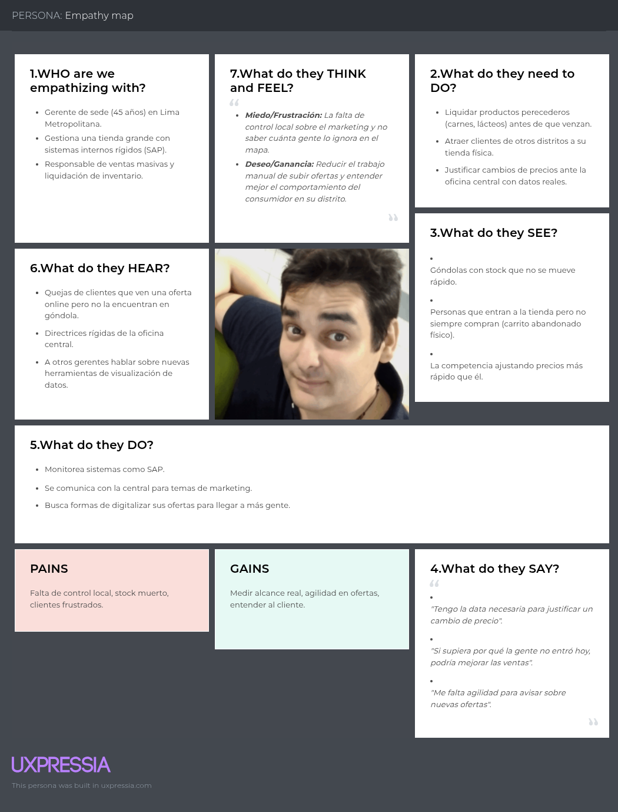
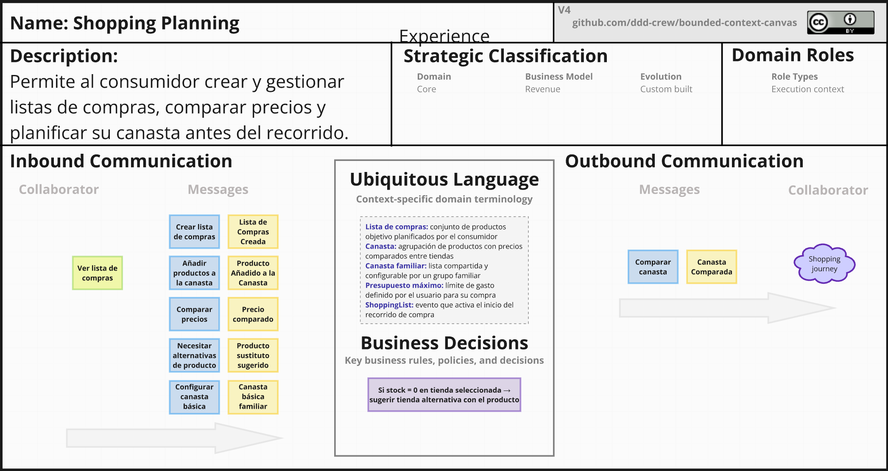
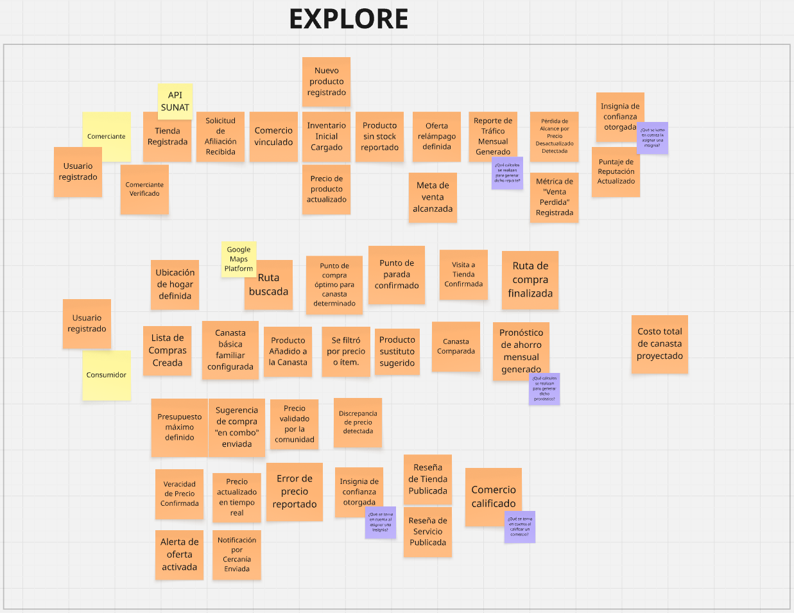

# Capítulo II: Requirements Development and Software Solution Design

## 2.1. Competidores
### 2.1.1. Análisis competitivo

El ecosistema retail en el Perú ha experimentado un avance hacia la digitalización comercial; sin embargo, persiste una limitación estructural: la gran mayoría de plataformas operan como canales de venta diseñados para promover el consumo cautivo dentro de su propia tienda, en lugar de desempeñarse como herramientas orientadas al ahorro objetivo que asistan al consumidor en la toma de decisiones informadas para adquirir productos al menor costo real.

# Competitive Analysis Landscape - PeruTech

| **¿Por qué llevar a cabo este análisis?** | **Identificar las ventajas competitivas de PeruTech frente a soluciones de delivery, agregadores de catálogos y gestores de alacena, permitiendo posicionarnos como una plataforma web que integra optimización de presupuesto, control de despensa y rutas presenciales de compra en el mercado peruano.** |
| ----------------------------------------- | ------------------------------------------------------------------------------------------------------------------------------------------------------------------------------------------------------------------------------------------------------------------------------------- |
|                                           |                                                                                                                                                                                                                                                       |

| Perfil | Atributo | PeruTech | Rappi / Fazil | Tiendeo / Ofertia | Out of Milk |
| :--- | :--- | :--- | :--- | :--- | :--- |
| **Perfil** | **Overview** | Plataforma web de planificación presupuestaria de compras, comparador de costos en góndola y gestión de despensa presencial. | Ecosistema digital de comercio electrónico y logística de despachos inmediatos bajo demanda. | Plataforma agregadora de catálogos comerciales y encartes publicitarios en formato digital estático (PDF). | Herramienta móvil para confección de listas de compras y registro de existencias en el hogar. |
| | **Ventaja competitiva ¿Qué valor ofrece a los clientes?** | Algoritmo propio de optimización presupuestaria y cálculo anticipado del costo total en góndola antes del pago en caja, junto con ordenamiento secuencial por pasillos. Brinda al usuario un ahorro monetario tangible y eficiencia de tiempo en compras presenciales sin sobreprecios ni cobros de servicio. | Infraestructura masiva de repartidores y entregas en lapsos reducidos. Ofrece comodidad inmediata al usuario al recibir los artículos en su domicilio sin desplazarse, priorizando el ahorro de tiempo a cambio de comisiones adicionales por servicio y envío. | Centralización de folletos y encartes promocionales de diversas cadenas minoristas en una sola interfaz. Ofrece visibilidad anticipada de promociones semanales, aunque sin herramientas de cálculo presupuestario dinámico ni asistencia durante la visita física. | Panel integrado para revisar stock de alacena y registrar faltantes mediante escaneo de código de barras, reduciendo la compra de artículos duplicados en alimentos básicos de uso regular. |
| **Perfil de Marketing** | **Mercado Objetivo** | Compradores independientes, parejas jóvenes y jefes de hogar de zonas urbanas que buscan optimizar su presupuesto y tiempo en compras presenciales. | Usuarios de niveles socioeconómicos A y B que priorizan la conveniencia y la inmediatez sobre el costo final de la canasta. | Personas habituadas a la consulta tradicional de folletos impresos y búsqueda anticipada de ofertas minoristas. | Consumidores que administran inventarios de cocina y priorizan el orden doméstico de insumos básicos. |
| | **Estrategias de marketing** | Posicionamiento orgánico web (SEO) centrado en finanzas personales, mercadeo de contenidos comunitarios y convenios de visibilidad con comercios minoristas. | Captación agresiva sustentada en cupones promocionales, programas de suscripción mensual (Prime) y convenios corporativos de exclusividad. | Posicionamiento en motores de búsqueda para términos relacionados con ofertas comerciales y pauta publicitaria con marcas retail. | Posicionamiento orgánico en tiendas de aplicaciones móviles (ASO) y monetización por despliegue de anuncios display. |
| **Perfil de Producto** | **Productos & Servicios** | Plataforma Web responsiva desarrollada en Angular con servicios RESTful backend en Spring Boot, cálculo presupuestario e inventario de alacena. | Aplicación de delivery con geolocalización en tiempo real, pasarela de pagos integrada y billetera digital. | Visor web y móvil de folletos interactivos geolocalizados sin motor transaccional de compras. | Herramienta móvil para edición de listas, gestión de existencias y escaneo de códigos de barra. |
| | **Precios & Costos** | Esquema Freemium (funcionalidades esenciales de acceso gratuito; suscripción mensual de $4.99 para analítica de gasto y comparativas avanzadas). | Precios de góndola con margen incrementado, tarifa fija por despacho, tarifa de servicio (*service fee*) y costo de propinas. | Gratuito para el usuario final (modelo financiado directamente por la inversión publicitaria de las marcas retail). | Gratuito con inserción constante de anuncios visuales; pago único opcional para remover la publicidad. |
| | **Canales de distribución** | Plataforma Web accesible desde navegadores modernos (escritorio y móviles), articulada con el Landing Page oficial. | Tiendas de distribución móvil (Google Play Store, App Store) y portal web de comercio electrónico. | Tiendas de distribución móvil y portal web informativo de catálogos. | Tiendas de distribución móvil (Google Play Store y App Store). |
| **SWOT** | PeruTech | Rappi / Fazil | Tiendeo / Ofertia | Out of Milk |
| **Fortalezas** | Algoritmo propio para proyección presupuestaria y ordenamiento de rutas por pasillos; arquitectura web escalable; diseño inclusivo; total transparencia en costos presenciales. | Logística robusta y red masiva de repartidores consolidada; presupuesto elevado para marketing y fidelización de usuarios; convenios directos con cadenas de retail. | Extensa base de datos de catálogos comerciales a nivel nacional; interfaz intuitiva para lectura de volantes publicitarios; alto reconocimiento en búsqueda de ofertas. | Módulo dual de despensa y lista de compras integrado; escaneo funcional de código de barras; baja demanda de recursos en el dispositivo cliente. |
| **Debilidades** | Marca en fase inicial de penetración; volumen de datos inicial dependiente de la integración de establecimientos comerciales y adopción temprana de la comunidad. | Precios finales notablemente inflados frente a la compra directa en tienda; altas comisiones de servicio por pedido; dependencia de la disponibilidad de repartidores. | Contenido estático en imágenes o PDF que no permite búsquedas dinámicas de precios unitarios; nula asistencia en cálculo del gasto acumulado en tienda. | Interfaz gráfica desactualizada; ausencia de sincronización web colaborativa en tiempo real; saturación excesiva de publicidad en su versión gratuita. |
| **Oportunidades** | Incremento de la inflación que aumenta la sensibilidad al precio en compras familiares; expansión del comercio minorista de descuento (tiendas de conveniencia como Mass y Vega). | Expansión hacia servicios financieros digitales (billeteras electrónicas) y programas corporativos de abastecimiento de oficinas. | Alianzas con pequeños comerciantes y bodegas de barrio para digitalizar sus promociones y volantes impresos. | Modernización visual del sistema orientada al consumo responsable y prevención del desperdicio de insumos perecibles. |
| **Amenazas** | Restricciones de acceso a datos públicos por parte de grandes cadenas de retail; incorporación de módulos de listas en plataformas bancarias o billeteras móviles. | Modificaciones en regulaciones laborales sobre repartidores que eleven los costos operativos; saturación y deserción de usuarios por cobros excesivos de servicio. | Desplazamiento por parte de usuarios jóvenes que demandan datos estructurados en tiempo real en lugar de lectura de folletos extensos. | Abandono de usuarios hacia aplicaciones genéricas de notas compartidas integradas en los sistemas operativos móviles. |

### 2.1.2. Estrategias y tácticas frente a competidores

* **Frente a Rappi / Fazil:** Posicionar a PeruTech como la alternativa de ahorro indispensable para el consumidor que no desea asumir comisiones elevadas ni sobreprecios inflados por intermediación logística, facilitando una experiencia de compra presencial planificada, rápida y económica.
* **Frente a Tiendeo / Ofertia:** Proveer datos de precios dinámicos, estructurados y comparables en tiempo real en sustitución de folletos estáticos en PDF, permitiendo al usuario calcular con exactitud cuánto dinero invertirá antes de dirigirse a la caja registradora.
* **Frente a Out of Milk:** Desarrollar una experiencia web moderna basada en Angular y directrices de Material Design accesible desde cualquier navegador sin requerir descargas pesadas obligatorias, integrando el control de despensa con la optimización de compras en una interfaz libre de publicidad invasiva.

## 2.2. Entrevistas

### 2.2.1. Diseño de entrevistas

Las entrevistas fueron diseñadas diferenciando preguntas demográficas, operativas y de hábitos financieros para los dos segmentos objetivo: Compradores Independientes (Segmento 1) y Administradores del Hogar Familiar (Segmento 2).

**Preguntas Principales (Segmento 1 - Compradores Independientes):**
1. ¿Con qué periodicidad sueles realizar las compras de alimentos y artículos de primera necesidad para tu hogar?
2. ¿Qué herramientas o métodos utilizas habitualmente para elaborar y revisar tu lista de compras?
3. ¿Estableces un límite monetario previo a la compra y de qué forma controlas no excederte dentro de la tienda?
4. ¿Cuáles consideras que son los principales motivos de demora, confusión o frustración al recorrer el supermercado?
5. ¿Alguna vez has comprado productos duplicados o innecesarios por no recordar con exactitud qué tenías en la despensa?
6. ¿Estarías dispuesto a utilizar una plataforma web que organice tus compras por pasillos y calcule tu presupuesto en tiempo real?

**Preguntas Principales (Segmento 2 - Administradores del Hogar Familiar):**
1. ¿Cómo coordinas y recopilas las solicitudes de compras cuando intervienen múltiples integrantes de la familia?
2. ¿Qué porcentaje aproximado de los ingresos del hogar se destina mensualmente al abastecimiento de despensa y alimentos?
3. ¿Cómo verificas qué productos están próximos a agotarse o vencer en tu alacena antes de ir a comprar?
4. ¿Qué tan importante es para tu economía doméstica comparar precios y ofertas entre distintos supermercados?
5. ¿Qué dificultades experimentas al momento de consolidar y pagar la cuenta total de compras en caja?
6. ¿Qué beneficios clave buscarías en una aplicación web diseñada para el control integral de compras del hogar?

### 2.2.2. Registro de entrevistas

#### Segmento 1: Compradores Independientes

* **Entrevista 1:**
  * **Nombre y Apellidos:** Fernando Justiniano Vega
  * **Edad:** 24 años
  * **Distrito:** San Miguel, Lima
  * **Ocupación:** Ingeniero de Software / Profesional Independiente
  * **Duración:** 04:25
  * **Enlace de Video (Microsoft Stream):** [Ver Entrevista 1 - Fernando Justiniano](https://web.microsoftstream.com/)
  * **Resumen descriptivo:** Fernando vive de manera independiente y realiza compras cada diez o quince días. Utiliza principalmente una nota rápida en su teléfono celular, pero señala que le resulta molesto porque no tiene un orden claro. Admite que con frecuencia compra productos repetidos (como fideos, salsas o condimentos) debido a que no revisa su despensa antes de salir por falta de tiempo. Sobre el presupuesto, intenta fijar un monto aproximado con tarjeta o billeteras digitales, pero suele enterarse del monto real exacto recién en la caja registradora. Afirma que pierde bastante tiempo dando vueltas entre pasillos buscando artículos específicos y considera que una plataforma web que agrupe su lista por zonas del supermercado y le muestre el costo acumulado le ahorraría dinero y tiempo valioso.

> *(Colocar captura de pantalla de la sesión en video donde se aprecie a Fernando ante la cámara).*

* **Entrevista 2:**
  * **Nombre y Apellidos:** `[Pendiente: Colocar Nombres y Apellidos del Entrevistado 2]`
  * **Edad:** `[Pendiente: Edad]`
  * **Distrito:** `[Pendiente: Distrito]`
  * **Ocupación:** `[Pendiente: Ocupación]`
  * **Duración:** `[hh:mm]`
  * **Enlace de Video (Microsoft Stream):** `[Pendiente: URL de Microsoft Stream]`
  * **Resumen descriptivo:** `[Pendiente: Redactar resumen de respuestas sobre compras independientes, presupuesto y alacena]`

> *(Colocar captura de pantalla del video de la Entrevista 2).*

* **Entrevista 3:**
  * **Nombre y Apellidos:** `[Pendiente: Colocar Nombres y Apellidos del Entrevistado 3]`
  * **Edad:** `[Pendiente: Edad]`
  * **Distrito:** `[Pendiente: Distrito]`
  * **Ocupación:** `[Pendiente: Ocupación]`
  * **Duración:** `[hh:mm]`
  * **Enlace de Video (Microsoft Stream):** `[Pendiente: URL de Microsoft Stream]`
  * **Resumen descriptivo:** `[Pendiente: Redactar resumen de respuestas sobre compras independientes, compras impulsivas y uso de herramientas web]`

> *(Colocar captura de pantalla del video de la Entrevista 3).*

---

#### Segmento 2: Administradores del Hogar Familiar

* **Entrevista 4:**
  * **Nombre y Apellidos:** Camila Villavicencio Ramos `(Dato de muestra provisional - Reemplazar cuando el equipo grabe su entrevista)`
  * **Edad:** 37 años
  * **Distrito:** Magdalena del Mar, Lima
  * **Ocupación:** Coordinadora Administrativa / Madre de familia
  * **Duración:** 05:05
  * **Enlace de Video (Microsoft Stream):** [Ver Entrevista 4](https://web.microsoftstream.com/)
  * **Resumen descriptivo:** Centraliza las compras de su hogar usando mensajes de WhatsApp con su familia; le molesta olvidar insumos esenciales o encontrar alimentos vencidos al fondo de la alacena; compara ofertas de limpieza y abarrotes entre distintas tiendas para no sobrepasar el presupuesto familiar asignado al mes.

> *(Colocar captura de pantalla del video de la Entrevista 4).*

* **Entrevista 5:**
  * **Nombre y Apellidos:** `[Pendiente: Colocar Nombres y Apellidos del Entrevistado 5]`
  * **Edad:** `[Pendiente: Edad]`
  * **Distrito:** `[Pendiente: Distrito]`
  * **Ocupación:** `[Pendiente: Ocupación]`
  * **Duración:** `[hh:mm]`
  * **Enlace de Video (Microsoft Stream):** `[Pendiente: URL de Microsoft Stream]`
  * **Resumen descriptivo:** `[Pendiente: Redactar resumen de respuestas sobre abastecimiento familiar, control de vencimiento y cálculo de cuenta final]`

> *(Colocar captura de pantalla del video de la Entrevista 5).*

### 2.2.3. Análisis de entrevistas

A partir del análisis cualitativo y cuantitativo de las respuestas recopiladas en las entrevistas registradas para ambos segmentos, se determinaron los siguientes patrones estadísticos representativos:

* **Empleo de medios no estructurados (80%):** 4 de cada 5 entrevistados (80%) elabora sus listas mediante chats de mensajería o blocs de notas genéricos, métodos que no previenen olvidos ni organizan los artículos de forma eficiente.
* **Incidencia de compras repetidas por falta de inventario (60%):** El 60% de los participantes (incluyendo a los compradores independientes como Fernando) confirmó haber comprado artículos duplicados al menos una vez al mes por no verificar con certeza las existencias en casa.
* **Monitoreo presupuestario preventivo como necesidad crítica (80%):** El 100% de los administradores familiares y el 66% de compradores independientes manifestaron preocupación por el aumento de precios en caja y la necesidad de conocer el monto acumulado antes de pagar.
* **Demoras por desorganización de pasillos (80%):** 4 de los 5 entrevistados señalaron que el recorrido desordenado dentro de locales grandes es su principal fuente de pérdida de tiempo y fatiga en horas punta.
* **Preferencia por soluciones Web modernas (100%):** La totalidad de la muestra cuenta con acceso diario a navegadores web en ordenadores y teléfonos inteligentes, expresando apertura total al uso de una plataforma web fluida que no demande almacenamiento local obligatorio.

## 2.3. Needfinding

### 2.3.1. User Personas

Con base en la información demográfica, metas y frustraciones obtenidas en las entrevistas, se formalizaron dos User Personas arquetípicos:

* **User Persona 1:** Sebastián Rivas, 24 años, practicante preprofesional de analítica que reside en San Miguel. Sus metas son apegarse a su presupuesto mensual, comprar únicamente lo indispensable y agilizar su visita a la tienda.
* **User Persona 2:** Camila Villavicencio, 37 años, profesional y madre de familia en Magdalena del Mar. Sus metas consisten en coordinar el abastecimiento familiar sin confusiones, reducir el desperdicio de comida y conseguir mejores precios en artículos de consumo masivo.

> *(Nota de originalidad: En la ficha de UXPressia/Figma, asegurar que el encabezado del arquetipo sea "Sebastián Rivas - Comprador Independiente").*

> *(Nota de originalidad: En la ficha de UXPressia/Figma, asegurar que el encabezado del arquetipo sea "Camila Villavicencio - Administradora del Hogar").*

### 2.3.2. User Task Matrix

La matriz describe las tareas cotidianas que ambos arquetipos realizan para abastecer su despensa, con su frecuencia e importancia:

| Tarea (Task) | Sebastián Rivas (Frecuencia) | Sebastián Rivas (Importancia) | Camila Villavicencio (Frecuencia) | Camila Villavicencio (Importancia) |
| :--- | :--- | :--- | :--- | :--- |
| Fijar el presupuesto de compras | Quincenal | Media | Mensual | Alta |
| Revisar existencias en la despensa | Ocasional | Baja | Semanal | Alta |
| Redactar la lista de compras | Quincenal | Media | Semanal | Alta |
| Comparar precios entre establecimientos | Rara vez | Baja | Mensual | Alta |
| Recorrer pasillos en el supermercado | Quincenal | Media | Semanal | Media |
| Contabilizar el gasto ejecutado | Ocasional | Media | Semanal | Alta |
| Verificar fechas de caducidad en casa | Rara vez | Baja | Semanal | Alta |

### 2.3.3. User Journey Mapping (As-Is)

El mapeo de jornada As-Is documenta el proceso actual de compra sin el soporte de la plataforma PeruTech:

1. **Revisión previa:** Intento mental rápido de verificar qué insumos faltan en casa. *Emoción: Duda.*
2. **Armado de lista:** Registro desordenado en papel o aplicación de chat. *Emoción: Rutina.*
3. **Trayecto y compra:** Desplazamiento caótico por pasillos buscando artículos olvidados. *Punto de dolor: Fatiga y pérdida de tiempo.*
4. **Pago en caja:** El costo acumulado resulta mayor al cálculo mental inicial. *Punto de dolor: Frustración por exceder el presupuesto.*
5. **Acomodo en el hogar:** Detección de productos repetidos o insumos faltantes. *Punto de dolor: Desperdicio y molestia.*

> *(Nota de originalidad: Verificar que el diagrama no contenga textos con nombres de proyectos o fechas anteriores en la cabecera).*

### 2.3.4. Empathy Mapping

Para cada arquetipo se sintetizó lo que observa, oye, piensa, siente, dice y hace, identificando sus principales dolores y beneficios esperados:

> *(Nota de originalidad: Canvas de empatía correspondiente al arquetipo de Comprador Independiente).*

> *(Nota de originalidad: Canvas de empatía correspondiente al arquetipo de Administrador del Hogar).*

## 2.4. Big Picture Event Storming

Durante el proceso colaborativo de Big Picture Event Storming, se estructuró visualmente la línea temporal del negocio de PeruTech, definiendo los eventos de dominio en pasado (naranja), los comandos asociados (azul) y los puntos de fricción detectados (rojo):

* **Eventos significativos identificados:** `InventoryDepleted`, `ShoppingListInitialized`, `ProductAppendedToList`, `BudgetThresholdNotified`, `RouteSuggested`, `PurchaseFinalized`, `ExpenseConsolidated`.

> *(Nota de originalidad: Captura de la fase abierta con post-its de eventos de dominio).*

> *(Nota de originalidad: Captura de la fase exploratoria organizando comandos y actores).*

> *(Nota de originalidad: Captura de la fase de cierre con los Bounded Contexts y políticas identificadas).*

## 2.5. Ubiquitous Language

| Término (Inglés) | Equivalente (Español) | Definición en el Dominio del Negocio |
| :--- | :--- | :--- |
| **Shopping List** | Lista de Compras | Conjunto planificado de artículos que el usuario define para adquirir en una visita comercial. |
| **Pantry Stock** | Inventario de Despensa | Registro cuantitativo de insumos almacenados en el hogar para supervisar el stock disponible. |
| **Budget Limit** | Límite Presupuestario | Monto máximo fijado por el usuario para su periodo de compra a fin de evitar sobregastos. |
| **Aisle Routing** | Ruta por Pasillos | Orden secuencial sugerido para recoger productos en función a la distribución física del local. |
| **Price Benchmark** | Comparativa de Precios | Evaluación comparativa de precios de un mismo bien entre diferentes comercios minoristas. |
| **Recurring Purchase** | Compra Recurrente | Frecuencia programada de reposición para artículos de consumo diario y no perecibles. |
| **Shared Household** | Hogar Compartido | Núcleo de usuarios que coordinan un mismo inventario y comparten presupuesto de despensa. |
| **Shopping Run** | Jornada de Compra | Acto de visita física o digital a un establecimiento para la adquisición y pago de bienes. |