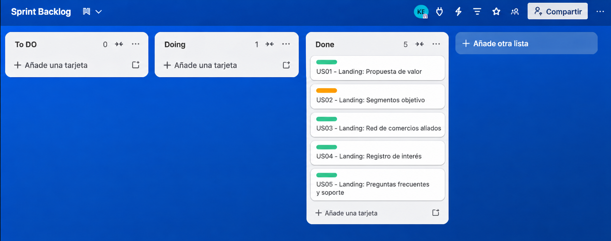

Universidad Peruana de Ciencias Aplicadas

Carrera de Ingeniería de Software

### **1ASI0729**
### **Desarrollo de Aplicaciones Open Source**

NRC

**7750**

### **Informe del Trabajo Final**

Docente

**Bautista Ubillús, Efrain Ricardo**

Equipo

**PeruTech** 

Proyecto

**[NOMBRE DEL PRODUCTO]** 

#### **Integrantes**

<table align="center" style="all: unset;">
<tr style="background: none !important; border: none !important;">
<td align="left" style="border: none !important; padding: 0 40px 0 0 !important; background: none !important;"><strong>Código</strong></td>
<td align="left" style="border: none !important; padding: 0 !important; background: none !important;"><strong>Apellidos y Nombres</strong></td>
</tr>
<tr style="background: none !important; border: none !important;">
<td align="left" style="border: none !important; padding: 0 40px 0 0 !important; background: none !important;">u20241c101</td>
<td align="left" style="border: none !important; padding: 0 !important; background: none !important;">Capillo Lema, Mía Valentina</td>
</tr>
<tr style="background: none !important; border: none !important;">
<td align="left" style="border: none !important; padding: 0 40px 0 0 !important; background: none !important;">[Código]</td>
<td align="left" style="border: none !important; padding: 0 !important; background: none !important;">[Apellidos y Nombres]</td>
</tr>
<tr style="background: none !important; border: none !important;">
<td align="left" style="border: none !important; padding: 0 40px 0 0 !important; background: none !important;">[Código]</td>
<td align="left" style="border: none !important; padding: 0 !important; background: none !important;">[Apellidos y Nombres]</td>
</tr>
<tr style="background: none !important; border: none !important;">
<td align="left" style="border: none !important; padding: 0 40px 0 0 !important; background: none !important;">[Código]</td>
<td align="left" style="border: none !important; padding: 0 !important; background: none !important;">[Apellidos y Nombres]</td>
</tr>
<tr style="background: none !important; border: none !important;">
<td align="left" style="border: none !important; padding: 0 40px 0 0 !important; background: none !important;">[Código]</td>
<td align="left" style="border: none !important; padding: 0 !important; background: none !important;">[Apellidos y Nombres]</td>
</tr>
<tr style="background: none !important; border: none !important;">
<td align="left" style="border: none !important; padding: 0 40px 0 0 !important; background: none !important;">[Código]</td>
<td align="left" style="border: none !important; padding: 0 !important; background: none !important;">[Apellidos y Nombres]</td>
</tr>
</table>

 

**Período 202620**

**Septiembre 2026**

---

# Registro de Versiones del Informe

| Versión | Fecha | Autor | Descripción de modificación |
|--------|------|------|-----------------------------|
| 1.0 | 06/09/2026 | Capillo Lema, Mía Valentina   | Creación inicial del informe |
| | | | |

---

# Project Report Collaboration Insights

[Contenido correspondiente a Project Report Collaboration Insights]

---

# Contenido

## Tabla de Contenidos

- [Student Outcome](#student-outcome)

- [Capítulo I: Introducción](#capítulo-i-introducción)
  - [1.1. Startup Profile](#11-startup-profile)
    - [1.1.1. Descripción de la Startup](#111-descripción-de-la-startup)
    - [1.1.2. Perfiles de integrantes del equipo](#112-perfiles-de-integrantes-del-equipo)
  - [1.2. Solution Profile](#12-solution-profile)
    - [1.2.1. Antecedentes y problemática](#121-antecedentes-y-problemática)
    - [1.2.2. Lean UX Process](#122-lean-ux-process)
      - [1.2.2.1. Lean UX Problem Statements](#1221-lean-ux-problem-statements)
      - [1.2.2.2. Lean UX Assumptions](#1222-lean-ux-assumptions)
      - [1.2.2.3. Lean UX Hypothesis Statements](#1223-lean-ux-hypothesis-statements)
      - [1.2.2.4. Lean UX Canvas](#1224-lean-ux-canvas)
  - [1.3. Segmentos objetivo](#13-segmentos-objetivo)

- [Capítulo II: Requirements Elicitation & Analysis](#capítulo-ii-requirements-elicitation--analysis)
  - [2.1. Competidores](#21-competidores)
    - [2.1.1. Análisis competitivo](#211-análisis-competitivo)
    - [2.1.2. Estrategias y tácticas frente a competidores](#212-estrategias-y-tácticas-frente-a-competidores)
  - [2.2. Entrevistas](#22-entrevistas)
    - [2.2.1. Diseño de entrevistas](#221-diseño-de-entrevistas)
    - [2.2.2. Registro de entrevistas](#222-registro-de-entrevistas)
    - [2.2.3. Análisis de entrevistas](#223-análisis-de-entrevistas)
  - [2.3. Needfinding](#23-needfinding)
    - [2.3.1. User Personas](#231-user-personas)
    - [2.3.2. User Task Matrix](#232-user-task-matrix)
    - [2.3.3. User Journey Mapping](#233-user-journey-mapping)
    - [2.3.4. Empathy Mapping](#234-empathy-mapping)
  - [2.4. Big Picture Event Storming](#24-big-picture-event-storming)
  - [2.5. Ubiquitous Language](#25-ubiquitous-language)

- [Capítulo III: Requirements Specification](#capítulo-iii-requirements-specification)
  - [3.1. User Stories](#31-user-stories)
  - [3.2. Impact Mapping](#32-impact-mapping)
  - [3.3. Product Backlog](#33-product-backlog)

- [Capítulo IV: Product Design](#capítulo-iv-product-design)
  - [4.1. Style Guidelines](#41-style-guidelines)
    - [4.1.1. General Style Guidelines](#411-general-style-guidelines)
    - [4.1.2. Web Style Guidelines](#412-web-style-guidelines)
  - [4.2. Information Architecture](#42-information-architecture)
    - [4.2.1. Organization Systems](#421-organization-systems)
    - [4.2.2. Labeling Systems](#422-labeling-systems)
    - [4.2.3. SEO Tags and Meta Tags](#423-seo-tags-and-meta-tags)
    - [4.2.4. Searching Systems](#424-searching-systems)
    - [4.2.5. Navigation Systems](#425-navigation-systems)
  - [4.3. Landing Page UI Design](#43-landing-page-ui-design)
    - [4.3.1. Landing Page Wireframe](#431-landing-page-wireframe)
    - [4.3.2. Landing Page Mock-up](#432-landing-page-mock-up)
  - [4.4. Web Applications UX/UI Design](#44-web-applications-uxui-design)
    - [4.4.1. Web Applications Wireframes](#441-web-applications-wireframes)
    - [4.4.2. Web Applications Wireflow Diagrams](#442-web-applications-wireflow-diagrams)
    - [4.4.3. Web Applications Mock-ups](#443-web-applications-mock-ups)
    - [4.4.4. Web Applications User Flow Diagrams](#444-web-applications-user-flow-diagrams)
  - [4.5. Web Applications Prototyping](#45-web-applications-prototyping)
  - [4.6. Domain-Driven Software Architecture](#46-domain-driven-software-architecture)
    - [4.6.1. Design-Level Event Storming](#461-design-level-event-storming)
    - [4.6.2. Software Architecture Context Diagram](#462-software-architecture-context-diagram)
    - [4.6.3. Software Architecture Container Diagrams](#463-software-architecture-container-diagrams)
    - [4.6.4. Software Architecture Components Diagrams](#464-software-architecture-components-diagrams)
  - [4.7. Software Object-Oriented Design](#47-software-object-oriented-design)
    - [4.7.1. Class Diagrams](#471-class-diagrams)
  - [4.8. Database Design](#48-database-design)
    - [4.8.1. Database Diagrams](#481-database-diagrams)

- [Capítulo V: Product Implementation, Validation & Deployment](#capítulo-v-product-implementation-validation--deployment)
  - [5.1. Software Configuration Management](#51-software-configuration-management)
    - [5.1.1. Software Development Environment Configuration](#511-software-development-environment-configuration)
    - [5.1.2. Source Code Management](#512-source-code-management)
    - [5.1.3. Source Code Style Guide & Conventions](#513-source-code-style-guide--conventions)
    - [5.1.4. Software Deployment Configuration](#514-software-deployment-configuration)
  - [5.2. Landing Page, Services & Applications Implementation](#52-landing-page-services--applications-implementation)
    - [5.2.1. Sprint 1](#521-sprint-1)
      - [5.2.1.1. Sprint Planning 1](#5211-sprint-planning-1)
      - [5.2.1.2. Aspect Leaders and Collaborators](#5212-aspect-leaders-and-collaborators)
      - [5.2.1.3. Sprint Backlog 1](#5213-sprint-backlog-1)
      - [5.2.1.4. Development Evidence for Sprint Review](#5214-development-evidence-for-sprint-review)
      - [5.2.1.5. Execution Evidence for Sprint Review](#5215-execution-evidence-for-sprint-review)
      - [5.2.1.6. Services Documentation Evidence for Sprint Review](#5216-services-documentation-evidence-for-sprint-review)
      - [5.2.1.7. Software Deployment Evidence for Sprint Review](#5217-software-deployment-evidence-for-sprint-review)
      - [5.2.1.8. Team Collaboration Insights during Sprint](#5218-team-collaboration-insights-during-sprint)
    - [5.2.2. Sprint 2](#522-sprint-2)
      - [5.2.2.1. Sprint Planning 2](#5221-sprint-planning-2)
      - [5.2.2.2. Aspect Leaders and Collaborators](#5222-aspect-leaders-and-collaborators)
      - [5.2.2.3. Sprint Backlog 2](#5223-sprint-backlog-2)
      - [5.2.2.4. Development Evidence for Sprint Review](#5224-development-evidence-for-sprint-review)
      - [5.2.2.5. Execution Evidence for Sprint Review](#5225-execution-evidence-for-sprint-review)
      - [5.2.2.6. Services Documentation Evidence for Sprint Review](#5226-services-documentation-evidence-for-sprint-review)
      - [5.2.2.7. Software Deployment Evidence for Sprint Review](#5227-software-deployment-evidence-for-sprint-review)
      - [5.2.2.8. Team Collaboration Insights during Sprint](#5228-team-collaboration-insights-during-sprint)
  - [5.3. Validation Interviews](#53-validation-interviews)
    - [5.3.1. Diseño de Entrevistas](#531-diseño-de-entrevistas)
    - [5.3.2. Registro de Entrevistas](#532-registro-de-entrevistas)
    - [5.3.3. Evaluaciones según heurísticas](#533-evaluaciones-según-heurísticas)
  - [5.4. Video About-the-Product](#54-video-about-the-product)

- [Conclusiones](#conclusiones)
- [Conclusiones y recomendaciones](#conclusiones-y-recomendaciones)
- [Video About-the-Team](#video-about-the-team)
- [Bibliografía](#bibliografía)
- [Anexos](#anexos)

---

# Student Outcome

El curso contribuye al cumplimiento del Student Outcome ABET:

**ABET – EAC - Student Outcome 3**

**Criterio:**  

*Capacidad de comunicarse efectivamente con un rango de audiencias. En el siguiente cuadro se describe las acciones realizadas y enunciados de conclusiones por parte del grupo, que permiten sustentar el haber alcanzado el logro del ABET – EAC - Student Outcome 3.*

| Criterio específico | Acciones realizadas | Conclusiones |
|---------------------|---------------------|--------------|
| **Comunica oralmente con efectividad a diferentes rangos de audiencia.** | [Descripción de acciones realizadas]   **AV1**   [Evidencia] | [Conclusiones] |
| **Comunica por escrito con efectividad a diferentes rangos de audiencia.** | [Descripción de acciones realizadas]   **AV1**   [Evidencia] | [Conclusiones] |

---

# Capítulo I: Introducción

## 1.1. Startup Profile

### 1.1.1. Descripción de la Startup

[Contenido]

### 1.1.2. Perfiles de integrantes del equipo

[Contenido]

## 1.2. Solution Profile

### 1.2.1. Antecedentes y problemática

[Contenido]

### 1.2.2. Lean UX Process

[Contenido]

#### 1.2.2.1. Lean UX Problem Statements

[Contenido]

#### 1.2.2.2. Lean UX Assumptions

[Contenido]

#### 1.2.2.3. Lean UX Hypothesis Statements

[Contenido]

#### 1.2.2.4. Lean UX Canvas

[Contenido]

## 1.3. Segmentos objetivo

[Contenido]

---

# Capítulo II: Requirements Elicitation & Analysis

## 2.1. Competidores

[Contenido]

### 2.1.1. Análisis competitivo

[Contenido]

### 2.1.2. Estrategias y tácticas frente a competidores

[Contenido]

## 2.2. Entrevistas

[Contenido]

### 2.2.1. Diseño de entrevistas

[Contenido]

### 2.2.2. Registro de entrevistas

[Contenido]

### 2.2.3. Análisis de entrevistas

[Contenido]

## 2.3. Needfinding

[Contenido]

### 2.3.1. User Personas

[Contenido]

### 2.3.2. User Task Matrix

[Contenido]

### 2.3.3. User Journey Mapping

[Contenido]

### 2.3.4. Empathy Mapping

[Contenido]

## 2.4. Big Picture Event Storming

[Contenido]

## 2.5. Ubiquitous Language

[Contenido]

---

# Capítulo III: Requirements Specification

## 3.1. User Stories

[Contenido]

## 3.2. Impact Mapping

[Contenido]

## 3.3. Product Backlog

[Contenido]

---

# Capítulo IV: Product Design

## 4.1. Style Guidelines

[Contenido]

### 4.1.1. General Style Guidelines

[Contenido]

### 4.1.2. Web Style Guidelines

[Contenido]

## 4.2. Information Architecture

[Contenido]

### 4.2.1. Organization Systems

[Contenido]

### 4.2.2. Labeling Systems

[Contenido]

### 4.2.3. SEO Tags and Meta Tags

[Contenido]

### 4.2.4. Searching Systems

[Contenido]

### 4.2.5. Navigation Systems

[Contenido]

## 4.3. Landing Page UI Design

[Contenido]

### 4.3.1. Landing Page Wireframe

[Contenido]

### 4.3.2. Landing Page Mock-up

[Contenido]

## 4.4. Web Applications UX/UI Design

[Contenido]

### 4.4.1. Web Applications Wireframes

[Contenido]

### 4.4.2. Web Applications Wireflow Diagrams

[Contenido]

### 4.4.3. Web Applications Mock-ups

[Contenido]

### 4.4.4. Web Applications User Flow Diagrams

[Contenido]

## 4.5. Web Applications Prototyping

[Contenido]

## 4.6. Domain-Driven Software Architecture

[Contenido]

### 4.6.1. Design-Level Event Storming

[Contenido]

### 4.6.2. Software Architecture Context Diagram

[Contenido]

### 4.6.3. Software Architecture Container Diagrams

[Contenido]

### 4.6.4. Software Architecture Components Diagrams

[Contenido]

## 4.7. Software Object-Oriented Design

[Contenido]

### 4.7.1. Class Diagrams

[Contenido]

## 4.8. Database Design

[Contenido]

### 4.8.1. Database Diagrams

[Contenido]

---

# Capítulo V: Product Implementation, Validation & Deployment

## 5.1. Software Configuration Management

Se detallan a continuación los entornos, herramientas y normas operativas encargados de asegurar la calidad, consistencia y trazabilidad de los artefactos desarrollados durante el ciclo de vida del proyecto.

### 5.1.1. Software Development Environment Configuration

Se presentan los entornos y herramientas seleccionadas para las fases de gestión, diseño, desarrollo web, documentación y despliegue del producto.

**Project Management**

| Herramienta | Uso Principal | Enlace / Ruta de Acceso |
| :--- | :--- | :--- |
| **Trello** | Gestión ágil de tareas, seguimiento del Sprint Backlog e historias de usuario mediante tableros Kanban. | [https://trello.com](https://trello.com) |

 

**Requirements & UX/UI Design**

| Herramienta | Uso Principal | Enlace / Ruta de Acceso |
| :--- | :--- | :--- |
| **UXPressia** | Elaboración de artefactos de diseño centrado en el usuario (User Personas, Empathy Maps, Journey Maps e Impact Maps). | [https://uxpressia.com](https://uxpressia.com) |
| **Lucidchart / Miro** | Diagramación y modelado colaborativo del dominio del problema y arquitectura C4 Model. | [https://lucidchart.com](https://lucidchart.com) |
| **Figma** | Diseño de wireframes, mockups de alta fidelidad y prototipos interactivos de la Landing Page y Web Application. | [https://figma.com](https://figma.com) |

 

**Software Development (Web & Services)**

| Herramienta / Tecnología | Propósito | Enlace / Ruta de Acceso |
| :--- | :--- | :--- |
| **WebStorm / VS Code** | Entorno de desarrollo para maquetación web, estilos y scripts frontend. | [https://www.jetbrains.com/webstorm/](https://www.jetbrains.com/webstorm/) |
| **IntelliJ IDEA Ultimate** | Entorno de desarrollo para la implementación del RESTful API en Java y Spring Boot. | [https://www.jetbrains.com/idea/](https://www.jetbrains.com/idea/) |
| **HTML5 & CSS3** | Lenguajes base para la estructuración y estilización semántica y accesible (a11y) del sitio web. | [https://developer.mozilla.org](https://developer.mozilla.org) |
| **JavaScript & TypeScript** | Lenguajes para la lógica del cliente y la interactividad del Landing Page y componentes Angular. | [https://www.typescriptlang.org](https://www.typescriptlang.org) |
| **Angular** | Marco de trabajo frontend para la construcción de la aplicación web de gestión comercial. | [https://angular.io](https://angular.io) |
| **Java & Spring Boot** | Lenguaje y marco de trabajo backend para la persistencia y servicios RESTful con Spring Data JPA. | [https://spring.io/projects/spring-boot](https://spring.io/projects/spring-boot) |

 

**Software Deployment & Hosting**

| Herramienta / Plataforma | Propósito | Enlace / Ruta de Acceso |
| :--- | :--- | :--- |
| **GitHub Pages** | Alojamiento e integración continua nativa para el despliegue del sitio web estático de la Landing Page. | [https://pages.github.com](https://pages.github.com) |

 

**Software Documentation & Version Control**

| Herramienta / Recurso | Propósito | Enlace / Ruta de Acceso |
| :--- | :--- | :--- |
| **Markdown** | Formato estructurado para la elaboración colaborativa del informe y especificaciones técnicas. | [https://www.markdownguide.org](https://www.markdownguide.org) |
| **Git & GitHub** | Sistema de control de versiones distribuido y servidor centralizado de repositorios bajo la organización del equipo. | [https://github.com](https://github.com) |
| **GitFlow & Conventional Commits** | Flujo de trabajo de ramificación estructurada y convención estándar para mensajes de confirmación. | [https://www.conventionalcommits.org](https://www.conventionalcommits.org) |

---

### 5.1.2. Source Code Management

El código fuente del proyecto se administra centralizadamente en la organización oficial de **GitHub**. El desarrollo se organiza en repositorios independientes para mantener el desacoplamiento entre la documentación técnica, la experiencia web y los servicios de backend, aplicando **GitFlow Workflow**:

**Repositorios Oficiales del Proyecto**

| Componente / Producto | Nombre del Repositorio | Enlace Remoto |
| :--- | :--- | :--- |
| **Organización Oficial** | Open Source - 1ASI0729-2620-7750 | [https://github.com/Open-Source-1ASI0729-2620-7750](https://github.com/Open-Source-1ASI0729-2620-7750) |
| **Documentación Técnica (Reporte)** | `PeruTech-Report` | [https://github.com/Open-Source-1ASI0729-2620-7750/PeruTech-Report](https://github.com/Open-Source-1ASI0729-2620-7750/PeruTech-Report) |
| **Landing Page** | `PeruTech-Landing-Page` | [https://github.com/Open-Source-1ASI0729-2620-7750/PeruTech-Landing-Page](https://github.com/Open-Source-1ASI0729-2620-7750/PeruTech-Landing-Page) |

#### Modelo de Ramificación (GitFlow)

El desarrollo en los repositorios se estructura mediante dos ramas principales permanentes:
* `main`: Contiene exclusivamente versiones estables, aprobadas y publicadas en producción.
* `develop`: Sirve como rama base para la integración continua de nuevas funcionalidades y secciones.

Adicionalmente, se utilizan ramas de soporte bajo las siguientes convenciones:
* `feature/<nombre-funcionalidad>`: Ramas derivadas de `develop` para la construcción de secciones específicas o capítulos de documentación (ej. `feature/landing-hero`, `feature/chapter-5-content`).
* `release/vX.X.X`: Ramas para la estabilización y preparación de entregas formales, aplicando el estándar **Semantic Versioning 2.0.0** (ej. `release/v1.0.0`).
* `hotfix/<descripcion-correccion>`: Ramas directas desde `main` para correcciones críticas no planificadas en producción.

#### Política de Commits

Para garantizar la legibilidad y trazabilidad del historial, los mensajes de commit emplean la especificación de **Conventional Commits**: `<tipo>(ámbito-opcional): descripción en imperativo y minúsculas` (ejemplos: `feat(landing): implement responsive navigation bar`, `docs(report): update chapter 5 environment tables`).

---

### 5.1.3. Source Code Style Guide & Conventions

Se establecen guías de estilo oficiales para asegurar la consistencia, legibilidad y mantenibilidad técnica en todos los componentes del sistema:

* **Idioma de Código**: Nomenclatura estrictamente en **idioma inglés** para identificadores, clases, interfaces, variables, comentarios y rutas de archivos.
* **HTML5**: Estructuración semántica (`<header>`, `<nav>`, `<main>`, `<section>`, `<footer>`), validación de accesibilidad con atributos ARIA (`a11y`), e identación uniforme de 2 espacios.
* **CSS3**: Nomenclatura `kebab-case` para clases personalizadas (`hero-container`, `btn-primary`), organización modular y aplicación de principios de diseño responsivo.
* **JavaScript & TypeScript**: Convención `camelCase` para variables y funciones (`toggleLanguage`, `submitContactForm`), `PascalCase` para clases e interfaces (`UserProfile`, `MerchantService`). Se siguen las directrices de la *Google TypeScript Style Guide*.
* **Java & Spring Boot**: Adopción estricta de la *Google Java Style Guide*. Nombres de clases en `PascalCase`, métodos en `camelCase`, constantes en `UPPER_SNAKE_CASE` y paquetes en minúsculas coherentes con la arquitectura orientada al dominio (DDD).
* **Markdown**: Sintaxis estándar para encabezados, tablas y enlaces según la especificación *The Markdown Guide*.

---

### 5.1.4. Software Deployment Configuration

El sitio web de la Landing Page se despliega mediante el servicio **GitHub Pages**, aprovechando la infraestructura nativa de GitHub para servir archivos estáticos directamente desde el repositorio del proyecto.

| Componente | Plataforma Hosting | Estrategia de Despliegue | URL Oficial |
| :--- | :--- | :--- | :--- |
| **Landing Page** | GitHub Pages | Despliegue automatizado desde la rama `main` | `https://open-source-1asi0729-2620-7750.github.io/PeruTech-Landing-Page/` |

#### Flujo de Configuración en GitHub Pages:
1. **Habilitación del Servicio**: Acceso a la configuración del repositorio (*Settings > Pages*) en `PeruTech-Landing-Page`.
2. **Selección de Rama Fuente (Source)**: Definición de la rama `main` y directorio `/root` como origen del despliegue público.
3. **Automatización del Despliegue**: Integración mediante GitHub Actions para compilar y publicar automáticamente los cambios tras cada merge confirmado.
4. **Configuración de Seguridad**: Habilitación forzada del protocolo criptográfico seguro HTTPS para proteger la navegación de los visitantes.

## 5.2. Landing Page, Services & Applications Implementation

En esta sección se detalla y evidencia el proceso de planificación, implementación, control de calidad y despliegue continuo de los artefactos del sistema (sitio web de la Landing Page, servicios de backend y aplicaciones cliente) a lo largo de los diferentes ciclos iterativos de desarrollo. La ejecución del proyecto sigue el marco de trabajo Scrum, estructurando el avance por sprints independientes en función del Product Backlog definido en el Capítulo III.

---

### 5.2.1. Sprint 1

El Sprint 1 comprende el ciclo inicial de desarrollo del proyecto enfocado en establecer las bases arquitectónicas, configurar los entornos colaborativos y desplegar en producción el sitio web de la Landing Page responsivo y accesible, orientado a captar el interés tanto del Comprador Independiente como del Comerciante Minorista.

#### 5.2.1.1. Sprint Planning 1

| Campo | Descripción |
| :--- | :--- |
| **Sprint #** | Sprint 1 |
| **Sprint Planning Background** | Sesión de planificación inicial para definir el alcance técnico del primer entregable (AV1), establecer la velocidad estimada del equipo y seleccionar las historias del Product Backlog correspondientes al despliegue de la Landing Page y la infraestructura de control de versiones. |
| **Date** | 2026-09-02 |
| **Time** | 07:00 PM (GMT -5) |
| **Location** | Modalidad remota síncrona vía Google Meet |
| **Prepared By** | Equipo de Desarrollo PeruTech |
| **Attendees (to planning meeting)** | Integrantes del equipo de desarrollo PeruTech |
| **Sprint 0 Review Summary** | Al tratarse de la iteración inicial del ciclo académico, no existe una revisión formal de un sprint previo. Se toma como insumo el conjunto de requisitos del Capítulo III y los artefactos de diseño UX/UI. |
| **Sprint 0 Retrospective Summary** | Se consolidaron los hallazgos del Needfinding y se validaron los wireframes de baja fidelidad. Se determinó priorizar una arquitectura web modular con HTML5 semántico, CSS3 adaptable y JavaScript para garantizar tiempos de carga reducidos en GitHub Pages. |
| **Sprint Goal & User Stories** | **Sprint 1 Goal:** Implementar, documentar y desplegar en producción el sitio web estático de la Landing Page para PeruTech mediante GitHub Pages, cumpliendo con criterios de diseño adaptativo (responsive design), accesibilidad semántica y captura de clientes potenciales para ambos segmentos de usuarios.  **User Stories Seleccionadas:** • **US01:** Landing: Propuesta de valor (5 SP) • **US02:** Landing: Segmentos objetivo (5 SP) • **US03:** Landing: Red de comercios aliados (3 SP) • **US04:** Landing: Registro de interés (5 SP) • **US05:** Landing: Preguntas frecuentes y soporte (3 SP) |
| **Sprint 1 Velocity** | 21 Story Points |
| **Sum of Story Points** | 21 Story Points |

#### 5.2.1.2. Aspect Leaders and Collaborators

En la siguiente tabla se distribuyen las responsabilidades de liderazgo y colaboración de los integrantes del equipo para el Sprint 1, organizadas por áreas de trabajo técnico y metodológico orientadas al despliegue de la Landing Page y la configuración del entorno:

| Aspecto / Área de Trabajo | Líder (Aspect Leader) | Colaboradores |
| :--- | :--- | :--- |
| **Software Configuration Management & GitFlow** | Kevin Patrick Pardo Chumpitazi | [Nombre del Integrante 2], [Nombre del Integrante 3] |
| **UI/UX Design & Semantic Prototyping** | [Nombre del Integrante 2] | Kevin Patrick Pardo Chumpitazi, [Nombre del Integrante 4] |
| **Frontend Web Development (Landing Page Structure & Style)** | [Nombre del Integrante 3] | [Nombre del Integrante 4], [Nombre del Integrante 5] |
| **Responsive Design & Accessibility (a11y)** | [Nombre del Integrante 4] | Kevin Patrick Pardo Chumpitazi, [Nombre del Integrante 3] |
| **Hosting, Continuous Deployment (CI/CD) & QA Review** | [Nombre del Integrante 5] | [Nombre del Integrante 2], Kevin Patrick Pardo Chumpitazi |

#### 5.2.1.3. Sprint Backlog 1

El Sprint Backlog 1 consolida el conjunto de User Stories priorizadas para la fase inicial del proyecto PeruTech, enfocada en la construcción, optimización semántica y despliegue continuo de la Landing Page estática en GitHub Pages.

Para la administración operativa del ciclo de desarrollo se utilizó Trello como herramienta formal de gestión visual mediante un tablero Kanban. Dicho tablero permitió desglosar cada historia de usuario en tareas técnicas específicas, asignar responsables directos y controlar la transición de los ítems a través de los estados del flujo de trabajo (*To Do*, *Doing* y *Done*), asegurando el cumplimiento riguroso de los criterios de aceptación antes de la liberación final.

  
  
<em>Figura 5.1: Estado final de las tareas del Sprint 1 en el tablero Kanban de Trello.</em>

 

**Desglose Detallado del Sprint Backlog 1:**

| User Story Id | Title | Task Id | Task Title | Description | Estimation (Hours) | Assigned To | Status (To-do/In-Process/To-Review/Done) |
| :---: | :--- | :---: | :--- | :--- | :---: | :--- | :---: |
| **US01** | Landing: Propuesta de valor | T01 | Maquetación Hero Section | Maquetación semántica del contenedor principal y titulares de valor con HTML5. | 3 | Kevin Patrick Pardo Chumpitazi | Done |
| **US01** | Landing: Propuesta de valor | T02 | Estilización diferencial | Aplicación de hojas de estilo CSS3 para evidenciar la optimización de compras y tiempos. | 2 | Kevin Patrick Pardo Chumpitazi | Done |
| **US01** | Landing: Propuesta de valor | T03 | Diseño Mobile-First | Implementación de media queries para adaptación visual en dispositivos móviles. | 3 | Kevin Patrick Pardo Chumpitazi | Done |
| **US02** | Landing: Segmentos objetivo | T04 | Tarjetas informativas | Estructuración modular de los perfiles Comprador Independiente y Comerciante. | 3 | [Nombre del Integrante 2] | Done |
| **US02** | Landing: Segmentos objetivo | T05 | Llamados a la acción (CTA) | Configuración de enlaces hacia los flujos de registro respectivos de cada segmento. | 2 | [Nombre del Integrante 2] | Done |
| **US02** | Landing: Segmentos objetivo | T06 | Accesibilidad y contraste | Validación de contrastes de color y jerarquía visual conforme a estándares WCAG 2.1. | 2 | [Nombre del Integrante 3] | Done |
| **US03** | Landing: Red de aliados | T07 | Módulo de cobertura | Maquetación del bloque interactivo de sectores urbanos y comercios minoristas. | 2 | [Nombre del Integrante 3] | Done |
| **US03** | Landing: Red de aliados | T08 | Optimización gráfica | Incorporación y compresión de logotipos vectoriales en formato SVG. | 2 | [Nombre del Integrante 4] | Done |
| **US04** | Landing: Registro de interés | T09 | Formulario de suscripción | Creación de campos semánticos para captura de correo electrónico de visitantes. | 2 | [Nombre del Integrante 4] | Done |
| **US04** | Landing: Registro de interés | T10 | Validación de sintaxis | Script en JavaScript con expresiones regulares (RegEx) para comprobación de correo. | 3 | Kevin Patrick Pardo Chumpitazi | Done |
| **US04** | Landing: Registro de interés | T11 | Notificación accesible | Implementación del mensaje interactivo de confirmación tras envío exitoso. | 2 | [Nombre del Integrante 5] | Done |
| **US05** | Landing: FAQ y soporte | T12 | Acordeón informativo | Estructuración semántica de preguntas frecuentes con elementos nativos HTML5. | 2 | [Nombre del Integrante 5] | Done |
| **US05** | Landing: FAQ y soporte | T13 | Lógica de colapso interactivo | Desarrollo de funciones JavaScript para apertura y cierre accesible de tópicos. | 2 | Kevin Patrick Pardo Chumpitazi | Done |
| **US05** | Landing: FAQ y soporte | T14 | Formulario de contacto | Integración del canal de comunicación directa para consultas de soporte. | 2 | [Nombre del Integrante 2] | Done |
| **TS01** | Despliegue en GitHub Pages | T15 | Inicialización GitFlow | Configuración del repositorio `PeruTech-Landing-Page` y esquema de ramas. | 2 | Kevin Patrick Pardo Chumpitazi | Done |
| **TS01** | Despliegue en GitHub Pages | T16 | Pipeline de despliegue | Configuración de la acción automática para compilación y hosting en GitHub Pages. | 1 | Kevin Patrick Pardo Chumpitazi | Done |
| **TS01** | Despliegue en GitHub Pages | T17 | Auditoría Lighthouse | Comprobación de métricas de rendimiento y SEO superando el 90% de puntaje. | 2 | [Nombre del Integrante 3] | Done |

#### 5.2.1.4. Development Evidence for Sprint Review

[Contenido]

#### 5.2.1.5. Execution Evidence for Sprint Review

[Contenido]

#### 5.2.1.6. Services Documentation Evidence for Sprint Review

[Contenido]

#### 5.2.1.7. Software Deployment Evidence for Sprint Review

[Contenido]

#### 5.2.1.8. Team Collaboration Insights during Sprint

[Contenido]

### 5.2.2. Sprint 2

[Contenido]

#### 5.2.2.1. Sprint Planning 2

[Contenido]

#### 5.2.2.2. Aspect Leaders and Collaborators

[Contenido]

#### 5.2.2.3. Sprint Backlog 2

[Contenido]

#### 5.2.2.4. Development Evidence for Sprint Review

[Contenido]

#### 5.2.2.5. Execution Evidence for Sprint Review

[Contenido]

#### 5.2.2.6. Services Documentation Evidence for Sprint Review

[Contenido]

#### 5.2.2.7. Software Deployment Evidence for Sprint Review

[Contenido]

#### 5.2.2.8. Team Collaboration Insights during Sprint

[Contenido]

## 5.3. Validation Interviews

[Contenido]

### 5.3.1. Diseño de Entrevistas

[Contenido]

### 5.3.2. Registro de Entrevistas

[Contenido]

### 5.3.3. Evaluaciones según heurísticas

[Contenido]

## 5.4. Video About-the-Product

[Contenido]

---

# Conclusiones

[Contenido]

# Conclusiones y recomendaciones

[Contenido]

# Video About-the-Team

[Contenido]

# Bibliografía

[Contenido]

# Anexos

[Contenido]
