

Universidad Peruana de Ciencias Aplicadas

Carrera de Ingeniería de Software

### **1ASI0729**
### **Desarrollo de Aplicaciones Open Source**

NRC

**7750**

### **Informe del Trabajo Final**

Docente

**Bautista Ubillús, Efrain Ricardo**

Equipo

**PeruTech** 

Proyecto

**Preciazo** 

#### **Integrantes**

<table align="center" style="all: unset;">
<tr style="background: none !important; border: none !important;">
<td align="left" style="border: none !important; padding: 0 40px 0 0 !important; background: none !important;"><strong>Código</strong></td>
<td align="left" style="border: none !important; padding: 0 !important; background: none !important;"><strong>Apellidos y Nombres</strong></td>
</tr>
<tr style="background: none !important; border: none !important;">
<td align="left" style="border: none !important; padding: 0 40px 0 0 !important; background: none !important;">u20241c101</td>
<td align="left" style="border: none !important; padding: 0 !important; background: none !important;">Capillo Lema, Mía Valentina</td>
</tr>
<tr style="background: none !important; border: none !important;">
<td align="left" style="border: none !important; padding: 0 40px 0 0 !important; background: none !important;">U20221A525</td>
<td align="left" style="border: none !important; padding: 0 !important; background: none !important;">Pardo Chumpitazi, Kevin Patrick</td>
</tr>
<tr style="background: none !important; border: none !important;">
<td align="left" style="border: none !important; padding: 0 40px 0 0 !important; background: none !important;">U20221B756</td>
<td align="left" style="border: none !important; padding: 0 !important; background: none !important;">Becerra Durand, Sebastian Uriel</td>
</tr>
<tr style="background: none !important; border: none !important;">
<td align="left" style="border: none !important; padding: 0 40px 0 0 !important; background: none !important;">U20231B331</td>
<td align="left" style="border: none !important; padding: 0 !important; background: none !important;">Miranda Romero, Sergio Luis</td>
</tr>
<tr style="background: none !important; border: none !important;">
<td align="left" style="border: none !important; padding: 0 40px 0 0 !important; background: none !important;">U202124030</td>
<td align="left" style="border: none !important; padding: 0 !important; background: none !important;">Casos Torre, Miguel Andre</td>
</tr>
</table>

 

**Período 202620**

**Septiembre 2026**

---

# Registro de Versiones del Informe

| Versión | Fecha      | Autor                           | Descripción de modificación |
|---------|------------|---------------------------------|-----------------------------|
| 1.0     | 06/09/2026 | Capillo Lema, Mía Valentina     | Creación inicial del informe. |
| 1.1     | 18/09/2026 | Becerra Durand, Sebastian Uriel | Incorporación del registro de entrevista al segmento de comerciantes minoristas en la sección 2.2.2. |
| 1.2     | 18/09/2026 | Miranda Romero, Sergio Luis     | Especificación de requerimientos del Capítulo III (User Stories, Impact Mapping y Product Backlog). |
| 1.3     | 18/09/2026 | Casós Torre, Miguel André       | Realización de entrevista, diagramas DDD y aportes al Capítulo I. |
| 1.4     | 18/09/2026 | Capillo Lema, Mía Valentina     | Avance de secciones del Capítulo I, Style Guidelines y arquitectura. |
| 1.5     | 19/09/2026 | Pardo Chumpitazi, Kevin Patrick | Corrección y estandarización integral del Capítulo I (Startup Profile, Solution Profile, Lean UX Process y criterios ABET). |
| 1.6     | 19/09/2026 | Pardo Chumpitazi, Kevin Patrick | Finalización, estandarización de nomenclatura y cierre del Capítulo II (Competidores, Entrevistas, Needfinding, Event Storming y Ubiquitous Language). |
| 1.7     | 19/09/2026 | Pardo Chumpitazi, Kevin Patrick | Revisión de consistencia, formato y enlaces técnicos en el Capítulo III. |

---

# Project Report Collaboration Insights

[Contenido correspondiente a Project Report Collaboration Insights]

---

# Contenido

## Tabla de Contenidos

- [Student Outcome](#student-outcome)

- [Capítulo I: Introducción](#capítulo-i-introducción)
  - [1.1. Startup Profile](#11-startup-profile)
    - [1.1.1. Descripción de la Startup](#111-descripción-de-la-startup)
    - [1.1.2. Perfiles de integrantes del equipo](#112-perfiles-de-integrantes-del-equipo)
  - [1.2. Solution Profile](#12-solution-profile)
    - [1.2.1. Antecedentes y problemática](#121-antecedentes-y-problemática)
    - [1.2.2. Lean UX Process](#122-lean-ux-process)
      - [1.2.2.1. Lean UX Problem Statements](#1221-lean-ux-problem-statements)
      - [1.2.2.2. Lean UX Assumptions](#1222-lean-ux-assumptions)
      - [1.2.2.3. Lean UX Hypothesis Statements](#1223-lean-ux-hypothesis-statements)
      - [1.2.2.4. Lean UX Canvas](#1224-lean-ux-canvas)
  - [1.3. Segmentos objetivo](#13-segmentos-objetivo)

- [Capítulo II: Requirements Elicitation & Analysis](#capítulo-ii-requirements-elicitation--analysis)
  - [2.1. Competidores](#21-competidores)
    - [2.1.1. Análisis competitivo](#211-análisis-competitivo)
    - [2.1.2. Estrategias y tácticas frente a competidores](#212-estrategias-y-tácticas-frente-a-competidores)
  - [2.2. Entrevistas](#22-entrevistas)
    - [2.2.1. Diseño de entrevistas](#221-diseño-de-entrevistas)
    - [2.2.2. Registro de entrevistas](#222-registro-de-entrevistas)
    - [2.2.3. Análisis de entrevistas](#223-análisis-de-entrevistas)
  - [2.3. Needfinding](#23-needfinding)
    - [2.3.1. User Personas](#231-user-personas)
    - [2.3.2. User Task Matrix](#232-user-task-matrix)
    - [2.3.3. User Journey Mapping](#233-user-journey-mapping)
    - [2.3.4. Empathy Mapping](#234-empathy-mapping)
  - [2.4. Big Picture Event Storming](#24-big-picture-event-storming)
  - [2.5. Ubiquitous Language](#25-ubiquitous-language)

- [Capítulo III: Requirements Specification](#capítulo-iii-requirements-specification)
  - [3.1. User Stories](#31-user-stories)
  - [3.2. Impact Mapping](#32-impact-mapping)
  - [3.3. Product Backlog](#33-product-backlog)

- [Capítulo IV: Product Design](#capítulo-iv-product-design)
  - [4.1. Style Guidelines](#41-style-guidelines)
    - [4.1.1. General Style Guidelines](#411-general-style-guidelines)
    - [4.1.2. Web Style Guidelines](#412-web-style-guidelines)
  - [4.2. Information Architecture](#42-information-architecture)
    - [4.2.1. Organization Systems](#421-organization-systems)
    - [4.2.2. Labeling Systems](#422-labeling-systems)
    - [4.2.3. SEO Tags and Meta Tags](#423-seo-tags-and-meta-tags)
    - [4.2.4. Searching Systems](#424-searching-systems)
    - [4.2.5. Navigation Systems](#425-navigation-systems)
  - [4.3. Landing Page UI Design](#43-landing-page-ui-design)
    - [4.3.1. Landing Page Wireframe](#431-landing-page-wireframe)
    - [4.3.2. Landing Page Mock-up](#432-landing-page-mock-up)
  - [4.4. Web Applications UX/UI Design](#44-web-applications-uxui-design)
    - [4.4.1. Web Applications Wireframes](#441-web-applications-wireframes)
    - [4.4.2. Web Applications Wireflow Diagrams](#442-web-applications-wireflow-diagrams)
    - [4.4.3. Web Applications Mock-ups](#443-web-applications-mock-ups)
    - [4.4.4. Web Applications User Flow Diagrams](#444-web-applications-user-flow-diagrams)
  - [4.5. Web Applications Prototyping](#45-web-applications-prototyping)
  - [4.6. Domain-Driven Software Architecture](#46-domain-driven-software-architecture)
    - [4.6.1. Design-Level Event Storming](#461-design-level-event-storming)
    - [4.6.2. Software Architecture Context Diagram](#462-software-architecture-context-diagram)
    - [4.6.3. Software Architecture Container Diagrams](#463-software-architecture-container-diagrams)
    - [4.6.4. Software Architecture Components Diagrams](#464-software-architecture-components-diagrams)
  - [4.7. Software Object-Oriented Design](#47-software-object-oriented-design)
    - [4.7.1. Class Diagrams](#471-class-diagrams)
  - [4.8. Database Design](#48-database-design)
    - [4.8.1. Database Diagrams](#481-database-diagrams)

- [Capítulo V: Product Implementation, Validation & Deployment](#capítulo-v-product-implementation-validation--deployment)
  - [5.1. Software Configuration Management](#51-software-configuration-management)
    - [5.1.1. Software Development Environment Configuration](#511-software-development-environment-configuration)
    - [5.1.2. Source Code Management](#512-source-code-management)
    - [5.1.3. Source Code Style Guide & Conventions](#513-source-code-style-guide--conventions)
    - [5.1.4. Software Deployment Configuration](#514-software-deployment-configuration)
  - [5.2. Landing Page, Services & Applications Implementation](#52-landing-page-services--applications-implementation)
    - [5.2.1. Sprint 1](#521-sprint-1)
      - [5.2.1.1. Sprint Planning 1](#5211-sprint-planning-1)
      - [5.2.1.2. Aspect Leaders and Collaborators](#5212-aspect-leaders-and-collaborators)
      - [5.2.1.3. Sprint Backlog 1](#5213-sprint-backlog-1)
      - [5.2.1.4. Development Evidence for Sprint Review](#5214-development-evidence-for-sprint-review)
      - [5.2.1.5. Execution Evidence for Sprint Review](#5215-execution-evidence-for-sprint-review)
      - [5.2.1.6. Services Documentation Evidence for Sprint Review](#5216-services-documentation-evidence-for-sprint-review)
      - [5.2.1.7. Software Deployment Evidence for Sprint Review](#5217-software-deployment-evidence-for-sprint-review)
      - [5.2.1.8. Team Collaboration Insights during Sprint](#5218-team-collaboration-insights-during-sprint)
    - [5.2.2. Sprint 2](#522-sprint-2)
      - [5.2.2.1. Sprint Planning 2](#5221-sprint-planning-2)
      - [5.2.2.2. Aspect Leaders and Collaborators](#5222-aspect-leaders-and-collaborators)
      - [5.2.2.3. Sprint Backlog 2](#5223-sprint-backlog-2)
      - [5.2.2.4. Development Evidence for Sprint Review](#5224-development-evidence-for-sprint-review)
      - [5.2.2.5. Execution Evidence for Sprint Review](#5225-execution-evidence-for-sprint-review)
      - [5.2.2.6. Services Documentation Evidence for Sprint Review](#5226-services-documentation-evidence-for-sprint-review)
      - [5.2.2.7. Software Deployment Evidence for Sprint Review](#5227-software-deployment-evidence-for-sprint-review)
      - [5.2.2.8. Team Collaboration Insights during Sprint](#5228-team-collaboration-insights-during-sprint)
  - [5.3. Validation Interviews](#53-validation-interviews)
    - [5.3.1. Diseño de Entrevistas](#531-diseño-de-entrevistas)
    - [5.3.2. Registro de Entrevistas](#532-registro-de-entrevistas)
    - [5.3.3. Evaluaciones según heurísticas](#533-evaluaciones-según-heurísticas)
  - [5.4. Video About-the-Product](#54-video-about-the-product)

- [Conclusiones](#conclusiones)
- [Conclusiones y recomendaciones](#conclusiones-y-recomendaciones)
- [Video About-the-Team](#video-about-the-team)
- [Bibliografía](#bibliografía)
- [Anexos](#anexos)

---

# Student Outcome

El curso contribuye al cumplimiento del Student Outcome ABET:

**ABET – EAC - Student Outcome 3**

**Criterio:**  

*Capacidad de comunicarse efectivamente con un rango de audiencias. En el siguiente cuadro se describe las acciones realizadas y enunciados de conclusiones por parte del grupo, que permiten sustentar el haber alcanzado el logro del ABET – EAC - Student Outcome 3.*

| Criterio específico | Acciones realizadas | Conclusiones |
|---------------------|----------------------|--------------|
| **Comunica oralmente con efectividad a diferentes rangos de audiencia.** | Capillo Lema, Mía Valentina   **AV1**   Entrevisté a los usuarios del Segmento 1 adaptando mis preguntas a un lenguaje sencillo, y presenté las ideas clave de mi trabajo de forma clara y directa.    Pardo Chumpitazi, Kevin Patrick   **AV1**   Conduje las sesiones de alineamiento técnico para definir la arquitectura de GitFlow y el uso de Conventional Commits, transmitiendo de manera clara las directrices de control de versiones y estándares de documentación al equipo.    Becerra Durand, Sebastian Uriel   **AV1**   Conduje la entrevista cualitativa a Laura Gamarra (Entrevista 2) en el Capítulo 2, adaptando el cuestionario a un lenguaje claro y recopilando de forma directa sus hábitos de compra, sensibilidad de precios y fricciones de movilidad.    Casós Torre, Miguel André   **AV1**   Participé en la discusión y explicación de decisiones relacionadas con el diseño y la arquitectura de Preciazo, comunicando al equipo los criterios utilizados para organizar los Bounded Contexts y representar la solución mediante diagramas técnicos.   Miranda Romero, Sergio Luis   **AV1**   Participé activamente en la discusión y alineamiento en equipo sobre la presentación del proyecto, transmitiendo las ideas clave del Capítulo 3 y aportando retroalimentación para estructurar una narrativa clara y coherente para la exposición. | Durante AV1, el equipo fortaleció su capacidad para comunicar ideas y decisiones del proyecto de manera clara, adaptando la explicación según el contexto y la audiencia. |
| **Comunica por escrito con efectividad a diferentes rangos de audiencia.** | Capillo Lema, Mía Valentina   **AV1**   Redacté el resumen de las entrevistas, estructuré la documentación técnica con diagramas de Wireflow y User Flow, y usé mensajes de Git claros para coordinar el avance del repositorio.    Pardo Chumpitazi, Kevin Patrick   **AV1**   Elaboré y estandaricé las plantillas técnicas del informe, supervisando la trazabilidad de los commits, el orden formal del Registro de Versiones y la rigurosidad conceptual entre el problema del negocio y la arquitectura propuesta.    Becerra Durand, Sebastian Uriel   **AV1**   Redacté y documenté la bitácora y resumen de la entrevista 2 en la sección 2.2.2 del Capítulo 2, estructurando las respuestas empíricas para el análisis de requerimientos del segmento de compradores.    Casós Torre, Miguel André   **AV1**   Participé en la elaboración y revisión de documentación técnica del proyecto, incluyendo Domain-Driven Design, arquitectura C4, diagramas de clases y diseño de base de datos, procurando mantener una redacción clara y coherente entre los artefactos.   Miranda Romero, Sergio Luis   **AV1**   Redacté la especificación de requisitos del Capítulo 3 (historias de usuario, Impact Mapping y Product Backlog), adaptando el lenguaje mediante el estándar Gherkin para los desarrolladores y una redacción clara orientada al negocio para los stakeholders. | Durante AV1, el equipo aplicó comunicación escrita para documentar requisitos, decisiones de diseño y arquitectura, manteniendo consistencia entre el informe y los artefactos técnicos desarrollados. |

---

# Capítulo I: Introducción

## 1.1. Startup Profile

### 1.1.1. Descripción de la Startup

PeruTech es una organización de innovación tecnológica integrada por estudiantes de la carrera de Ingeniería de Software de la Universidad Peruana de Ciencias Aplicadas (UPC). La iniciativa se enfoca en el diseño e implementación de soluciones digitales orientadas a mitigar fricciones urbanas cotidianas, principalmente aquellas vinculadas a la planificación financiera del hogar, la dispersión de precios minoristas y la optimización de traslados en la ciudad.

El proyecto central del equipo, denominado **Preciazo**, surge como una respuesta directa a las dificultades económicas que enfrentan las familias en Lima ante la variación continua de costos en la canasta básica. La plataforma otorga transparencia al mercado minorista al articular un motor comparativo de precios de bienes esenciales con la optimización algorítmica de rutas de desplazamiento. De esta forma, Preciazo asiste a los compradores independientes en la toma de decisiones de abastecimiento eficientes —maximizando su presupuesto y reduciendo tiempos de traslado—, mientras provee a los comercios minoristas un canal estructurado de visibilidad digital para posicionar sus catálogos.

*   **Misión:** Facilitar decisiones de abastecimiento eficientes mediante información verificable de precios, trazado inteligente de rutas comerciales y herramientas de presupuesto familiar, integrando en simultáneo a los comercios minoristas en un canal digital que potencie la exposición de sus ofertas locales.
*   **Visión:** Consolidar a Preciazo como la plataforma tecnológica referente a nivel nacional en la optimización de compras cotidianas y en la conexión digital directa y dinámica entre compradores independientes y comercios minoristas.

### 1.1.2. Perfiles de integrantes del equipo

  

**Capillo Lema, Mía Valentina**  
* **Código de estudiante:** u20241c101  
* **Carrera:** Ingeniería de Software  

Estudiante de la carrera de Ingeniería de Software en la Universidad Peruana de Ciencias Aplicadas (UPC). Posee conocimientos en los lenguajes C++ y Python, lo que le permite contribuir activamente en el desarrollo de soluciones de software eficientes. Cuenta con destrezas en el levantamiento, recopilación y análisis de requerimientos con usuarios reales, fundamentales para optimizar procesos comerciales. Asimismo, domina estructuras de datos para gestionar información de manera estructurada y aportar en el diseño centrado en el usuario dentro de las fases tempranas del ciclo de desarrollo.

 

  

**Pardo Chumpitazi, Kevin Patrick**  
* **Código de estudiante:** U20221A525 
* **Carrera:** Ingeniería de Software  

Estudiante de pregrado de la carrera de Ingeniería de Software en la Universidad Peruana de Ciencias Aplicadas (UPC). Posee conocimientos en desarrollo de soluciones de software mediante lenguajes de programación como C#, Java, Python y TypeScript, así como en la estructuración de componentes web en Angular y servicios en Spring Boot. Cuenta con experiencia en administración de bases de datos relacionales, aplicación de flujos de trabajo colaborativos bajo GitFlow y Conventional Commits, y gestión ágil mediante tableros Kanban y marcos Scrum. En el equipo aporta liderazgo técnico en la configuración de entornos, estandarización de repositorios, control de versiones y trazabilidad en la arquitectura de software.

 

  

**Becerra Durand, Sebastian Uriel**  
* **Código de estudiante:** U20221B756  
* **Carrera:** Ingeniería de Software  

Estudiante de Ingeniería de Software en la UPC enfocado en el ciclo de vida del desarrollo de software, desde la conceptualización técnica hasta el despliegue de componentes backend y frontend. Aplica principios de modelado de datos, consumo de APIs y estandarización de código bajo flujos de trabajo en Git y marcos de trabajo ágiles (Scrum/Kanban). Se orienta al aprendizaje continuo de nuevos stacks tecnológicos y a la optimización de procesos dentro de equipos de desarrollo.

 

  

**Miranda Romero, Sergio Luis**  
* **Código de estudiante:** U20231B331  
* **Carrera:** Ingeniería de Software  

Estudiante de pregrado de la carrera de Ingeniería de Software en la Universidad Peruana de Ciencias Aplicadas (UPC). Posee conocimientos en desarrollo de software utilizando lenguajes de programación como C++, C# y JavaScript, así como en la gestión de bases de datos relacionales y no relacionales mediante MySQL y MongoDB. Cuenta con la certificación Scrum Fundamentals Certified, lo que le permite aplicar marcos de trabajo ágiles y gestionar el flujo de tareas del equipo. Aporta en el desarrollo de la solución, la estructuración de la base de datos y la organización del trabajo bajo metodologías ágiles.

 

  

**Casós Torre, Miguel André**  
* **Código de estudiante:** U202124030  
* **Carrera:** Ingeniería de Software  

Estudiante de Ingeniería de Software en la Universidad Peruana de Ciencias Aplicadas (UPC). Sus principales áreas de interés se orientan al desarrollo de software, automatización de procesos, arquitectura de software y prácticas de MLOps. Ha trabajado con tecnologías y herramientas como Python, JavaScript/TypeScript, Git, GitHub, Docker y Power BI, contribuyendo activamente en el diseño arquitectónico de bounded contexts y diagramas de dominio del proyecto.

## 1.2. Solution Profile

### 1.2.1. Antecedentes y problemática

*   **Who? (¿Quién?):**
    *   *Compradores Independientes:* Estudiantes, jóvenes profesionales y responsables del abastecimiento en hogares de Lima Metropolitana que disponen de un presupuesto acotado y requieren optimizar sus tiempos de traslado.
    *   *Comerciantes Minoristas:* Propietarios, administradores y encargados de bodegas, minimarkets, tiendas de conveniencia y puestos de abasto que precisan dinamizar la rotación de su inventario, reducir la merma de productos y captar clientes presenciales en su entorno comercial local.
*   **What? (¿Qué?):** La asimetría en el acceso a la información de precios y la ineficiencia logística en la planificación de recorridos de aprovisionamiento minorista. Actualmente existe una marcada inconsistencia entre las tarifas publicadas en canales digitales y los costos en las estanterías de las tiendas físicas, sumado a la falta de herramientas centralizadas para contrastar el costo consolidado de una lista de compras multiestablecimiento. Esta desconexión ocasiona sobrecostos financieros en los hogares e incrementos innecesarios en gastos de transporte y tiempos de traslado.
*   **Where? (¿Dónde?):** El problema se focaliza en sectores y ejes urbanos de Lima Metropolitana con alta densidad y dispersión de establecimientos minoristas. La solución está dirigida a compradores independientes con conectividad móvil y a comerciantes minoristas interesados en maximizar su presencia georreferenciada en su zona de influencia.
*   **When? (¿Cuándo?):** Se presenta durante la planificación periódica del aprovisionamiento familiar (semanal o quincenal) y en compras imprevistas de reposición inmediata. La situación se vuelve crítica durante los fines de semana o jornadas de ofertas zonales, periodos en los cuales el stock y las tarifas varían de manera acelerada.
*   **Why? (¿Por qué?):** Principalmente debido a la fragmentación tecnológica del sector minorista y la rigidez de los sistemas de inventario tradicionales, los cuales impiden la difusión sincronizada de tarifas y promociones hacia el entorno cercano. En consecuencia, el comprador independiente incurre en traslados infructuosos hacia promociones desactualizadas, mientras que el comerciante minorista pierde ventas por no visibilizar oportunamente su catálogo.
*   **How? (¿Cómo?):** Actualmente, los compradores independientes recopilan información a través de canales dispares (redes sociales, catálogos físicos o consultas presenciales), evaluando de manera manual y aproximada si el diferencial de precio compensa el traslado. En simultáneo, los comerciantes minoristas dependen de medios convencionales de difusión (pizarras físicas, carteles o mensajería cerrada), lo que limita su capacidad para comunicar ofertas de forma inmediata a los compradores locales.
*   **How much? (¿Cuánto?):** Esta dificultad para optimizar el gasto se agrava ante la continua presión sobre los costos de la canasta alimentaria urbana en Lima Metropolitana, donde las variaciones constantes en los precios de alimentos y servicios reducen de forma directa la capacidad adquisitiva de los hogares (Instituto Nacional de Estadística e Informática [INEI], 2026). De acuerdo con el Banco Central de Reserva del Perú (BCRP, 2025), la volatilidad en las cotizaciones de productos de primera necesidad empuja a las familias a buscar alternativas de ahorro entre múltiples comercios. Por consiguiente, una porción significativa de las familias prioriza la localización de descuentos para equilibrar su presupuesto, mientras que desplazarse entre establecimientos dispersos sin planificación previa genera sobrecostos de hasta un 20% en transporte y pérdida de tiempo por congestión vehicular (Sabagh Nejad & Fazekas, 2022), impacto logístico que puede corregirse mediante algoritmos de trazado y optimización de rutas comerciales.

 

**Enunciado del problema:**  
Los compradores independientes de Lima Metropolitana afrontan barreras para identificar la alternativa de aprovisionamiento de menor costo consolidado, debido a la dispersión de información tarifaria y a la ausencia de herramientas integradas que consideren los tiempos y costos de desplazamiento entre establecimientos. Paralelamente, los comerciantes minoristas carecen de canales digitales centralizados para difundir su catálogo y promociones a compradores de proximidad, lo cual limita la visibilidad oportuna de sus ofertas.

**Objetivo general:**  
Diseñar, desarrollar y desplegar la plataforma web responsive **Preciazo**, permitiendo que los compradores independientes accedan instantáneamente desde el navegador de cualquier dispositivo móvil o de escritorio —sin requerir la descarga ni la instalación de un aplicativo móvil nativo— para consultar precios actualizados, consolidar presupuestos y trazar recorridos comerciales eficientes; proveyendo en simultáneo a los comerciantes minoristas una consola digital para registrar su oferta y dinamizar sus ventas locales.

**Restricciones de alcance:**  
* El acceso de los usuarios se realizará exclusivamente a través de navegadores web modernos mediante diseño responsive adaptativo, suprimiendo la necesidad de instalación en el almacenamiento del dispositivo.
* El alcance geográfico operativo se circunscribe a distritos comerciales de Lima Metropolitana.
* La exactitud de las listas de precios y la disponibilidad de productos se encuentra sujeta a la información suministrada por comerciantes inscritos y validaciones de la comunidad.
* La versión inicial del sistema no asegura la cobertura de la totalidad del universo comercial de la ciudad.
* La estructuración de rutas y la estimación de tiempos de viaje dependen de la disponibilidad operativa de servicios externos de geolocalización y mapas.
* La arquitectura se centra estrictamente en tecnologías web estandarizadas (HTML5, CSS3, TypeScript), descartando el empaquetado nativo durante esta fase de lanzamiento.

### 1.2.2. Lean UX Process

El proceso de Lean UX adoptado por PeruTech establece un marco de validación continua y temprana de valor para la plataforma **Preciazo**. Mediante la iteración constante de los ciclos de formulación de supuestos (*Think*), diseño de artefactos e interfaces (*Make*) y comprobación empírica con métricas objetivas (*Check*), el equipo orienta el esfuerzo de desarrollo hacia la construcción de un Producto Mínimo Viable (MVP). Este enfoque permite corroborar oportunamente los requerimientos críticos de los **compradores independientes** y los **comerciantes minoristas**, minimizando riesgos técnicos y garantizando soluciones eficientes ante las fricciones de costo y desplazamiento urbano.

#### 1.2.2.1. Lean UX Problem Statements

> **The current state of** retail shopping and local store management in Lima Metropolitan Area **has focused mainly on** individual supermarket discounts, traditional physical price browsing, and isolated delivery platforms that prioritize home delivery fees over local retail foot traffic and budget optimization.  
> **What existing products/services fail to address is** the lack of a unified, multi-establishment system that calculates the true consolidated cost of an in-person shopping trip—integrating real-time verified prices, multi-stop routing efficiency, and urban transit expenses—while providing proximity merchants with an accessible channel to publish promotions and liquidate slow-moving inventory.  
> **Our product/service will address this gap by** developing **Preciazo**, an instant-access responsive web platform that optimizes shopping lists against verified retail prices, transit costs, and user budget thresholds to generate dynamic multi-store routes, while equipping proximity retail managers with a centralized dashboard to broadcast local discounts and attract nearby store foot traffic.  
> **Our initial focus will be** budget-conscious independent buyers (university students and young adults living in Lima) and retail merchants (independent store managers and local market vendors).  
> **We’ll know we are successful when we see** independent buyers regularly generating and completing multi-store purchases using our optimized routes, and retail merchants actively publishing and updating weekly discount listings on the platform.

#### 1.2.2.2. Lean UX Assumptions

##### Business Assumptions
1. **Creemos que existe una demanda insatisfecha en el mercado** de compradores independientes que requieren una solución tecnológica que determine si el diferencial de ahorro de una oferta justifica el tiempo y costo de traslado urbano.
2. **Creemos que estas necesidades se satisfacen eficazmente mediante** la plataforma web responsive **Preciazo**, la cual calcula el costo consolidado de la canasta y optimiza itinerarios multiestablecimiento según el medio de locomoción del comprador independiente.
3. **Creemos que nuestros segmentos primarios son** los compradores independientes (estudiantes universitarios, jóvenes profesionales y jefes de hogar) y los comerciantes minoristas (administradores de bodegas, minimarkets y abastos locales) en zonas de alta densidad comercial de Lima Metropolitana.
4. **Creemos que la propuesta de valor diferenciada para el comprador independiente es** maximizar su presupuesto y optimizar tiempos de traslado; mientras que para el comerciante minorista es dinamizar la rotación de stock crítico y captar afluencia presencial en tienda física.
5. **Creemos que el modelo de monetización se sustentará en** planes de suscripción mensual/trimestral para comerciantes minoristas interesados en posicionamiento destacado en el catálogo local y en analítica predictiva de demanda barrial.
6. **Creemos que los principales competidores del servicio son** la cotización manual presencial, los catálogos estáticos de grandes cadenas y las aplicaciones de delivery que imponen sobrecostos tarifarios de envío.
7. **Creemos que la ventaja competitiva esencial de Preciazo reside en** consolidar el costo real total de abastecimiento (costo agregado de productos más costo de transporte georreferenciado) a través de una ruta optimizada entre múltiples comercios.
8. **Creemos que el riesgo operativo crítico es** la posible resistencia o demora inicial de los comerciantes minoristas en la actualización continua y oportuna de sus listas de precios.
9. **Creemos que mitigaremos dicho riesgo operativo** proveyendo un mecanismo colaborativo de verificación ciudadana de precios y demostrando a los comerciantes el incremento directo en el flujo de visitas y ventas locales.

##### Business Outcome Assumptions
1. **Creemos que lograremos una tasa de adopción activa donde** al menos el 65% de los compradores independientes registrados complete un recorrido de abastecimiento basado en las rutas sugeridas durante su primer mes de uso.
2. **Creemos que alcanzaremos una retención mensual (*churn rate* reducido) donde** más del 40% de los compradores independientes activos retorne a la plataforma web de forma recurrente semana a semana.
3. **Creemos que demostraremos la efectividad de la propuesta de valor cuando** el ahorro económico promedio comprobado por los compradores independientes sea de al menos un 15% sobre el valor convencional de su canasta básica.
4. **Creemos que validaremos la viabilidad de tracción comercial cuando** al menos el 60% de los comerciantes minoristas afiliados reporte un incremento verificable en la afluencia presencial a sus establecimientos derivado de sus publicaciones.

##### User Assumptions
1. **Creemos que los compradores independientes son** individuos de entre 18 y 50 años que gestionan presupuestos definidos, poseen smartphones con conectividad a internet y buscan optimizar sus trayectos cotidianos de aprovisionamiento.
2. **Creemos que los comerciantes minoristas son** propietarios o encargados de micro y pequeños negocios de abasto que buscan canales digitales accesibles y de bajo costo para dar salida oportuna a su inventario.
3. **Creemos que la solución encaja en el flujo de vida del comprador independiente** tanto en la fase previa de formulación del presupuesto en el hogar como en la fase operativa durante el recorrido entre comercios.
4. **Creemos que la solución encaja en la rutina operativa del comerciante minorista** durante las horas matutinas y jornadas de cierre de inventario para difundir promociones sobre productos de alta rotación o fecha de caducidad próxima.

##### User Outcome and Benefit Assumptions
1. **Creemos que los compradores independientes obtendrán como beneficio** visibilidad total y anticipada del costo exacto de su lista de abastecimiento antes de iniciar el trayecto físico.
2. **Creemos que los compradores independientes optimizarán su tiempo de desplazamiento urbano**, minimizando tiempos muertos y gastos innecesarios de movilidad entre tiendas zonales.
3. **Creemos que los comerciantes minoristas lograrán como resultado** acelerar la rotación de artículos de menor salida y reducir significativamente las pérdidas económicas por merma de bienes perecibles.
4. **Creemos que los comerciantes minoristas ampliarán su alcance de mercado local**, captando consumidores que habitualmente no frecuentaban su establecimiento.

##### Feature Assumptions
1. **Feature Assumption 1 (Comparador de Canasta Multi-establecimiento):** Creemos que proveer un módulo de armado de listas de compras con cotejo automático multi-establecimiento permitirá a los compradores independientes visualizar y elegir la combinación comercial más económica.
2. **Feature Assumption 2 (Optimizador de Rutas según Presupuesto Límite):** Creemos que implementar un motor de cálculo de rutas con restricciones presupuestarias y modos de transporte asegurará que los compradores completen sus adquisiciones sin exceder su límite de gasto.
3. **Feature Assumption 3 (Módulo de Verificación Colaborativa de Precios):** Creemos que habilitar un componente de validación ciudadana donde los compradores confirmen la exactitud de los precios en góndola garantizará la fiabilidad e integridad continua de los datos.
4. **Feature Assumption 4 (Consola de Gestión y Promociones para Comerciantes):** Creemos que desarrollar una consola simplificada para el registro rápido de catálogos y promociones georreferenciadas incrementará la afluencia de clientes de proximidad hacia los comercios minoristas.

#### 1.2.2.3. Lean UX Hypothesis Statements

*   **Hypothesis Statement 1 (basado en Feature Assumption 1: Comparador de Canasta Multi-establecimiento):**
    *   **We believe we will achieve** a 70% rate of active users completing at least one guided purchase in their first month and an overall platform user retention above 40%
    *   **If** independent buyers managing a tight budget
    *   **Attain** an accurate, pre-calculated total cost of their entire shopping list before leaving home
    *   **With** a comprehensive multi-store basket comparison engine (**Comparador de Canasta Multi-establecimiento**).

*   **Hypothesis Statement 2 (basado en Feature Assumption 2: Optimizador de Rutas según Presupuesto Límite):**
    *   **We believe we will achieve** an average reduction of 25% in the time users spend completing multi-store purchases
    *   **If** busy urban independent buyers looking to maximize both their time and money
    *   **Attain** optimized shopping itineraries that strictly respect their maximum budget and transportation choices
    *   **With** an interactive route calculator with budget caps (**Optimizador de Rutas según Presupuesto Límite**).

*   **Hypothesis Statement 3 (basado en Feature Assumption 3: Módulo de Verificación Colaborativa de Precios):**
    *   **We believe we will achieve** an 80% price verification accuracy rate between reported shelf prices and actual checkout counter costs
    *   **If** active members of the shopping community
    *   **Attain** high trust in platform data accuracy and recognition for contributing real-time updates
    *   **With** a crowd-sourced price reporting and verification system (**Módulo de Verificación Colaborativa de Precios**).

*   **Hypothesis Statement 4 (basado en Feature Assumption 4: Consola de Gestión y Promociones para Comerciantes):**
    *   **We believe we will achieve** a 20% drop in food waste/expiration and a 60% rate of partner stores reporting increased foot traffic
    *   **If** proximity retail merchants dealing with overstocked inventory
    *   **Attain** immediate local visibility for time-sensitive discounts to draw nearby shoppers into their physical stores
    *   **With** a fast-publishing promotion dashboard for store managers (**Consola de Gestión y Promociones para Comerciantes**).

#### 1.2.2.4. Lean UX Canvas

A continuación se presenta el Lean UX Canvas sintetizado, articulando el problema de negocio, los segmentos, los beneficios esperados, las hipótesis operativas y las tácticas de aprendizaje validado para la plataforma **Preciazo**:

  

> *Figura 1.1: Lienzo de Lean UX Canvas para la solución Preciazo, elaborado por el equipo PeruTech.*

## 1.3. Segmentos objetivo

### 1. Compradores Independientes
Este segmento comprende a estudiantes universitarios, jóvenes profesionales independientes y responsables del aprovisionamiento familiar que residen en áreas urbanas de Lima Metropolitana, concentrándose en los niveles socioeconómicos (NSE) B y C. Demográficamente, se sitúan en un rango etario de 18 a 50 años, disponen de conectividad constante mediante teléfonos inteligentes y presentan hábitos de consumo orientados a la optimización presupuestaria. 

A nivel estadístico, los estratos B y C destinan entre el 35% y el 45% de sus ingresos mensuales a la adquisición de alimentos y bienes de primera necesidad (Instituto Nacional de Estadística e Informática [INEI], 2026). Asimismo, el 41% de los consumidores peruanos ha adoptado conductas de compra omnicanal y multitienda para mitigar la inflación de la canasta básica, dividiendo sus transacciones en distintos puntos de venta para capturar ofertas (Kantar Worldpanel, 2025). Este grupo experimenta fricciones operativas causadas por la falta de transparencia en los precios físicos y la dispersión geográfica comercial, lo que incrementa hasta en un 20% sus gastos imprevistos de transporte urbano (Sabagh Nejad & Fazekas, 2022). Requieren una herramienta accesible desde el navegador móvil que les permita contrastar costos consolidados y trazar rutas eficientes sin incurrir en desplazamientos infructuosos.

### 2. Comerciantes Minoristas
Este segmento abarca a los propietarios, administradores y encargados de establecimientos comerciales de proximidad (bodegas estructuradas, minimarkets, discounters y puestos feriales) ubicados en zonas de alta densidad comercial en Lima Metropolitana. En términos de perfil operativo, gestionan inventarios de alta y mediana rotación, cuentan con equipos de cómputo básico o dispositivos móviles para la administración del local y dependen de una clientela concentrada en un radio de 500 metros a 1.5 kilómetros a la redonda.

En el Perú, el comercio minorista representa más del 12% del Producto Bruto Interno y agrupa a miles de unidades económicas donde la merma y el estancamiento de inventario perecible suponen pérdidas operativas directas de entre el 3% y el 7% de sus ingresos brutos (BCRP, 2025). Pese a la competencia del retail moderno, cerca del 70% de estos negocios carece de plataformas digitales integradas de bajo costo para publicitar liquidaciones puntuales a compradores locales (KPMG, 2025). En consecuencia, este segmento requiere una consola digital ágil y simplificada que les permita anunciar promociones georreferenciadas en tiempo real, impulsando el flujo peatonal presencial (*foot traffic*) y dinamizando la salida de stock antes de su vencimiento.

# Capítulo II: Requirements Elicitation & Analysis

## 2.1. Competidores

En el mercado digital orientado al consumo masivo, abastecimiento doméstico y gestión de compras, existen diversas alternativas tecnológicas con modelos de negocio digitales. A continuación, se detallan tres competidores representativos (directos e indirectos) que resuelven de forma fragmentada las necesidades del consumidor y los comercios.

### 1. Rappi / Fazil (Plataformas de Quick-Commerce y Delivery Retail)
* **Descripción del producto digital:** Aplicaciones móviles y plataformas web orientadas al comercio electrónico rápido bajo demanda, integrando catálogos de supermercados, tiendas de descuento y tiendas de conveniencia mediante reparto a domicilio.
* **Modelo de negocio:** Comisión porcentual retenida por cada venta efectuada a los comercios afiliados (entre 15% y 25%), tarifas adicionales cobradas al consumidor (costo de envío y tasa de servicio), y programas de membresía mensual (*RappiPrime*).
* **Tipo de competidor:** Indirecto.
* **Limitaciones frente a Preciazo:** Se enfocan exclusivamente en la comodidad del despacho a domicilio a cambio de un sobreprecio significativo, incrementando el gasto familiar. No ofrecen comparación de canasta física multitienda ni trazan itinerarios para compras presenciales a pie o en transporte público, dejando fuera a bodegas locales y comercios tradicionales sin capacidad de reparto.

### 2. Tiendeo / Ofertia (Agregadores de Catálogos y Folletos Digitales)
* **Descripción del producto digital:** Plataformas web y aplicaciones móviles que centralizan encartes, folletos promocionales y revistas comerciales de grandes cadenas minoristas y tiendas por departamento en formato digital estático (PDF interactivo).
* **Modelo de negocio:** Publicidad digital nativa, venta de espacios destacados a marcas de retail por coste por clic (CPC) o coste por mil impresiones (CPM), y generación de tráfico promocional geolocalizado.
* **Tipo de competidor:** Directo / Indirecto.
* **Limitaciones frente a Preciazo:** La información se presenta en folletos estáticos que obligan al usuario a buscar manualmente página por página; no permiten ingresar una lista de compras para calcular un presupuesto consolidado dinámico, no informan costos en tiempo real ni optimizan trayectos entre diferentes puntos de venta.

### 3. Out of Milk (Gestores de Listas de Compras y Alacena)
* **Descripción del producto digital:** Aplicación móvil diseñada para la confección y organización de listas de compras domésticas, control de despensa básica y escaneo de códigos de barra para registrar productos en el hogar.
* **Modelo de negocio:** Modelo Freemium financiado principalmente mediante la inserción de publicidad gráfica y anuncios display en la interfaz, ofreciendo una compra única para remover los anuncios publicitarios.
* **Tipo de competidor:** Indirecto.
* **Limitaciones frente a Preciazo:** Es una herramienta estrictamente organizativa y cerrada al inventario personal del usuario. Carece de base de datos de precios en góndola de comercios reales, no realiza comparaciones de costo monetario entre tiendas, no cuenta con geolocalización de rutas y no ofrece ningún canal de conexión para comerciantes minoristas.

---

### 2.1.1. Análisis competitivo

El ecosistema retail en el Perú ha experimentado un avance hacia la digitalización comercial; sin embargo, persiste una limitación estructural: la gran mayoría de plataformas operan como canales de venta diseñados para promover el consumo cautivo dentro de su propia tienda o cobrar recargos por intermediación, en lugar de desempeñarse como herramientas orientadas al ahorro objetivo que asistan al consumidor en la toma de decisiones informadas para adquirir productos al menor costo real.

#### Competitive Analysis Landscape

| **¿Por qué llevar a cabo este análisis?** | **Identificar las ventajas competitivas de Preciazo (desarrollado por PeruTech) frente a soluciones de delivery, agregadores de catálogos y gestores de alacena, permitiendo posicionarnos como una plataforma web que integra optimización de presupuesto, comparativa de precios y trazado de rutas presenciales de compra en el mercado peruano.** |
| :--- | :--- |

| Perfil | Atributo | Preciazo (PeruTech) | Rappi / Fazil | Tiendeo / Ofertia | Out of Milk |
| :--- | :--- | :--- | :--- | :--- | :--- |
| **Perfil** | **Overview** | Plataforma web de planificación presupuestaria de compras, comparador de costos en góndola y optimización de rutas comerciales entre locales. | Ecosistema digital de comercio electrónico y logística de despachos inmediatos bajo demanda. | Plataforma agregadora de catálogos comerciales y encartes publicitarios en formato digital estático (PDF). | Herramienta móvil para confección de listas de compras y registro de existencias en el hogar. |
| | **Ventaja competitiva ¿Qué valor ofrece a los clientes?** | Algoritmo de optimización presupuestaria y cálculo anticipado del costo total de la canasta antes del pago en caja, junto con el trazado de rutas óptimas entre locales comerciales. Ofrece a los compradores ahorro monetario tangible sin cobros de intermediación, y a los comerciantes locales un canal directo de visibilidad para sus ofertas. | Infraestructura masiva de repartidores y entregas en lapsos reducidos. Ofrece comodidad inmediata al usuario al recibir los artículos en su domicilio sin desplazarse, priorizando el ahorro de tiempo a cambio de comisiones adicionales por servicio y envío. | Centralización de folletos y encartes promocionales de diversas cadenas minoristas en una sola interfaz. Ofrece visibilidad anticipada de promociones semanales, aunque sin herramientas de cálculo presupuestario dinámico ni asistencia durante la visita física. | Panel integrado para revisar stock de alacena y registrar faltantes mediante escaneo de código de barras, reduciendo la compra de artículos duplicados en alimentos básicos de uso regular. |
| **Perfil de Marketing** | **Mercado Objetivo** | Compradores independientes y consumidores urbanos que buscan optimizar su presupuesto; y comerciantes minoristas o administradores de tiendas locales interesados en visibilizar sus promociones en su zona de influencia. | Usuarios de niveles socioeconómicos A y B que priorizan la conveniencia y la inmediatez sobre el costo final de la canasta. | Personas habituadas a la consulta tradicional de folletos impresos y búsqueda anticipada de ofertas minoristas. | Consumidores que administran inventarios de cocina y priorizan el orden doméstico de insumos básicos. |
| | **Estrategias de marketing** | Posicionamiento orgánico web (SEO) centrado en ahorro inteligente, difusión comunitaria y programas de afiliación de bajo costo para comercios locales. | Captación agresiva sustentada en cupones promocionales, programas de suscripción mensual (Prime) y convenios corporativos de exclusividad. | Posicionamiento en motores de búsqueda para términos relacionados con ofertas comerciales y pauta publicitaria con marcas retail. | Posicionamiento orgánico en tiendas de aplicaciones móviles (ASO) y monetización por despliegue de anuncios display. |
| **Perfil de Producto** | **Productos & Servicios** | Plataforma Web responsiva con enfoque *mobile-first* desarrollada en Angular con servicios RESTful backend en Spring Boot, cálculo de canasta económica y panel de gestión de ofertas para comercios. | Aplicación de delivery con geolocalización en tiempo real, pasarela de pagos integrada y billetera digital. | Visor web y móvil de folletos interactivos geolocalizados sin motor transaccional de compras. | Herramienta móvil para edición de listas, gestión de existencias y escaneo de códigos de barra. |
| | **Precios & Costos** | Esquema Freemium (acceso gratuito para compradores con funciones esenciales de presupuesto y rutas; plan de afiliación mensual accesible en Soles para comerciantes que deseen destacar promociones). | Precios de góndola con margen incrementado, tarifa fija por despacho, tarifa de servicio (*service fee*) y costo de propinas. | Gratuito para el usuario final (modelo financiado directamente por la inversión publicitaria de las marcas retail). | Gratuito con inserción constante de anuncios visuales; pago único opcional para remover la publicidad. |
| | **Canales de distribución** | Plataforma Web accesible desde cualquier navegador moderno (escritorio y móviles), integrada con su Landing Page oficial. | Tiendas de distribución móvil (Google Play Store, App Store) y portal web de comercio electrónico. | Tiendas de distribución móvil y portal web informativo de catálogos. | Tiendas de distribución móvil (Google Play Store y App Store). |
| **SWOT** | | **Preciazo (PeruTech)** | **Rappi / Fazil** | **Tiendeo / Ofertia** | **Out of Milk** |
| **Fortalezas** | | Algoritmo propio para proyección presupuestaria y optimización de rutas entre locales; arquitectura web escalable; total transparencia de precios presenciales; valor agregado tanto para compradores como para comercios afiliados. | Logística robusta y red masiva de repartidores consolidada; presupuesto elevado para marketing y fidelización de usuarios; convenios directos con cadenas de retail. | Extensa base de datos de catálogos comerciales a nivel nacional; interfaz intuitiva para lectura de volantes publicitarios; alto reconocimiento en búsqueda de ofertas. | Módulo dual de despensa y lista de compras integrado; escaneo funcional de código de barras; baja demanda de recursos en el dispositivo cliente. |
| **Debilidades** | | Plataforma en fase inicial de penetración; volumen de datos inicial dependiente de la integración progresiva de establecimientos comerciales y adopción temprana de la comunidad. | Precios finales notablemente inflados frente a la compra directa en tienda; altas comisiones de servicio por pedido; dependencia de la disponibilidad de repartidores. | Contenido estático en imágenes o PDF que no permite búsquedas dinámicas de precios unitarios; nula asistencia en cálculo del gasto acumulado en tienda. | Interfaz gráfica desactualizada; ausencia de sincronización web colaborativa en tiempo real; saturación excesiva de publicidad en su versión gratuita. |
| **Oportunidades** | | Sensibilidad al precio en compras presenciales ante variaciones de inflación; crecimiento de cadenas de descuento y necesidad de digitalización de bodegas de barrio. | Expansión hacia servicios financieros digitales (billeteras electrónicas) y programas corporativos de abastecimiento de oficinas. | Alianzas con pequeños comerciantes y bodegas de barrio para digitalizar sus promociones y volantes impresos. | Modernización visual del sistema orientada al consumo responsable y prevención del desperdicio de insumos perecibles. |
| **Amenazas** | | Restricciones de acceso a datos públicos por parte de grandes cadenas de retail; incorporación de módulos de listas en plataformas bancarias o billeteras móviles. | Modificaciones en regulaciones laborales sobre repartidores que eleven los costos operativos; saturación y deserción de usuarios por cobros excesivos de servicio. | Desplazamiento por parte de usuarios jóvenes que demandan datos estructurados en tiempo real en lugar de lectura de folletos extensos. | Abandono de usuarios hacia aplicaciones genéricas de notas compartidas integradas en los sistemas operativos móviles. |

### 2.1.2. Estrategias y tácticas frente a competidores

A partir del diagnóstico FODA cruzado y el mapeo del entorno competitivo, la startup **PeruTech** define las siguientes estrategias y tácticas preliminares para consolidar la propuesta de valor de **Preciazo** frente a las fortalezas y debilidades de los competidores, capitalizando las oportunidades del mercado y mitigando amenazas del entorno:

* **Frente a Rappi / Fazil (Ecosistemas de Delivery On-Demand y Quick-Commerce):**
  * **Estrategia (Aprovechamiento de debilidades y mitigación de amenazas):** Contrarrestar la fortaleza logística del delivery posicionando a Preciazo como la alternativa enfocada en el ahorro neto real. Se aprovecha la debilidad de sus sobrecostos por comisiones (15% a 25%) y tarifas de servicio, captando la oportunidad que representa la sensibilidad del consumidor frente a la inflación en la canasta básica.
  * **Tácticas:**
    * Desarrollar un comparador dinámico en tiempo real que contraste el ticket presencial acumulado versus el costo estimado en aplicaciones de entrega, transparentando el ahorro directo para el hogar.
    * Implementar un algoritmo de geolocalización que calcule itinerarios y rutas comerciales óptimas (a pie o transporte público), minimizando el gasto de pasajes y el tiempo de desplazamiento.
    * Ofrecer a bodegas y minimarkets una consola accesible de bajo costo que no recorte sus márgenes operativos como lo hacen las apps de delivery.

* **Frente a Tiendeo / Ofertia (Agregadores de Catálogos y Folletos Digitales):**
  * **Estrategia (Explotación de limitaciones técnicas y captura de oportunidades):** Neutralizar su posicionamiento en folletos promocionales reemplazando la lectura pasiva de archivos estáticos (PDF o imágenes) por datos estructurados y actualizados en tiempo real, captando a los usuarios que demandan inmediatez y exactitud en góndola.
  * **Tácticas:**
    * Desarrollar un motor de búsqueda indexada por producto, presentación y marca que calcule automáticamente el precio unitario en cada tienda física registrada.
    * Incorporar una calculadora presupuestaria en vivo que compute el costo consolidado de la canasta antes de que el usuario acuda a comprar.
    * Habilitar un sistema colaborativo de validación comunitaria donde los usuarios verifiquen y reporten discordancias entre precios anunciados y precios en caja.

* **Frente a Out of Milk (Gestores de Listas de Compras y Alacena):**
  * **Estrategia (Superación tecnológica y mejora de experiencia de usuario):** Superar su fortaleza en organización doméstica enlazando la planificación de despensa con la realidad del mercado (precios reales en tienda), solucionando su debilidad de interfaces saturadas de publicidad invasiva y carentes de sincronización con comercios.
  * **Tácticas:**
    * Diseñar una plataforma web responsiva con arquitectura *Mobile-First*, liviana y accesible desde cualquier navegador moderno, evitando descargas obligatorias de apps pesadas.
    * Integrar listas de compra interactivas que vinculen automáticamente cada ítem con las ofertas y liquidaciones geolocalizadas más cercanas.
    * Implementar un entorno limpio y libre de anuncios display obstructivos, priorizando la agilidad de consulta y la claridad visual en la interfaz.

## 2.2. Entrevistas
### 2.2.1. Diseño de entrevistas

El diseño del instrumento cualitativo desarrollado por **PeruTech** se fundamenta en el enfoque de Diseño Centrado en el Usuario (UCD) para recopilar evidencia empírica directa y validar los requerimientos de la plataforma **Preciazo**. Esta información sustenta la construcción técnica de los arquetipos (*User Personas*), mapas de empatía (*Empathy Maps*) y recorridos de usuario (*User Journey Maps*).

El instrumento integra variables demográficas, competencias digitales y dinámicas operativas adaptadas a cada perfil objetivo. Para el segmento del consumidor final, las preguntas indagan en los hábitos de abastecimiento, sensibilidad al precio, planificación de rutas y control de gastos; mientras que, para el segmento del comerciante minorista o administrador de tienda, el cuestionario se orienta a comprender los mecanismos de fijación de precios, la difusión de promociones y las barreras de visibilidad frente a las grandes cadenas minoristas. Las preguntas se estructuran rigurosamente en principales (orientadas a validar los problemas clave y la viabilidad de la solución) y complementarias (enfocadas en profundizar en variables de personalidad, hábitos cotidianos y fricciones operativas).

---

#### A. Preguntas de perfil demográfico y construcción de arquetipos (Comunes y de contexto)
*Objetivo: Obtener datos biográficos de base, entorno operativo, nivel de digitalización y hábitos tecnológicos de los entrevistados.*

1. **Datos Demográficos y Contexto:** ¿Cuál es su edad, ocupación/cargo actual, grado de instrucción y distrito donde reside o donde opera su establecimiento?
2. **Contexto Operativo y del Entorno:** 
   * *Para el consumidor:* ¿Con cuántas personas convive habitualmente y quién asume la responsabilidad de las compras del día a día?
   * *Para el comerciante:* ¿Cuál es el rubro o giro principal de su negocio (bodega, minimarket, puesto de abastos) y cuántos años lleva operando en la zona?
3. **Dispositivos y Competencias Digitales:** ¿Qué dispositivos tecnológicos (smartphone, tablet, laptop) utiliza a diario y con qué nivel de facilidad interactúa con nuevas aplicaciones web o herramientas digitales?
4. **Canales, Herramientas e Influencias:** ¿Qué aplicaciones o servicios digitales consulta con mayor frecuencia (billeteras digitales como Yape/Plin, redes sociales, banca móvil, plataformas web) para sus actividades cotidianas o laborales?

---

#### B. Segmento Objetivo 1: Compradores Independientes (Compradores Multitienda y Optimizadores de Desplazamiento)
*Perfil: Individuos que recorren diversos establecimientos buscando optimizar presupuesto frente a las distancias urbanas.*

* **Preguntas Principales:**
  1. ¿Sueles visitar varios establecimientos (mercados, supermercados, bodegas) en un mismo día para buscar mejores precios, o prefieres comprar todo en un solo lugar?
  2. Ante el constante aumento de precios, ¿cómo te enteras actualmente de qué locales de tu zona tienen los productos esenciales más baratos antes de salir de casa?
  3. ¿Cómo te trasladas habitualmente para hacer tus compras y cuánto influye el costo o tiempo de ese transporte en tu decisión de a dónde ir?
  4. ¿Qué es lo que más te frustra al momento de movilizarte para hacer tus compras en la ciudad (tráfico, gasto en pasajes/gasolina, tiempo perdido)?
  5. ¿Qué herramientas o métodos utilizas habitualmente para asegurarte de no excederte del presupuesto familiar que tienes disponible para el mes?
  6. Si existiera una plataforma que te compare los precios de locales cercanos y te diseñe la ruta de viaje más eficiente para ahorrar tiempo y dinero, ¿qué características harían que la uses en tu día a día?

* **Preguntas Complementarias:**
  1. ¿En qué momentos del día o días de la semana prefieres desplazarte para evitar la congestión en las tiendas o vías de transporte?
  2. Cuando encuentras una oferta atractiva en un establecimiento distante, ¿cómo evalúas si el ahorro compensa el gasto adicional de traslado?
  3. ¿Compartes información sobre precios u ofertas con amigos o familiares mediante canales digitales (como WhatsApp o grupos locales)?

---

#### C. Segmento Objetivo 2: Comerciantes Minoristas y Administradores de Tiendas Locales
*Perfil: Propietarios, administradores o encargados de bodegas, minimarkets y puestos de abasto responsables de la fijación de precios, control de existencias y comercialización de productos de consumo masivo.*

* **Preguntas Principales:**
  1. ¿Qué canales o métodos utiliza actualmente para comunicar sus precios, promociones del día y ofertas a los clientes de su zona (pizarras, carteles, redes sociales, catálogos físicos)?
  2. ¿Con qué frecuencia actualiza los precios de sus productos de mayor rotación (arroz, azúcar, lácteos, abarrotes) y qué criterios considera para realizar ajustes frente a la competencia de grandes cadenas o tiendas de conveniencia?
  3. ¿Cómo gestiona el control de su inventario diario y la identificación de artículos próximos a vencer o con bajo movimiento comercial?
  4. ¿Qué dificultades o limitaciones experimenta al intentar captar nuevos compradores presenciales que transitan por su zona de influencia?
  5. Si existiera una plataforma digital donde los vecinos pudieran comparar canastas y ver los precios de su local antes de salir de casa, ¿qué tan dispuesto estaría a registrar su negocio y publicar sus ofertas?
  6. ¿Qué herramientas o facilidades consideraría indispensables en un panel web para animarse a mantener actualizados sus precios y productos sin que le demande demasiado tiempo operativo?

* **Preguntas Complementarias:**
  1. ¿Cuáles son los principales motivos por los que un cliente habitual decide no concretar una compra en su establecimiento (falta de stock, diferencia de precio, métodos de pago)?
  2. ¿Qué opina sobre las comisiones y condiciones de las aplicaciones de delivery tradicionales (como Rappi o PedidosYa)? ¿Considera que benefician o perjudican el margen de ganancia de un comercio local?
  3. ¿Utiliza actualmente algún software de punto de venta (POS), hojas de cálculo en Excel o registros manuales (cuadernos) para administrar las ventas y el flujo de caja de su negocio?

  
### 2.2.2. Registro de entrevistas

A continuación, se presenta la bitácora de las entrevistas cualitativas realizadas a los representantes de los segmentos objetivo. Los datos recopilados documentan las características demográficas, hábitos tecnológicos, canales de interacción, dispositivos y factores psicográficos requeridos para la formulación formal de los arquetipos de usuario.

---

#### Segmento 1: Compradores Multitienda y Optimizadores de Desplazamiento

* **Entrevista 1:**
  * **Nombre y Apellidos:** Fernando Mauricio Justiniano Vega
  * **Edad:** 24 años
  * **Distrito de residencia:** San Miguel, Lima
  * **Ocupación:** Desarrollador de Software / Profesional Independiente
  * **Plataforma de video:** Microsoft Stream
  * **Enlace de Video:** [Ver Registro en Microsoft Stream](https://upcedupe-my.sharepoint.com/:v:/g/personal/u20221a525_upc_edu_pe/IQALn1WCs-n2RKG7i-4XYYVKAYtnp2Uw9sig9WHpe8BqaZc?nav=eyJyZWZlcnJhbEluZm8iOnsicmVmZXJyYWxBcHAiOiJTdHJlYW1XZWJBcHAiLCJyZWZlcnJhbFZpZXciOiJTaGFyZURpYWxvZy1MaW5rIiwicmVmZXJyYWxBcHBQbGF0Zm9ybSI6IldlYiIsInJlZmVycmFsTW9kZSI6InZpZXcifX0%3D&e=K0Fd6F)
  * **Marca de tiempo (Timing de inicio):** `[00:00]`
  * **Duración:** `[04:30 min]`
  * **Perfil técnico y entorno digital:**
    * *Dispositivos habituales:* Smartphone Android (gama media-alta) y Laptop personal.
    * *Navegador de preferencia:* Google Chrome.
    * *Canales digitales e influencias:* Billeteras digitales (Yape, Plin), aplicaciones bancarias (BCP), Google Maps y foros tecnológicos.
    * *Rasgos de personalidad:* Analítico, pragmático, enfocado en la eficiencia de tiempos y reservado en gastos innecesarios.
  * **Resumen descriptivo:** Fernando reside de manera independiente y realiza compras de aprovisionamiento de forma quincenal. Suele dividir sus compras entre el mercado zonal para alimentos frescos y un supermercado de cadena para abarrotes y artículos de aseo, con el fin de abaratar costos. Manifiesta alta frustración por el tráfico vehicular y los tiempos muertos de traslado entre locales, lo cual en ocasiones diluye el ahorro económico obtenido. No utiliza folletos físicos ni catálogos web tradicionales por considerarlos ineficientes; en su lugar, se traslada directamente asumiendo los precios del momento. Administra un presupuesto estimado mediante notas en su celular y pagos móviles, pero pierde la cuenta precisa de sus consumos al añadir artículos de último minuto. Señaló que utilizaría cotidianamente una solución web que compare precios de locales cercanos y trace la ruta más eficiente de traslado antes de salir de casa.
  * **Nota sobre el registro audiovisual:** Durante la sesión, el participante solicitó mantener la cámara desactivada por motivos personales y de privacidad visual, autorizando únicamente el registro de audio para fines académicos de investigación cualitativa.

> *Figura 2.1: Registro audiovisual de la entrevista cualitativa a Fernando Justiniano Vega.*

- **Entrevista 2:**
  - **Nombre y Apellidos:** Laura Gamarra
  - **Edad:** 23 años
  - **Distrito de residencia:** Ate
  - **Ocupación:** Coordinadora General de una empresa familiar de transporte de carga a nivel nacional
  - **Grado de instrucción:** Estudiante universitaria de noveno ciclo de Negocios Internacionales
  - **Plataforma de video:** Microsoft Stream
  - **Enlace de Video:** [Ver entrevista](https://1drv.ms/v/c/33e54e659b0ea103/IQA5hhx1fJT0Q7aLNoTW3LBlAaVE9gRm6ooCZK9alOX3WCY?e=hjJT6B)
  - **Marca de tiempo (Timing de inicio):** `00:00`
  - **Duración:** `08:23 min`
  - **Perfil técnico y entorno digital:**
    - *Dispositivos habituales:* Smartphone y laptop.
    - *Canales digitales e influencias:* Instagram, TikTok, Yape, banca móvil, PedidosYa y aplicaciones de tiendas por departamento como Falabella y Ripley.
    - *Hábitos digitales relacionados con compras:* Consulta precios y disponibilidad de productos mediante Internet antes de desplazarse a los establecimientos.
    - *Rasgos inferidos a partir de la entrevista:* Planificada, sensible al precio y orientada a optimizar tanto el presupuesto como el costo de desplazamiento.

  - **Resumen descriptivo:** Laura, de 23 años, se encarga habitualmente de realizar las compras de su hogar. Antes de realizar una compra consulta precios en Internet y compara distintos establecimientos para identificar dónde puede adquirir los productos que necesita a menor costo. No suele visitar varios locales durante un mismo día; distribuye sus compras en diferentes días dependiendo de los precios y de la disponibilidad de los productos.
Además del precio directo de los productos, considera los beneficios asociados a sus tarjetas bancarias, tales como promociones y descuentos disponibles en determinados establecimientos o días de la semana. Para trasladarse habitualmente utiliza Uber, por lo que la distancia y el costo del transporte influyen de manera directa en su decisión de compra.
Uno de sus principales puntos de frustración es el tráfico y el costo de movilidad. Cuando no cuenta con promociones o descuentos en el servicio de transporte, puede incluso postergar una compra debido al aumento del costo total del desplazamiento.
Para controlar sus gastos establece un presupuesto aproximado de S/600 a S/700. Antes de comprar revisa qué productos necesita y consulta sus precios en la web. Cuando el monto total supera el presupuesto disponible, prioriza las compras urgentes y posterga otros productos para el siguiente mes.
Frente a una plataforma de comparación de precios y optimización de rutas, manifestó interés en identificar establecimientos cercanos que ofrezcan precios convenientes. También propuso considerar los descuentos y beneficios asociados a tarjetas bancarias y días específicos de promoción, permitiendo generar una planificación semanal de compras.
Laura prefiere realizar sus compras durante días laborables y aproximadamente entre las 11:00 a. m. y las 4:00 p. m., evitando los horarios de mayor congestión. Cuando encuentra una oferta en un establecimiento distante, evalúa el costo del transporte de ida y vuelta y considera qué otros productos podría adquirir en el mismo lugar para determinar si el desplazamiento realmente resulta conveniente. Asimismo, comparte regularmente información sobre precios y promociones con familiares.

> *Figura 2.2: Registro audiovisual de la entrevista cualitativa a Laura Gamarra, representante del Segmento 1.*

* **Entrevista 3:**
  * **Nombre y Apellidos:** `Danella Palacios`
  * **Edad:** `19`
  * **Distrito de residencia:** `Surco`
  * **Ocupación:** `Estudiante`
  * **Plataforma de video:** Microsoft Stream
  * **Enlace de Video:** [Ver entrevista](https://upcedupe-my.sharepoint.com/:v:/g/personal/u20241c101_upc_edu_pe/IQBeRZULw_NIRK4BLM-8WdSdAVL58Y-wToNe5CeY1_QLawc?nav=eyJyZWZlcnJhbEluZm8iOnsicmVmZXJyYWxBcHAiOiJPbmVEcml2ZUZvckJ1c2luZXNzIiwicmVmZXJyYWxBcHBQbGF0Zm9ybSI6IldlYiIsInJlZmVycmFsTW9kZSI6InZpZXciLCJyZWZlcnJhbFZpZXciOiJNeUZpbGVzTGlua0NvcHkifX0&e=kw5w1B)
  * **Marca de tiempo (Timing de inicio):** `[00:00]`
  * **Duración:** `[03:43]`
  * **Perfil técnico y entorno digital:** 

  * **Dispositivos:** Celular y Computadora/Laptop.
  * **Navegador:** Navegador web estándar (acceso a herramientas de hoja de cálculo).
  * **Canales:** Redes sociales (Instagram) y aplicaciones financieras/comerciales (Yape).
  * **Personalidad:** Organizada con el presupuesto, enfocada en el ahorro mediante promociones y prioriza la eficiencia en el uso de su tiempo.
  * **Resumen descriptivo:** 
  Prefiere concentrar todas sus compras en un solo establecimiento en una misma salida para optimizar su tiempo. Antes de salir de casa, busca ofertas y promociones activas mediante redes sociales (Instagram) y aplicaciones financieras como Yape. Realiza sus traslados en vehículo propio; por ello, el tiempo de viaje o la distancia no representan una limitante crítica, aunque identifica la congestión vehicular (tráfico nocturno en Lima) como su principal punto de dolor. Demuestra un alto nivel de organización financiera al gestionar el presupuesto familiar a través de un formulario integrado con Excel. Respecto a la adopción de una plataforma de comparación de precios y diseño de rutas, expresa interés condicionado a que la herramienta cuente con una interfaz intuitiva, sencilla y de fácil uso para su rutina diaria.

> *Figura 2.3: Registro audiovisual de la entrevista cualitativa 3.*

---

#### Segmento 2: Comerciantes Minoristas y Administradores de Tiendas Locales

* **Entrevista 4:**
  - **Nombre y Apellidos:** `Daniel Stalin Palomino Murga`
  - **Edad:** `29`
  - **Distrito de residencia:** `Santa Anita`
  - **Ocupación:** `Propietario o administrador de bodega`
  - **Plataforma de video:** Microsoft Stream
  - **Enlace de Video:** `[Ver video.](https://upcedupe-my.sharepoint.com/:v:/g/personal/u20221b756_upc_edu_pe/IQCGCWoyG5FVQbEdtq6CSFwOAYcuD4-mK4BqWpmAxF6fwL8?nav=eyJyZWZlcnJhbEluZm8iOnsicmVmZXJyYWxBcHAiOiJTdHJlYW1XZWJBcHAiLCJyZWZlcnJhbFZpZXciOiJTaGFyZURpYWxvZy1MaW5rIiwicmVmZXJyYWxBcHBQbGF0Zm9ybSI6IldlYiIsInJlZmVycmFsTW9kZSI6InZpZXcifX0%3D&e=6KWDyr)`
  - **Marca de tiempo (Timing de inicio):** `[00:28]`
  - **Duración:** `[00:03:53]`
  - **Perfil técnico y entorno digital:**
   - *Dispositivos habituales:* Laptop y teléfono.
   - *Canales digitales e influencias:* Facebook, TikTok, Yape, PedidosYa, Rappi, Diddi y webs de supermercados.
   - *Hábitos digitales relacionados con compras:* Consulta precios y disponibilidad de productos mediante Internet antes de desplazarse a los establecimientos.
   - *Rasgos inferidos a partir de la entrevista:* Enfocado en optimizar y mejorar su negocio, precavido al realizar compras y abastecimiento de mercancía.
- **Resumen descriptivo:** El entrevistado es propietario o administrador de un establecimiento comercial ubicado en Santa Anita. Para comunicar sus promociones utiliza principalmente WhatsApp y carteles en la entrada de su tienda. Actualiza los precios de sus productos según el aumento de precios de los proveedores de mercancía y administra su inventario mediante el uso de un cuadernillo donde anota datos importantes. Señala que sus principales dificultades para atraer clientes son la competencia eleveada en la zona, los escasos medios para promocionar su negocio y que depende de clientes fijos. Respecto a la plataforma propuesta, manifestó que le gustaria actualizar sus precios rapidamente desde cualquier dispositivo, publicar ofertas y recibir avisos cuando los productos se agoten, destacando la importancia de que la herramienta sea intuitiva y no tenga costos elevados. Finalmente, explicó que los principales motivos por los que pierde ventas son falta de inventario y que sus clientes encuentrar un precio más bajo en otras tiendas, además actualmente administra su negocio utilizando unicamente un cuadernillo fisico.
  

> *Figura 2.4: Registro audiovisual de la entrevista cualitativa 4.*

### 2.2.3. Análisis de entrevistas

A partir de la triangulación cualitativa y la cuantificación de las respuestas de las 4 entrevistas realizadas, se sintetizan las variables objetivas y subjetivas más representativas de cada segmento objetivo. Este análisis constituye el sustento empírico y estadístico directo para la modelación de los arquetipos (*User Personas*), mapas de empatía y matrices de tareas de la plataforma **Preciazo**.

---

#### Segmento 1: Compradores Independientes
*(Análisis cuantitativo sustentado en la muestra de 3 entrevistados: Fernando Justiniano, Laura Gamarra y Danella Palacios)*

* **Variables Objetivas (Demográficas, Técnicas y Hábitos de Compra):**
  * **Digitalización financiera y medios de pago (100%):** El 100% (3 de 3) utiliza intensivamente billeteras digitales (Yape/Plin) y canales de banca móvil para sus transacciones cotidianas.
  * **Multidispositivo con predominancia móvil (100%):** Los 3 entrevistados operan tanto desde su smartphone como desde laptops para coordinar sus actividades y consultar información web.
  * **Búsqueda previa de precios y ofertas (100%):** El 100% de la muestra busca activamente información de precios o promociones antes o durante sus compras (mediante redes sociales como Instagram, aplicaciones bancarias, catálogos web o consulta directa en tienda).
  * **Sensibilidad al impacto del transporte en el gasto final (100%):** El 100% identifica el desplazamiento como un factor crítico en sus decisiones de aprovisionamiento, ya sea evaluando el costo de movilidad versus el descuento (Uber en Laura, pasajes en Fernando) o el tiempo perdido en el tráfico de Lima (Danella y Fernando).
  * **Estrategias de control presupuestario formal o semiestructurado (66.7%):** 2 de los 3 entrevistados (Laura y Danella) manejan rangos presupuestarios definidos (presupuesto tope de S/600 a S/700 o matrices en hojas de cálculo como Excel), mientras que 1 entrevistado (Fernando, 33.3%) utiliza registros no estructurados en bloc de notas.
  * **Segmentación de compras multitienda (66.7%):** 2 de 3 usuarios distribuyen sus compras entre distintos puntos (mercados zonales y cadenas de autoservicio o visitas escalonadas por días de oferta), mientras que el 33.3% (Danella) prefiere centralizar en un solo lugar para optimizar tiempo.

* **Variables Subjetivas (Psicográficas, Motivaciones y Frustraciones):**
  * **Frustración por la congestión vehicular y tiempo de traslado (100%):** La totalidad de los entrevistados identifica el tráfico caótico y las demoras en el transporte urbano como el punto de dolor más severo de su experiencia de compra presencial.
  * **Interés condicionado por interfaces intuitivas y de bajo esfuerzo (100%):** El 100% expresó disposición para adoptar una plataforma como Preciazo, enfatizando como requisito indispensable que la interfaz sea minimalista, ágil y de rápida consulta.
  * **Rechazo a la asimetría de precios y al gasto imprevisto (66.7%):** El 66.7% (Fernando y Laura) manifiesta frustración ante compras no planificadas o la falta de transparencia de ofertas reales al llegar al establecimiento físico.
  * **Aprovechamiento de beneficios financieros externos (33.3%):** Se identificó una conducta orientada al beneficio de tarjetas de crédito/débito y promociones por días específicos de la semana (Laura), lo que representa una oportunidad para el motor de recomendaciones de la plataforma.

---

#### Segmento 2: Comerciantes Minoristas y Administradores de Tiendas Locales
*(Análisis cuantitativo sustentado en la muestra de 1 entrevistado: Daniel Stalin Palomino Murga, propietario de bodega en Santa Anita)*

* **Variables Objetivas (Demográficas, Operativas y Técnicas):**
  * **Gestión analógica y rudimentaria del negocio (100%):** El 100% (1 de 1) administra su inventario, pedidos críticos y control de flujo de caja de manera física mediante un **cuaderno o libreta de notas**, careciendo de sistemas POS o software de gestión comercial.
  * **Comunicación de ofertas restringida al ámbito inmediato (100%):** Utiliza únicamente canales básicos y locales (carteles físicos en la entrada del local y mensajes por WhatsApp a su círculo de contactos), lo que limita la atracción a los vecinos que ya transitan por la cuadra.
  * **Adopción de herramientas digitales cotidianas (100%):** El comerciante opera activamente con smartphone y laptop, utilizando redes sociales (Facebook, TikTok) y billeteras móviles (Yape) para transacciones comerciales básicas.
  * **Mecanismo reactivo de fijación de precios (100%):** La actualización de precios se efectúa exclusivamente cuando los proveedores mayoristas incrementan el costo de la mercancía, sin un monitoreo sistemático de las tarifas del entorno.

* **Variables Subjetivas (Psicográficas, Percepciones y Expectativas):**
  * **Presión competitiva y dependencia de clientela fija (100%):** Reconoce como principal amenaza la alta densidad de negocios competidores en su zona y la fuga de clientes hacia locales que ofrecen precios más bajos, sufriendo por la falta de canales para captar nuevos transeúntes.
  * **Fricción por quiebre de stock y pérdida de ventas (100%):** Identifica el agotamiento no advertido de productos y la discrepancia de precios como los dos factores determinantes en la pérdida de clientes habituales.
  * **Disposición a la digitalización ágil y económica (100%):** Expresó total apertura a registrar su catálogo y ofertas en Preciazo, siempre y cuando la consola web sea rápida de utilizar desde el celular, no requiera una curva técnica compleja, ofrezca alertas de existencias agotadas y mantenga un esquema de costos accesible sin comisiones desproporcionadas.

## 2.3. Needfinding

A partir de la triangulación de la información cualitativa recolectada en las entrevistas, el análisis del entorno competitivo y las hipótesis formuladas en el Lean UX Canvas, el equipo de **PeruTech** ejecutó el proceso de *Needfinding* para la plataforma **Preciazo**. Este procedimiento permitió identificar y categorizar las necesidades esenciales, frustraciones (*pain points*) y motivaciones críticas de cada segmento objetivo. 

Los hallazgos empíricos confirman la problemática central abordada: la reducción del poder adquisitivo del comprador debido a la asimetría de precios en el mercado y a la ineficiencia logística de los traslados urbanos (costo y congestión vehicular), sumada a la brecha de visibilidad y desventaja comercial que sufren los comerciantes minoristas tradicionales frente a grandes cadenas corporativas.

### Síntesis de necesidades identificadas por segmento objetivo

* **Segmento 1: Compradores Independientes (Compradores Multitienda y Optimizadores de Desplazamiento):**
  * **Comparación multiestablecimiento ágil y centralizada:** Necesidad de cotejar precios actualizados entre mercados zonales, cadenas de supermercados y minimarkets de proximidad antes de salir del domicilio, evitando desplazamientos ineficientes a ciegas.
  * **Optimización de trayectos y cálculo de ahorro neto:** Requerimiento de trazar itinerarios que minimicen el tiempo de exposición al tráfico vehicular de Lima y reduzcan el gasto en transporte (pasajes, combustible o taxis de aplicativo), asegurando que el costo de movilidad no supere el descuento obtenido en el ticket de compra.
  * **Cálculo presupuestario anticipado:** Necesidad de computar el costo total consolidado de la lista de compras antes del pago en caja para respetar los techos presupuestarios familiares o mensuales.
  * **Acceso web liviano y multiplataforma:** Demanda de una herramienta accesible de forma inmediata desde navegadores móviles (*Mobile-First*) y de escritorio, sin requerir descargas de aplicaciones nativas pesadas ni registros invasivos.

* **Segmento 2: Comerciantes Minoristas y Administradores de Tiendas Locales:**
  * **Visibilidad digital hiperlocal de bajo costo:** Necesidad de posicionar sus productos, ofertas del día y liquidaciones de inventario directamente en el radar de los consumidores que circulan o viven en su misma zona urbana.
  * **Competitividad comercial sin intermediación onerosa:** Demanda de un canal de promoción directo que no merme sus márgenes de ganancia con las comisiones abusivas (15% a 25%) de las aplicaciones de delivery convencionales.
  * **Consola de gestión ágil y amigable:** Requerimiento de un panel administrativo simplificado que permita actualizar precios y registrar artículos agotados en pocos segundos desde un teléfono móvil o laptop, adaptado a comercios que gestionan su negocio mediante libretas o cuadernos manuales.
  * **Tracción y atracción al local físico:** Necesidad de que el establecimiento se integre en los mapas de compras y rutas de optimización de los vecinos, incrementando el tráfico peatonal presencial hacia el punto de venta.

---
  
### 2.3.1. User Personas

La elaboración de los arquetipos de usuario sintetiza los patrones empíricos recolectados durante las entrevistas cualitativas y el diagnóstico del ecosistema competitivo. Las fichas integran variables demográficas, competencias digitales, motivaciones y fricciones reales para guiar el diseño centrado en el usuario de **PeruTech**, asegurando que las decisiones arquitectónicas y funcionales de la plataforma **Preciazo** respondan a necesidades operativas validadas.

En particular, para el primer segmento se modelaron el hábito de fragmentar compras o planificar presupuestos quincenales, el uso diario de pagos móviles (Yape/Plin), la sensibilidad al sobrecosto del transporte urbano y la frustración por el tráfico de Lima evidenciados por los entrevistados. Para el segundo segmento, se tomó en cuenta la gestión manual de existencias en cuadernos físicos, la actualización reactiva de precios sujeta al costo mayorista, la amenaza de la competencia cercana y la búsqueda de canales digitales livianos y sin comisiones abusivas para atraer transeúntes al local.

---

#### User Persona 1: Fernando Justiniano Vega (Comprador Multitienda y Optimizador de Desplazamiento)

> *Figura 2.5: Ficha de User Persona correspondiente al Segmento 1, elaborada en UXPressia.*

---

#### User Persona 2: Daniel Stalin Palomino Murga (Comerciante Minorista y Administrador de Tienda Local)

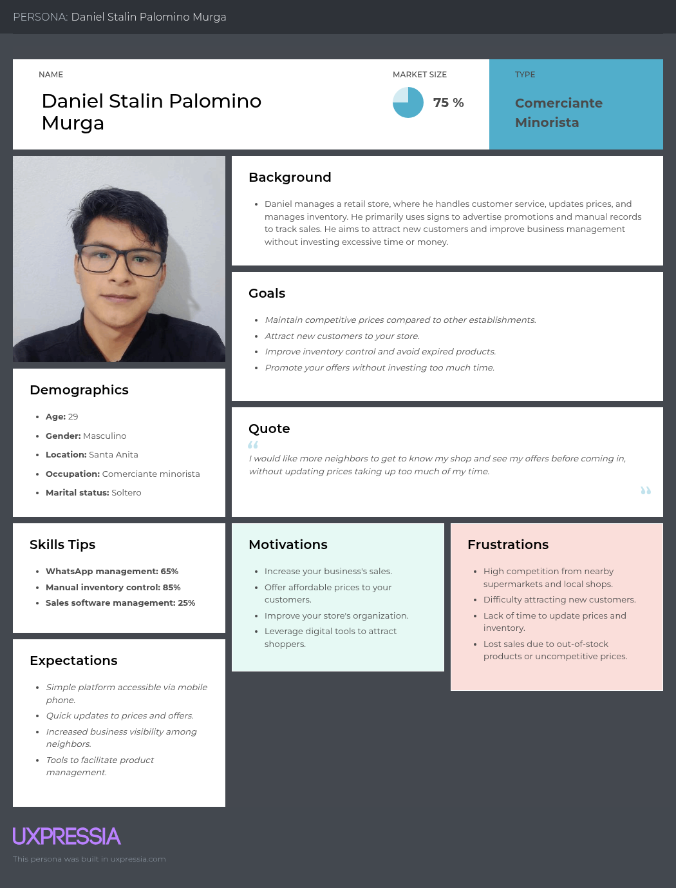
> *Figura 2.6: Ficha de User Persona correspondiente al Segmento 2, elaborada en UXPressia.*

### 2.3.2. User Task Matrix

En esta sección se presenta la matriz de tareas de usuario (*User Task Matrix*), diseñada para mapear y contrastar las actividades esenciales que ejecutan los representantes arquetípicos de cada segmento objetivo en su contexto cotidiano: el **Segmento 1: Compradores Independientes**, representado por Fernando Justiniano Vega (comprador metódico que busca optimizar su gasto y tiempo de traslado), y el **Segmento 2: Comerciantes Minoristas y Administradores de Tiendas Locales**, representado por Daniel Palomino Murga (bodeguero y administrador enfocado en la rentabilidad y visibilidad de su negocio).

Las actividades identificadas corresponden estrictamente a tareas del mundo real que cada actor realiza de manera habitual en su día a día para alcanzar sus metas de abastecimiento o gestión comercial, con total independencia de la existencia o uso de una solución tecnológica o software específico.

| Tarea del Mundo Real (*Task*) | Fernando Justiniano (Frecuencia) | Fernando Justiniano (Importancia) | Daniel Palomino (Frecuencia) | Daniel Palomino (Importancia) |
| :--- | :--- | :--- | :--- | :--- |
| **Calcular presupuesto estimado antes de pagar / cobrar** | Quincenal | Alta | Diaria | Alta |
| **Comparar costos de productos entre establecimientos** | Quincenal | Alta | Semanal | Media |
| **Monitorear precios del mercado y competencia en la zona** | Quincenal | Media | Diaria | Alta |
| **Planificar trayectos y transporte físico de compras** | Quincenal | Alta | Rara vez | Baja |
| **Verificar existencias y estado físico de productos (stock)** | Quincenal | Media | Diaria | Alta |
| **Actualizar y exhibir precios u ofertas vigentes** | N/A | N/A | Diaria | Alta |
| **Elaborar listas de artículos prioritarios a adquirir** | Quincenal | Alta | Semanal | Alta |
| **Comunicar promociones mediante carteles, pizarras o avisos** | N/A | N/A | Semanal | Media |
| **Buscar alternativas para atraer clientes o rotar mercancía** | N/A | N/A | Semanal | Alta |
| **Evaluar impacto de métodos de pago y promociones bancarias** | Quincenal | Media | Diaria | Media |

---

#### Análisis y hallazgos del User Task Matrix

A partir de la matriz de tareas consolidada, se identifican patrones clave de comportamiento, contrastes operativos e intersecciones estratégicas entre ambos perfiles:

* **Tareas con mayor frecuencia e importancia:**
  * Para **Daniel Palomino (Comerciante):** Las tareas más críticas y de periodicidad **diaria** son el *cálculo presupuestario y cuadre de caja*, la *actualización y exhibición de precios* y el *control de existencias y productos próximos a agotarse*. La supervivencia de su minimarket exige una supervisión continua del inventario y la rápida rotación de mercadería.
  * Para **Fernando Justiniano (Comprador):** Las tareas con mayor peso ocurren de forma **quincenal** (alineadas con su ciclo de aprovisionamiento salarial y reposición de alacena), destacando la *estimación anticipada del presupuesto*, la *planificación de los trayectos físicos* y la *comparación de precios multitienda*.
* **Principales coincidencias:**
  * Ambos actores le otorgan **alta importancia al control del dinero**: Fernando lo hace para no superar su límite de gasto familiar en caja y Daniel para resguardar el margen neto de ganancia de su negocio frente a aumentos de distribuidores.
  * Tanto el comprador como el comerciante necesitan **monitorear los precios de la zona**, confirmando que la transparencia del mercado y la asimetría de costos impactan a los dos extremos de la cadena comercial.
* **Principales diferencias operativas:**
  * **Movilidad vs. Localidad:** Mientras la *planificación de trayectos físicos de desplazamiento* es una tarea de alta importancia para Fernando (debido al impacto de los pasajes y el tráfico de Lima), para Daniel es prácticamente irrelevante en su día a día comercial al estar fijo en su local de atención.
  * **Visibilidad y Difusión:** Tareas como la *comunicación de promociones en carteles* y la *búsqueda de alternativas para atraer compradores* son exclusivas del comerciante minorista, quien asume el rol activo de captar el flujo peatonal frente a la competencia de grandes cadenas.

### 2.3.3. User Journey Mapping

En esta sección se modelan los *User Journey Maps* en su versión actual (*As-Is*) para cada uno de los arquetipos de usuario. El propósito de este artefacto es ilustrar el viaje de extremo a extremo (*end-to-end journey*) que experimenta cada actor en su realidad cotidiana —el comprador al abastecerse y el comerciante al gestionar y comercializar sus productos—, identificando las etapas del proceso, puntos de contacto, pensamientos, niveles de satisfacción y las fricciones críticas que enfrentan en ausencia de la plataforma Preciazo.

---

#### User Journey Map 1: Fernando Justiniano Vega (Segmento 1 - Comprador Multitienda)

El recorrido documenta la experiencia de Fernando al realizar sus compras de abastecimiento quincenal. La travesía inicia con la identificación de faltantes y la fijación de un presupuesto mental, continúa con el traslado físico a ciegas hacia los comercios de su zona (enfrentando tráfico y dispersión de precios), prosigue con la búsqueda de productos y la incertidumbre en caja, y concluye con el balance final entre el tiempo invertido en el transporte y el ahorro monetario obtenido.

> *Figura 2.7: Diagrama de User Journey Map (As-Is) correspondiente al Segmento 1, elaborado en UXPressia.*

---

#### User Journey Map 2: Daniel Stalin Palomino Murga (Segmento 2 - Comerciante Minorista y Administrador de Tienda Local)

El recorrido documenta la jornada típica de Daniel en la administración de su bodega en Santa Anita. La experiencia inicia con el ajuste de precios según el incremento fijado por los proveedores y el registro manual de inventario en un cuadernillo físico; continúa con la colocación de carteles en la entrada de su local y el envío de estados por WhatsApp para difundir ofertas; prosigue con la pérdida de ventas ocasionada por desabastecimiento de productos clave o clientes que encuentran mejores precios en la competencia zonal; y concluye con la necesidad de digitalizar sus precios de forma ágil desde el celular para comunicar quiebres de stock a tiempo, atraer nuevos compradores del barrio y evitar la merma de mercadería.

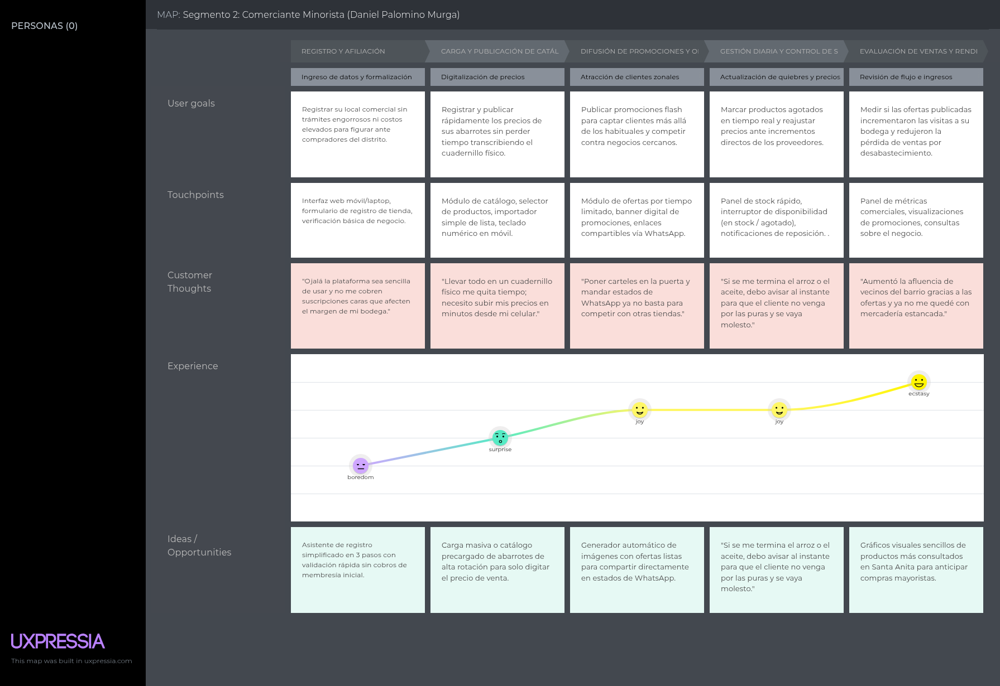
> *Figura 2.8: Diagrama de User Journey Map correspondiente al Segmento 2, elaborado en UXPressia.*
 
### 2.3.4. Empathy Mapping

En esta sección se sintetiza el proceso de empatización desarrollado para comprender a profundidad el entorno emocional, cognitivo y conductual de los arquetipos de usuario. La construcción de cada *Empathy Map* se estructuró situando a cada arquetipo en el centro del análisis para desglosar sus percepciones en torno a las dimensiones clave: qué piensa y siente, qué ve, qué oye, qué dice y hace, así como sus principales esfuerzos (*Pains*) y resultados esperados (*Gains*).

---

#### Empathy Map 1: Fernando Justiniano Vega (Segmento 1 - Comprador Multitienda)

El mapa de empatía de Fernando refleja la tensión constante entre la necesidad de ahorrar en la canasta básica y el desgaste generado por la ineficiencia del transporte urbano. Sus dolores se concentran en la asimetría de información de precios y las pérdidas de tiempo en el tráfico, mientras que sus ganancias se orientan al ahorro neto medible y al uso de una solución web ligera que agilice su toma de decisiones antes de salir de casa.

> *Figura 2.9: Mapa de empatía correspondiente al Segmento 1, elaborado en UXPressia.*

---

#### Empathy Map 2: Daniel Stalin Palomino Murga (Segmento 2 - Comerciante Minorista y Administrador de Tienda Local)

El mapa de empatía de Daniel documenta las presiones comerciales y operativas vinculadas a la administración de su bodega en el distrito de Santa Anita. Refleja la preocupación constante por la pérdida recurrente de ventas debido a quiebres de stock no detectados a tiempo, la desventaja frente a comercios con mejores precios y la dependencia de métodos manuales como cuadernos físicos (*Pains*). Asimismo, consolida la necesidad de contar con una plataforma intuitiva y económica que le permita actualizar precios al instante desde su smartphone, publicar ofertas locales para atraer nuevos vecinos y emitir alertas tempranas de mercadería agotada para optimizar la rentabilidad de su negocio (*Gains*).

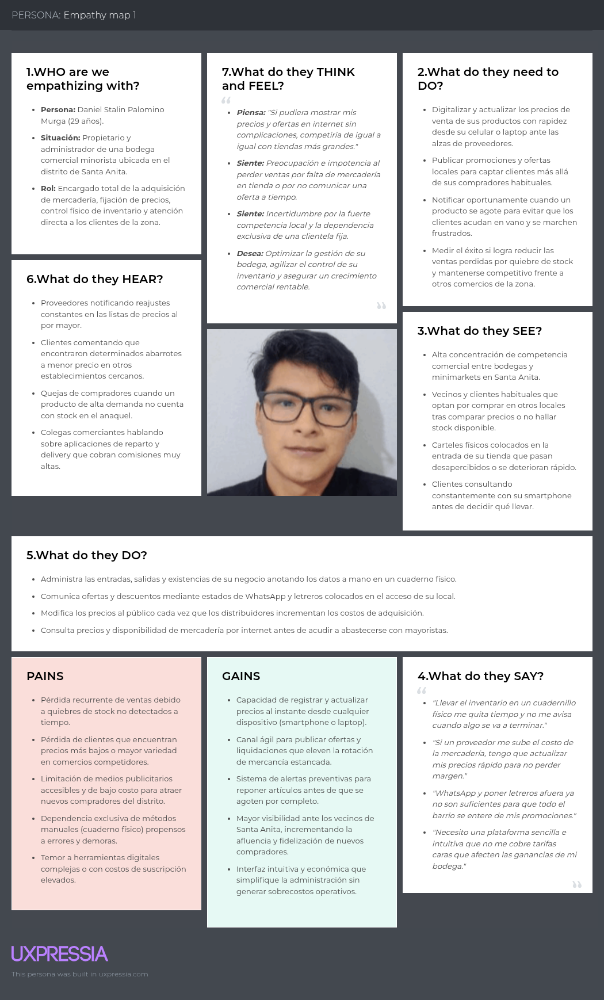
> *Figura 2.10: Mapa de empatía correspondiente al Segmento 2, elaborado en UXPressia.*

## 2.4. Big Picture Event Storming

Para modelar la complejidad del dominio de negocio y comprender integralmente los flujos operativos de la plataforma **Preciazo**, el equipo de la startup **PeruTech** llevó a cabo un taller colaborativo de *Big Picture Event Storming* siguiendo la guía metodológica de Domain-Driven Design (DDD). Esta dinámica visual de alto nivel facilitó un entendimiento compartido entre los desarrolladores de software y los requerimientos del negocio, permitiendo explorar exhaustivamente el *landscape* comercial, mapear los procesos fundamentales de aprovisionamiento y comercialización, y evidenciar de forma temprana los puntos críticos, riesgos y oportunidades de innovación tecnológica para ambos segmentos objetivo.

A continuación, se detalla el desarrollo secuencial del taller a través de sus fases progresivas:

---

### 2.4.1. Fase 1: Generación Abierta de Eventos (Open Space)

En esta fase inicial divergente, los integrantes del equipo registraron de manera abierta y sin restricciones de orden cronológico todos los eventos significativos ocurridos dentro del dominio de negocio (*Domain Events*), redactados estrictamente en tiempo verbal pasado sobre notas adhesivas de color naranja. El levantamiento abarcó todo el ciclo de vida de la interacción comercial y operativa: desde el registro e inicio de sesión de los usuarios, la afiliación de bodegas, la publicación y actualización de ofertas, el armado de canastas básicas y listas de compras, hasta la proyección presupuestaria, el cálculo de trayectos óptimos y la confirmación final de compra en el establecimiento físico.

> *Figura 2.11: Fase Open Space del Big Picture Event Storming, lluvia de ideas y registro no estructurado de eventos de dominio para Preciazo.*

---

### 2.4.2. Fase 2: Exploración y Línea de Tiempo (Explore)

Durante la fase de exploración y convergencia, el equipo estructuró una línea temporal secuencial orientando los eventos de dominio de izquierda a derecha según el flujo natural de las operaciones. En este análisis se incorporaron notas de color rojo/rosado para identificar puntos de dolor, cuellos de botella e incertidumbres críticas del dominio (*Hotspots*). Entre las fricciones expuestas destacaron la discrepancia entre precios exhibidos digitalmente y los cobrados en caja registradora, la saturación del tráfico limeño que encarece los traslados físicos, los quiebres imprevistos de stock en comercios minoristas y el riesgo de abandono de la plataforma ante interfaces complejas.

> *Figura 2.12: Fase Explore del Big Picture Event Storming, ordenamiento cronológico sobre la línea de tiempo y detección de Hotspots.*

---

### 2.4.3. Fase 3: Consolidación y Definición de Triggers (Close Space)

En el cierre del espacio de exploración, se refinó la línea temporal eliminando duplicidades y clarificando las transiciones del sistema. Se integraron los comandos desencadenantes (*Commands* / post-it azules) que representan las intenciones y acciones operadas por los actores primarios (el comprador independiente y el comerciante minorista), así como las políticas y reglas de negocio reactivas (*Policies* / post-it lilas). Estas políticas modelan la lógica automática del sistema, tales como la emisión de alertas preventivas cuando el costo acumulado de la canasta supera el presupuesto límite, la sugerencia de artículos sustitutos ante falta de existencias y la reconfiguración dinámica de rutas ante alertas de congestión vehicular.

> *Figura 2.13: Fase Close Space del Big Picture Event Storming, articulación de actores, comandos ejecutores y políticas de dominio.*

---

### 2.4.4. Fase 4: Modelo Final del Dominio (Final Landscape)

Como resultado definitivo del taller colaborativo, se consolidó el mapa general del dominio (*Business Landscape*) para la plataforma **Preciazo**, estructurado por el equipo de **PeruTech**. Este artefacto articula de forma holística los eventos, comandos, reglas y sistemas externos en torno a los subdominios clave del negocio: gestión de perfiles e identidad (consumidores y comercios afiliados), catálogo estructurado de productos y tarifas en góndola, planificación colaborativa de presupuestos familiares, y motor de geolocalización para optimización de rutas comerciales.

> *Figura 2.14: Modelo consolidado del Big Picture Event Storming para Preciazo, desarrollado por el equipo de PeruTech.*

### 2.5. Ubiquitous Language

En esta sección se define el *Ubiquitous Language* (Lenguaje Ubicuo) para el dominio de Preciazo, desarrollado por la startup PeruTech, siguiendo los principios de modelado estratégico de *Domain-Driven Design* (DDD) formulados por Eric Evans. Este glosario formal unifica el vocabulario compartido entre los desarrolladores, los expertos del dominio y los usuarios finales (consumidores y comerciantes), eliminando ambigüedades operativas. Se enfoca estrictamente en términos de la dinámica comercial minorista, abastecimiento presencial y movilidad urbana:

* **Affiliated Store (Tienda Afiliada):** Establecimiento comercial físico (bodega, minimarket o puesto de abastos) cuyos datos registrales han sido formalmente validados para exhibir su catálogo y ofertas en la plataforma.
* **Affiliation Request (Solicitud de Afiliación):** Trámite inicial mediante el cual un comerciante minorista registra los datos de su negocio y su identificación fiscal para integrarse a la red del sistema.
* **Basic Basket (Canasta Básica):** Conjunto estructurado de bienes y alimentos de primera necesidad requeridos para el consumo periódico de una persona o grupo familiar.
* **Crowdsourced Verification (Verificación Colaborativa):** Mecanismo mediante el cual la comunidad de compradores confirma, actualiza o reporta la vigencia de los precios y el stock físico observado en góndola.
* **Multi-stop Route (Ruta Multiparada):** Itinerario secuencial de desplazamiento físico que conecta el punto de origen del comprador con múltiples locales comerciales optimizados geográficamente.
* **Net Savings (Ahorro Neto):** Diferencia económica positiva resultante de deducir el gasto logístico de transporte (pasajes o combustible) del ahorro monetario bruto obtenido por la dispersión de precios en góndola.
* **Optimal Purchase Stop (Punto Óptimo de Compra):** Establecimiento comercial sugerido por el sistema al ofrecer el mejor balance entre proximidad geográfica, disponibilidad de artículos y menor precio de canasta.
* **Price Discrepancy (Discrepancia de Precio):** Desfase identificado entre el precio de venta publicado digitalmente o exhibido en anaquel y el importe real cobrado en la caja registradora.
* **Price Dispersion (Dispersión de Precios):** Variación del precio de venta de un mismo producto idéntico entre distintos establecimientos comerciales de una misma zona o distrito.
* **Product Catalog (Catálogo de Productos):** Conjunto indexado de artículos y bienes de consumo masivo clasificados por marca, categoría y presentación estándar.
* **Purchase Budget (Presupuesto de Compra):** Techo financiero monetario definido por el consumidor antes de salir a comprar para controlar su nivel de gasto.
* **Purchase Item (Artículo de Compra):** Bien individual definido por nombre, marca, formato y unidad de medida que integra la lista de compras del usuario.
* **Retail Store (Comercio Minorista):** Punto de venta físico dedicado a la comercialización directa de bienes de consumo al comprador presencial.
* **Shopping List (Lista de Compras):** Registro organizado de los artículos que el consumidor planifica adquirir durante su jornada de compra.
* **Store Administrator (Administrador de Tienda):** Propietario o encargado formal del establecimiento comercial responsable de la publicación de precios, control de promociones y gestión del perfil del local.
* **Store Offer (Oferta de Tienda):** Reducción temporal de precio o promoción especial publicada por un comercio afiliado para incentivar la afluencia de compradores locales.
* **Substituted Good (Bien Sustituto):** Producto de características o valor nutricional equivalente que el comprador selecciona como alternativa cuando el artículo preferente no tiene stock o excede su presupuesto.
* **SUNAT Verification (Validación SUNAT):** Verificación del estado del Registro Único de Contribuyentes (RUC) y la condición fiscal activa del comercio antes de habilitar su visibilidad pública.
* **Transit Overhead (Sobrecosto de Desplazamiento):** Demora temporal y gasto adicional de movilidad en los que incurre un comprador debido al tráfico urbano o a la lejanía entre tiendas.
* **Unit Price (Precio Unitario):** Costo por unidad estándar de medida (kilogramo, litro, paquete) que permite comparar con equidad el valor real de productos con diferentes tamaños de empaque.

# Capítulo III: Requirements Specification

## 3.1. User Stories
---

En esta sección se especifican los requisitos funcionales y técnicos de la plataforma **Preciazo** (desarrollada por **PeruTech**) mediante Epics, User Stories y Technical Stories, derivados de los hallazgos cualitativos del proceso de Needfinding, las entrevistas a usuarios y el modelado del dominio de negocio. La redacción sigue el enfoque de diseño centrado en el usuario, estructurando cada descripción bajo el estándar formal de rol, necesidad y beneficio (*"Como [rol], deseo [necesidad] para [beneficio]"*).

Asimismo, los criterios de aceptación se definen bajo la sintaxis formal de Gherkin (*Given-When-Then*), redactados en tiempo presente, tercera persona y prescindiendo de detalles de interfaz gráfica (como botones, pantallas o clics), asegurando su comprobabilidad tanto en la experiencia web interactiva como en los contratos de servicio del RESTful API.

A continuación, se definen los Epics identificados que agrupan funcionalmente los requisitos del sistema:
* **EP01: Plataforma Informativa y Landing Page:** Difusión pública del servicio, propuesta de valor y captación de visitantes.
* **EP02: Gestión de Identidad y Perfiles:** Registro, autenticación y configuración de preferencias para compradores y comercios.
* **EP03: Planificación y Control Presupuestario:** Elaboración de listas de compras y control financiero preventivo en tiempo real.
* **EP04: Comparación de Mercado y Ruteo Inteligente:** Comparativa multiestablecimiento, optimización de traslados y bienes sustitutos.
* **EP05: Gestión de Ofertas y Catálogo Minorista:** Administración simplificada de precios, promociones y existencias para comercios barriales.
* **EP06: Inteligencia Colectiva y Moderación Comunitaria:** Verificación colaborativa de precios en góndola y reporte de discrepancias.
* **EP07: Núcleo de Servicios Backend y RESTful API:** Servicios de backend, endpoints de integración y reglas de persistencia.

| Epic / Story ID | Título | Descripción | Criterios de Aceptación | Relacionado con (Epic ID) |
| :--- | :--- | :--- | :--- | :--- |
| **US01** | Landing: Propuesta de valor | Como visitante, deseo visualizar la propuesta central del servicio para comprender cómo optimizar mis compras y tiempos de traslado. | **Escenario 1: Carga inicial de la propuesta.** Dado que el visitante accede al sitio web estático, cuando se completa la carga inicial, entonces visualiza el mensaje central enfocado en la comparación multiestablecimiento y el cálculo de rutas de compra.  **Escenario 2: Comprensión del valor diferencial.** Dado que el visitante se desplaza hacia la sección de beneficios, cuando revisa la información comparativa, entonces comprende el impacto de la dispersión de precios entre comercios minoristas y tiendas de conveniencia.  **Escenario 3: Adaptabilidad de visualización.** Dado que el visitante accede desde un navegador web móvil, cuando visualiza el contenido, entonces la disposición de los bloques y textos se adapta fluidamente sin desbordamientos ni solapamientos. | EP01 |
| **US02** | Landing: Segmentos objetivo | Como visitante, deseo conocer a qué perfiles está orientada la solución para identificar si resuelve mis necesidades de abastecimiento o comercio. | **Escenario 1: Visualización diferenciada por segmento.** Dado que el visitante navega en la sección de perfiles, cuando interactúa con los módulos informativos, entonces visualiza las funciones orientadas al Comprador Independiente y al Comerciante Minorista.  **Escenario 2: Redirección hacia registro.** Dado que el visitante selecciona el llamado a la acción correspondiente a su perfil, cuando ejecuta la acción, entonces es derivado al flujo de registro respectivo en la aplicación web. | EP01 |
| **US03** | Landing: Red de comercios aliados | Como visitante, deseo visualizar qué establecimientos y zonas cuentan con cobertura para verificar la disponibilidad del servicio. | **Escenario 1: Consulta de locales asociados.** Dado que el visitante consulta la sección de comercios, cuando visualiza la red registrada, entonces se listan los tipos de establecimientos minoristas participantes agrupados por sectores urbanos.  **Escenario 2: Explicación de cobertura.** Dado que el visitante revisa el alcance geográfico, cuando consulta las zonas activas, entonces visualiza los distritos con presencia y densidad de datos comerciales comprobados. | EP01 |
| **US04** | Landing: Registro de interés | Como visitante, deseo suscribir mi correo electrónico para recibir notificaciones sobre el lanzamiento y novedades de la plataforma. | **Escenario 1: Registro exitoso de correo.** Dado que el visitante introduce una dirección de correo con sintaxis válida, cuando confirma el envío, entonces el sistema almacena el registro y emite un mensaje de suscripción exitosa.  **Escenario 2: Validación de sintaxis errónea.** Dado que el visitante ingresa un formato de correo inválido, cuando intenta enviar los datos, entonces el sistema impide el envío y solicita la corrección del texto ingresado.  **Escenario 3: Correo previamente registrado.** Dado que el correo ingresado ya existe en la lista de difusión, cuando se procesa la solicitud, entonces el sistema informa que la dirección ya cuenta con una suscripción activa. | EP01 |
| **US05** | Landing: Preguntas frecuentes y soporte | Como visitante, deseo consultar una sección de preguntas frecuentes para aclarar el modelo de servicio y los canales de contacto. | **Escenario 1: Visualización de preguntas frecuentes.** Dado que el visitante accede a la sección informativa, cuando consulta los tópicos de ayuda, entonces el sistema despliega las respuestas sobre el funcionamiento del comparador y las condiciones para comercios afiliados.  **Escenario 2: Envío de consulta de soporte.** Dado que el visitante completa el formulario de contacto con datos válidos, cuando confirma el envío, entonces el sistema registra el mensaje y emite una confirmación de recepción. | EP01 |
| **US06** | Autenticación y acceso | Como comprador independiente, deseo iniciar sesión con mis credenciales registradas para gestionar mis listas y presupuesto. | **Escenario 1: Inicio de sesión válido.** Dado que el usuario introduce credenciales registradas y correctas, cuando solicita el ingreso, entonces el sistema valida la identidad y da acceso al entorno principal.  **Escenario 2: Credenciales no coincidentes.** Dado que el usuario ingresa una combinación incorrecta de credenciales, cuando intenta iniciar sesión, entonces el sistema deniega el acceso y muestra una notificación de autenticación fallida.  **Escenario 3: Bloqueo por seguridad.** Dado que se registran múltiples intentos fallidos consecutivos, cuando se alcanza el umbral de seguridad, entonces el sistema bloquea temporalmente el acceso y solicita comprobación de seguridad. | EP02 |
| **US07** | Gestión de comercios favoritos | Como comprador independiente, deseo guardar mis establecimientos de confianza para priorizar sus ofertas en mis consultas diarias. | **Escenario 1: Asignación de comercio preferente.** Dado que el usuario marca un local como habitual, cuando realiza búsquedas de canasta, entonces el sistema prioriza los precios de dicho establecimiento en la vista de resultados.  **Escenario 2: Retiro de preferencia.** Dado que el usuario desmarca el local de su lista de favoritos, cuando actualiza sus parámetros, entonces el sistema restablece el ordenamiento geográfico estándar. | EP02 |
| **US08** | Creación de lista de compras | Como comprador independiente, deseo crear una lista de productos requeridos para estructurar mi jornada de abastecimiento. | **Escenario 1: Inicialización de lista.** Dado que el usuario inicia la confección de una lista, cuando define un nombre identificador, entonces el sistema genera el contenedor de compras asociado a su perfil.  **Escenario 2: Asignación por defecto.** Dado que el usuario omite asignar un nombre específico, cuando confirma la creación, entonces el sistema asigna una denominación automática basada en la fecha y hora actual. | EP03 |
| **US09** | Agregado de ítems a la lista | Como comprador independiente, deseo buscar y agregar artículos específicos a mi lista para consolidar mi canasta básica. | **Escenario 1: Inclusión de artículo.** Dado que el usuario localiza un producto en el catálogo general, cuando define la cantidad requerida, entonces el artículo se vincula a su lista activa.  **Escenario 2: Incremento de cantidad existente.** Dado que un artículo ya forma parte de la lista, cuando el usuario lo selecciona nuevamente, entonces el sistema suma la cantidad ingresada sin generar registros duplicados. | EP03 |
| **US10** | Fijación de presupuesto límite | Como comprador independiente, deseo configurar un tope de gasto para mi lista de compras para controlar mi economía personal. | **Escenario 1: Configuración de umbral.** Dado que el usuario introduce un monto monetario mayor a cero, cuando guarda el parámetro, entonces el sistema fija dicho valor como umbral máximo para la lista.  **Escenario 2: Entrada no válida.** Dado que el usuario introduce un monto menor o igual a cero, cuando intenta guardar el parámetro, entonces el sistema descarta el valor y solicita un importe válido. | EP03 |
| **US11** | Alerta de rebase presupuestario | Como comprador independiente, deseo recibir una advertencia cuando la sumatoria de mi lista supere el presupuesto establecido para ajustar mi selección. | **Escenario 1: Detección de exceso presupuestario.** Dado que la suma del costo proyectado de los artículos supera el límite fijado, cuando se agrega un nuevo producto, entonces el sistema emite una alerta visual de exceso presupuestario.  **Escenario 2: Restablecimiento del límite.** Dado que el usuario retira productos o reduce cantidades, cuando el monto total vuelve a estar dentro del presupuesto permitido, entonces la alerta se desactiva de forma automática. | EP03 |
| **US12** | Modo de jornada de compra en local | Como comprador independiente, deseo marcar los artículos conforme los coloco en mi canasta para verificar el gasto acumulado en tiempo real. | **Escenario 1: Marcado de artículo adquirido.** Dado que el usuario se encuentra en el local comercial, cuando marca un producto como recogido, entonces el sistema lo señala como adquirido y suma su importe al total proyectado en caja.  **Escenario 2: Desmarcado de producto.** Dado que el usuario decide descartar un producto previamente marcado, cuando revierte la selección, entonces el sistema descuenta el importe del total acumulado. | EP03 |
| **US13** | Comparativa multiestablecimiento | Como comprador independiente, deseo comparar el costo total de mi lista entre locales comerciales cercanos para identificar el menor costo de compra. | **Escenario 1: Generación de tabla comparativa.** Dado que la lista de compras cuenta con artículos definidos, cuando el usuario solicita la comparativa, entonces el sistema presenta los comercios ordenados por el costo total de la canasta.  **Escenario 2: Disponibilidad parcial de productos.** Dado que un comercio no dispone de la totalidad de los artículos de la lista, cuando se procesa la comparativa, entonces el sistema advierte qué productos se encuentran ausentes en dicho punto. | EP04 |
| **US14** | Cálculo de ruta de compra eficiente | Como comprador independiente, deseo obtener un itinerario secuencial de paradas óptimas para reducir mi tiempo de traslado y costo de transporte. | **Escenario 1: Generación de itinerario de paradas.** Dado que el usuario selecciona los locales comerciales de compra, cuando solicita la optimización de traslado, entonces el sistema genera una secuencia de recorrido que minimiza la distancia total a recorrer.  **Escenario 2: Estimación de tiempos de viaje.** Dado que se calcula la ruta entre los establecimientos, cuando se despliega el resumen del itinerario, entonces se indica el tiempo estimado global considerando la modalidad de traslado seleccionada. | EP04 |
| **US15** | Sugerencia de bienes sustitutos | Como comprador independiente, deseo recibir recomendaciones de productos alternativos más económicos para disminuir el monto total a pagar. | **Escenario 1: Detección de sustituto accesible.** Dado que un producto seleccionado posee un sustituto de características análogas a menor costo, cuando se evalúa la lista, entonces el sistema sugiere el cambio de artículo indicando el ahorro potencial.  **Escenario 2: Aplicación del cambio.** Dado que el usuario acepta la alternativa sugerida, cuando confirma el reemplazo, entonces el sistema actualiza la lista y recalcula de forma inmediata el total estimado. | EP04 |
| **US16** | Comparación por unidad de medida | Como comprador independiente, deseo comparar el costo por unidad de medida (kilogramo o litro) para evaluar presentaciones con distinto gramaje. | **Escenario 1: Cálculo de precio normalizado.** Dado que los artículos cuentan con peso o volumen registrado, cuando el usuario visualiza la comparativa, entonces el sistema calcula y exhibe el costo por unidad estándar de medida.  **Escenario 2: Omisión por datos insuficientes.** Dado que un artículo carece del registro de gramaje en su ficha técnica, cuando se procesa la comparativa, entonces el sistema omite el cálculo unitario mostrando únicamente el precio final en góndola. | EP04 |
| **US17** | Búsqueda por filtros de proximidad | Como comprador independiente, deseo filtrar comercios dentro de un radio caminable específico para evitar traslados excesivamente largos. | **Escenario 1: Aplicación de radio de búsqueda.** Dado que el usuario define una distancia máxima de desplazamiento (ej. 800 metros), cuando ejecuta la búsqueda, entonces el sistema restringe los resultados a los comercios situados dentro del perímetro señalado.  **Escenario 2: Ausencia de locales en el perímetro.** Dado que no existen establecimientos dentro del radio fijado, cuando concluye la consulta, entonces el sistema sugiere ampliar el rango de búsqueda al siguiente intervalo disponible. | EP04 |
| **US18** | Registro de compras recurrentes | Como comprador independiente, deseo guardar una canasta base como plantilla para reutilizarla en compras quincenales sin reingresar productos. | **Escenario 1: Guardado de plantilla.** Dado que el usuario concluye una lista de compras, cuando la guarda como plantilla recurrente, entonces el sistema genera una copia maestra en su perfil.  **Escenario 2: Instanciación de nueva lista.** Dado que el usuario inicia un nuevo ciclo de compra, cuando selecciona su plantilla guardada, entonces el sistema genera una lista activa con los precios actualizados a la fecha. | EP03 |
| **US19** | Historial de precios de producto | Como comprador independiente, deseo consultar la evolución histórica del valor de un bien para evaluar la conveniencia de una oferta. | **Escenario 1: Consulta de variación temporal.** Dado que el usuario selecciona un artículo específico, cuando consulta su registro de variaciones, entonces el sistema exhibe el comportamiento de su precio durante los últimos 30 días.  **Escenario 2: Ausencia de histórico.** Dado que un artículo es de reciente incorporación, cuando se solicita su histórico, entonces el sistema informa que solo se cuenta con el precio de registro inicial. | EP04 |
| **US20** | Recálculo dinámico de ruta | Como comprador independiente, deseo reordenar mi trayecto de compra si un local se encuentra cerrado o inaccesible. | **Escenario 1: Omisión de parada.** Dado que el usuario omite un establecimiento de su itinerario activo, cuando confirma la modificación, entonces el algoritmo recalcula la secuencia restante minimizando la distancia.  **Escenario 2: Reasignación de comercio.** Dado que el usuario solicita un reemplazo para el local omitido, cuando el sistema evalúa la zona, entonces asigna la tienda cercana con el siguiente mejor precio de canasta. | EP04 |
| **US21** | Registro y afiliación de tienda | Como comerciante minorista, deseo registrar los datos de mi establecimiento para integrar mi negocio al mapa comercial de la plataforma. | **Escenario 1: Ingreso de datos registrales.** Dado que el comerciante remite su RUC, razón social, dirección y coordenadas geográficas, cuando envía la solicitud, entonces el sistema genera el registro en estado pendiente de validación fiscal.  **Escenario 2: Control de duplicidad comercial.** Dado que el identificador fiscal ingresado ya se encuentra registrado, cuando se procesa la solicitud, entonces el sistema notifica la existencia previa de la tienda impidiendo registros repetidos. | EP02 |
| **US22** | Configuración de horarios comerciales | Como comerciante minorista, deseo indicar los horarios de atención de mi local para que los compradores conozcan cuándo pueden acudir. | **Escenario 1: Registro de turno regular.** Dado que el comerciante especifica sus horas de apertura y cierre por día de la semana, cuando guarda los parámetros, entonces el sistema despliega el estado de atención en el mapa de ruta.  **Escenario 2: Actualización de estado en tiempo real.** Dado que la hora del sistema se encuentra fuera del rango configurado, cuando un comprador consulta el comercio, entonces el sistema indica que el local se encuentra cerrado. | EP02 |
| **US23** | Publicación de precios en catálogo | Como comerciante minorista, deseo registrar y actualizar los precios de venta de mis productos para mantener informados a los compradores de la zona. | **Escenario 1: Actualización de precio unitario.** Dado que el comerciante selecciona un producto de su inventario, cuando ingresa un nuevo valor de venta y confirma la acción, entonces el sistema actualiza el dato en el catálogo público.  **Escenario 2: Validación de valor positivo.** Dado que el comerciante ingresa un monto menor o igual a cero, cuando intenta guardar el cambio, entonces el sistema rechaza el valor solicitando un precio de venta positivo. | EP05 |
| **US24** | Publicación de ofertas de tienda | Como comerciante minorista, deseo publicar promociones por tiempo limitado para acelerar la rotación de artículos y atraer mayor afluencia. | **Escenario 1: Creación de promoción.** Dado que el comerciante define un producto, precio rebajado y rango de vigencia temporal, cuando activa la oferta, entonces el sistema la expone como oferta especial en el sector geográfico.  **Escenario 2: Caducidad automática de oferta.** Dado que se alcanza la fecha u hora límite de la promoción, cuando expira el periodo, entonces el sistema retira la condición de oferta restableciendo el precio habitual. | EP05 |
| **US25** | Reporte de agotamiento de stock | Como comerciante minorista, deseo marcar artículos sin disponibilidad física en mi local para evitar desplazamientos infructuosos de los clientes. | **Escenario 1: Cambio a estado sin stock.** Dado que un producto agota sus existencias en tienda, cuando el comerciante actualiza su disponibilidad en el panel, entonces el sistema lo excluye de los cálculos inmediatos de canasta para ese local.  **Escenario 2: Restablecimiento de existencias.** Dado que el local repone existencias, cuando el comerciante marca nuevamente el artículo como disponible, entonces se reactiva su visibilidad en el comparador zonal. | EP05 |
| **US26** | Carga estructurada de catálogo | Como comerciante minorista, deseo importar una lista estructurada de artículos y precios para actualizar mi inventario de forma ágil. | **Escenario 1: Procesamiento de archivo de inventario.** Dado que el comerciante remite un archivo de datos con el formato y columnas requeridas, cuando el sistema procesa el contenido, entonces actualiza los registros de precios y existencias en el catálogo del local.  **Escenario 2: Detección de inconsistencias de formato.** Dado que el archivo remitido presenta celdas vacías o valores numéricos erróneos, cuando el validador analiza el documento, entonces cancela la importación e indica las líneas con errores para su corrección. | EP05 |
| **US27** | Panel de rendimiento comercial | Como comerciante minorista, deseo consultar métricas de visualización de mis promociones para evaluar el impacto de mis precios publicados. | **Escenario 1: Conteo de apariciones en rutas.** Dado que los compradores generan itinerarios en la zona, cuando el comerciante ingresa a su panel de control, entonces visualiza la cantidad de veces que su establecimiento fue sugerido como parada óptima durante el mes.  **Escenario 2: Métricas de ofertas consultadas.** Dado que el comerciante mantiene promociones vigentes, cuando consulta las estadísticas, entonces visualiza el número de usuarios que interactuaron con sus productos destacados. | EP05 |
| **US28** | Reporte colaborativo de discrepancia | Como comprador independiente, deseo reportar cuando un precio en góndola difiere del valor registrado en el sistema para colaborar con la comunidad. | **Escenario 1: Envío de reporte de precio.** Dado que el usuario detecta un precio distinto en góndola, cuando remite el nuevo valor observado, entonces el sistema genera un evento de verificación comunitaria.  **Escenario 2: Control de valores anómalos.** Dado que el usuario remite un valor extremadamente desproporcionado respecto a la media histórica, cuando se procesa el reporte, entonces el sistema lo retiene para moderación. | EP06 |
| **US29** | Confirmación comunitaria de datos | Como comprador independiente, deseo validar los reportes de precios efectuados por otros usuarios para consolidar la confiabilidad de la información. | **Escenario 1: Aprobación de reporte.** Dado que un comprador se encuentra en el establecimiento y verifica el precio reportado, cuando emite su confirmación favorable, entonces el sistema incrementa el índice de confianza del dato.  **Escenario 2: Rechazo de información errónea.** Dado que un comprador constata que el precio reportado no es verídico, cuando emite una calificación desfavorable, entonces el sistema disminuye la confiabilidad del reporte. | EP06 |
| **TS01** | API de autenticación y tokens | Como Developer, deseo implementar el endpoint de autenticación con JWT para asegurar el acceso a los servicios de la plataforma. | **Escenario 1: Emisión exitosa de JWT.** Dado un requerimiento POST a `/api/v1/auth/login` con credenciales válidas en formato JSON, cuando el servicio valida la identidad del usuario, entonces responde con un código HTTP 200 OK y el token de acceso correspondiente.  **Escenario 2: Denegación de acceso.** Dado un requerimiento POST a `/api/v1/auth/login` con contraseña no coincidente, cuando el servicio procesa la solicitud, entonces responde con un código HTTP 401 Unauthorized y el mensaje de error respectivo. | EP07 |
| **TS02** | API de cálculo comparativo de canasta | Como Developer, deseo proveer un endpoint para computar el costo total de una lista de productos en los comercios registrados en un radio geográfico. | **Escenario 1: Procesamiento comparativo exitoso.** Dado un requerimiento POST a `/api/v1/baskets/compare` con la lista de identificadores de productos y coordenadas geográficas, cuando el motor calcula las sumatorias, entonces responde con un código HTTP 200 OK y la lista de comercios con sus montos totales calculados.  **Escenario 2: Solicitud con lista vacía.** Dado un requerimiento POST con un cuerpo sin artículos, cuando el controlador evalúa la petición, entonces responde con un código HTTP 400 Bad Request indicando la ausencia de datos. | EP07 |
| **TS03** | API de optimización de rutas | Como Developer, deseo proveer un endpoint que ordene una secuencia de establecimientos según eficiencia de traslado. | **Escenario 1: Cálculo de itinerario óptimo.** Dado un requerimiento POST a `/api/v1/routes/optimize` conteniendo coordenadas de origen y paradas seleccionadas, cuando se procesa el ordenamiento, entonces responde con un código HTTP 200 OK entregando las paradas ordenadas y la distancia acumulada.  **Escenario 2: Punto inalcanzable.** Dado un requerimiento cuyas coordenadas no cuentan con conexión vial viable, cuando falla el algoritmo de ruteo, entonces responde con un código HTTP 422 Unprocessable Entity y la descripción del fallo. | EP07 |
| **TS04** | API de validación fiscal de establecimientos | Como Developer, deseo integrar un servicio de verificación de RUC contra entidades oficiales para constatar la vigencia legal de los comercios afiliados. | **Escenario 1: Verificación de comercio activo.** Dado un requerimiento GET a `/api/v1/merchants/validate-ruc/{ruc}` con un identificador válido de 11 dígitos, cuando el servicio consulta la fuente registral, entonces responde con un código HTTP 200 OK y el estado formal del contribuyente.  **Escenario 2: Tiempo de respuesta excedido.** Dado que el servicio externo de consulta fiscal demora más de 5000 milisegundos, cuando expira el tiempo límite, entonces el servicio responde con un código HTTP 504 Gateway Timeout controlado sin suspender la ejecución del sistema. | EP07 |
| **TS05** | API de sincronización de catálogo | Como Developer, deseo proveer un endpoint para la actualización en bloque de inventario de tiendas mediante solicitudes en formato JSON. | **Escenario 1: Recepción de lote de productos.** Dado un requerimiento PUT a `/api/v1/merchants/{id}/inventory` con un arreglo de artículos y precios, cuando el servicio valida la estructura, entonces actualiza la base de datos y responde con un código HTTP 200 OK.  **Escenario 2: Solicitud con identificador no autorizado.** Dado un requerimiento con credenciales que no corresponden al establecimiento consultado, cuando se procesa la llamada, entonces el servicio responde con un código HTTP 403 Forbidden. | EP07 |
| **TS06** | API de consulta de catálogo zonal | Como Developer, deseo proveer un endpoint con paginación para consultar artículos disponibles por categoría y distrito. | **Escenario 1: Consulta paginada exitosa.** Dado un requerimiento GET a `/api/v1/products?category={cat}&district={dist}&page=0&size=20`, cuando el servicio ejecuta la consulta, entonces responde con un código HTTP 200 OK y el listado ordenado de productos.  **Escenario 2: Parámetros de paginación inválidos.** Dado un requerimiento con un valor de página negativo, cuando el controlador evalúa la petición, entonces responde con un código HTTP 400 Bad Request. | EP07 |
| **TS07** | API de registro de eventos de reporte | Como Developer, deseo implementar un endpoint para almacenar las confirmaciones y discrepancias emitidas por los usuarios sobre los precios. | **Escenario 1: Registro de reporte comunitario.** Dado un requerimiento POST a `/api/v1/reports/prices` con el ID del producto, ID de tienda y nuevo precio, cuando el servicio procesa la solicitud, entonces persiste el reporte y responde con un código HTTP 201 Created.  **Escenario 2: Reporte duplicado en ventana temporal.** Dado un usuario que intenta emitir múltiples reportes sobre el mismo artículo en menos de 60 segundos, cuando el filtro de seguridad lo detecta, entonces responde con un código HTTP 429 Too Many Requests. | EP07 |
| **TS08** | API de gestión de promociones de tienda | Como Developer, deseo implementar endpoints CRUD para la administración del ciclo de vida de ofertas emitidas por comerciantes. | **Escenario 1: Creación de promoción.** Dado un requerimiento POST a `/api/v1/promotions` con artículo, precio y vigencia, cuando el servicio confirma la titularidad del local, entonces crea la oferta y responde con un código HTTP 201 Created.  **Escenario 2: Vigencia incoherente.** Dado un requerimiento cuya fecha de fin es anterior a la fecha de inicio, cuando el modelo valida los datos, entonces responde con un código HTTP 422 Unprocessable Entity. | EP07 |

## 3.2. Impact Mapping

En esta sección se presenta el *Impact Mapping* desarrollado para alinear los objetivos estratégicos de negocio con las capacidades funcionales de la plataforma **Preciazo** de **PeruTech**. Mediante este artefacto visual se establece la trazabilidad formal entre los objetivos medibles de la organización (*Business Goals* formulados bajo el estándar SMART), los actores clave (*Actors/Personas*), los cambios esperados de comportamiento (*Impacts*), las entregas o soluciones de software (*Deliverables*) y las historias de usuario asociadas en formato canónico (*User Stories*).

### Business Goals del Proyecto (Criterios SMART)
* **BG01:** Reducir en un 15% el gasto promedio quincenal de canasta básica y en un 20% el tiempo invertido en desplazamientos para 10,000 compradores urbanos independientes en Lima Metropolitana durante los primeros 6 meses de operación.
* **BG02:** Incrementar la base de retención activa mensual (MAU) de compradores al 35% en los primeros 4 meses mediante el uso de listas de compras con presupuesto dinámico.
* **BG03:** Afiliar a 500 comercios minoristas locales (bodegas y minimarkets) en distritos de alta densidad comercial durante los primeros 6 meses, logrando que al menos el 60% actualice su catálogo semanalmente.
* **BG04:** Incrementar en un 20% la rotación de mercancías y liquidaciones en tiendas de proximidad afiliadas durante el primer trimestre de suscripción activa.

---

### 3.2.1. Impact Mapping - Segmento #1: Comprador Independiente

Este mapa articula cómo el actor **Fernando Justiniano** colabora en la consecución de las metas de ahorro, reducción de tiempos y fidelización del comprador.

*Figura 3.1: Impact Mapping para el Segmento Comprador Independiente.*

#### Desglose de Relaciones y User Stories Asociadas:
* **Impacto 1: Compara precios de su canasta completa entre tiendas cercanas de forma instantánea sin visitar físicamente cada local.**
  * *Deliverable: EP04 - Motor de Comparativa y Optimización de Rutas.*
    * **US13:** Como comprador independiente, deseo comparar el costo total de mi lista entre locales comerciales cercanos para identificar el menor costo de compra.
    * **US15:** Como comprador independiente, deseo recibir recomendaciones de productos alternativos más económicos para disminuir el monto total a pagar.
    * **US16:** Como comprador independiente, deseo comparar el costo por unidad de medida (kilogramo o litro) para evaluar presentaciones con distinto gramaje.
    * **US17:** Como comprador independiente, deseo filtrar comercios dentro de un radio caminable específico para evitar traslados excesivamente largos.
  * *Deliverable: EP07 - Servicios API RESTful.*
    * **TS02:** Como Developer, deseo proveer un endpoint para computar el costo total de una lista de productos en los comercios registrados en un radio geográfico.
    * **TS06:** Como Developer, deseo proveer un endpoint con paginación para consultar artículos disponibles por categoría y distrito.

* **Impacto 2: Minimiza el tiempo de recorrido y distancia caminada en sus jornadas de compra.**
  * *Deliverable: EP04 - Motor de Comparativa y Optimización de Rutas.*
    * **US14:** Como comprador independiente, deseo obtener un itinerario secuencial de paradas óptimas para reducir mi tiempo de traslado y costo de transporte.
  * *Deliverable: EP07 - Servicios API RESTful.*
    * **TS03:** Como Developer, deseo proveer un endpoint que ordene una secuencia de establecimientos según eficiencia de traslado.

* **Impacto 3: Planifica y controla el techo de gasto de sus compras para no sobrepasar su presupuesto personal.**
  * *Deliverable: EP03 - Gestión de Listas de Compras y Presupuesto.*
    * **US08:** Como comprador independiente, deseo crear una lista de productos requeridos para estructurar mi jornada de abastecimiento.
    * **US09:** Como comprador independiente, deseo buscar y agregar artículos específicos a mi lista para consolidar mi canasta básica.
    * **US10:** Como comprador independiente, deseo configurar un tope de gasto para mi lista de compras para controlar mi economía personal.
    * **US11:** Como comprador independiente, deseo recibir una advertencia cuando la sumatoria de mi lista supere el presupuesto establecido para ajustar mi selección.
    * **US12:** Como comprador independiente, deseo marcar los artículos conforme los coloco en mi canasta para verificar el gasto acumulado en tiempo real.
  * *Deliverable: EP02 - Autenticación y Perfil.*
    * **US06:** Como comprador independiente, deseo iniciar sesión con mis credenciales registradas para gestionar mis listas y presupuesto.
    * **US07:** Como comprador independiente, deseo guardar mis establecimientos de confianza para priorizar sus ofertas en mis consultas diarias.

* **Impacto 4: Reporta y valida discrepancias de precio en góndola para asegurar datos fidedignos en la comunidad.**
  * *Deliverable: EP06 - Validación Comunitaria.*
    * **US28:** Como comprador independiente, deseo reportar cuando un precio en góndola difiere del valor registrado en el sistema para colaborar con la comunidad.
    * **US29:** Como comprador independiente, deseo validar los reportes de precios efectuados por otros usuarios para consolidar la confiabilidad de la información.
  * *Deliverable: EP07 - Servicios API RESTful.*
    * **TS07:** Como Developer, deseo implementar un endpoint para almacenar las confirmaciones y discrepancias emitidas por los usuarios sobre los precios.

---

### 3.2.2. Impact Mapping - Segmento #2: Comerciante Minorista

Este mapa articula cómo el actor **Daniel Palomino** contribuye a alcanzar las metas de digitalización barrial, captación de clientela y rotación de stock.

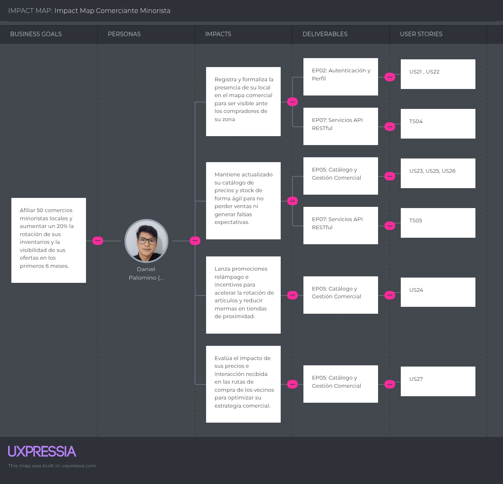

*Figura 3.2: Impact Mapping para el Segmento Comerciante Minorista.*

#### Desglose de Relaciones y User Stories Asociadas:
* **Impacto 1: Registra y formaliza la presencia de su local en el mapa comercial para ser visible ante los compradores de su zona.**
  * *Deliverable: EP02 - Autenticación y Perfil.*
    * **US21:** Como comerciante minorista, deseo registrar los datos de mi establecimiento para integrar mi negocio al mapa comercial de la plataforma.
    * **US22:** Como comerciante minorista, deseo indicar los horarios de atención de mi local para que los compradores conozcan cuándo pueden acudir.
  * *Deliverable: EP07 - Servicios API RESTful.*
    * **TS04:** Como Developer, deseo integrar un servicio de verificación de RUC contra entidades oficiales para constatar la vigencia legal de los comercios afiliados.

* **Impacto 2: Mantiene actualizado su catálogo de precios y stock de forma ágil para no perder ventas ni generar falsas expectativas.**
  * *Deliverable: EP05 - Catálogo y Gestión Comercial.*
    * **US23:** Como comerciante minorista, deseo registrar y actualizar los precios de venta de mis productos para mantener informados a los compradores de la zona.
    * **US25:** Como comerciante minorista, deseo marcar artículos sin disponibilidad física en mi local para evitar desplazamientos infructuosos de los clientes.
    * **US26:** Como comerciante minorista, deseo importar una lista estructurada de artículos y precios para actualizar mi inventario de forma ágil.
  * *Deliverable: EP07 - Servicios API RESTful.*
    * **TS05:** Como Developer, deseo proveer un endpoint para la actualización en bloque de inventario de tiendas mediante solicitudes en formato JSON.

* **Impacto 3: Lanza promociones relámpago e incentivos para acelerar la rotación de artículos y reducir mermas en tiendas de proximidad.**
  * *Deliverable: EP05 - Catálogo y Gestión Comercial.*
    * **US24:** Como comerciante minorista, deseo publicar promociones por tiempo limitado para acelerar la rotación de artículos y atraer mayor afluencia.
  * *Deliverable: EP07 - Servicios API RESTful.*
    * **TS08:** Como Developer, deseo implementar endpoints CRUD para la administración del ciclo de vida de ofertas emitidas por comerciantes.

* **Impacto 4: Evalúa el impacto de sus precios e interacción recibida en las rutas de compra de los vecinos para optimizar su estrategia comercial.**
  * *Deliverable: EP05 - Catálogo y Gestión Comercial.*
    * **US27:** Como comerciante minorista, deseo consultar métricas de visualización de mis promociones para evaluar el impacto de mis precios publicados.

## 3.3. Product Backlog

En esta sección se presenta el *Product Backlog* priorizado y estimado para la plataforma **Preciazo**, desarrollado por **PeruTech**. La priorización de los requisitos responde estrictamente al valor entregado al negocio y a los usuarios (*Business Value First*). Cumpliendo con los lineamientos del marco de trabajo Scrum y las directivas académicas, las historias vinculadas a la Landing Page se sitúan al inicio para viabilizar la captación temprana de usuarios en el primer sprint. Posteriormente, se integran las funcionalidades nucleares de cálculo comparativo de canasta, optimización de trayectos y gestión comercial para bodegas y minimarkets, relegando las tareas de autenticación y parametrización avanzada a etapas posteriores.

La estimación del esfuerzo de cada ítem fue establecida mediante la dinámica de *Planning Poker*, aplicando la secuencia estándar de Fibonacci para Story Points (1, 2, 3, 5 y 8 SP).

| # Orden | User Story Id | Título | Descripción | Story Points (1 / 2 / 3 / 5 / 8) |
| :---: | :---: | :--- | :--- | :---: |
| 1 | **US01** | Landing: Propuesta de valor | Como visitante, deseo visualizar la propuesta central del servicio para comprender cómo optimizar mis compras y tiempos de traslado. | 1 |
| 2 | **US02** | Landing: Segmentos objetivo | Como visitante, deseo conocer a qué perfiles está orientada la solución para identificar si resuelve mis necesidades de abastecimiento o comercio. | 1 |
| 3 | **US03** | Landing: Red de comercios aliados | Como visitante, deseo visualizar qué establecimientos y zonas cuentan con cobertura para verificar la disponibilidad del servicio. | 1 |
| 4 | **US04** | Landing: Registro de interés | Como visitante, deseo suscribir mi correo electrónico para recibir notificaciones sobre el lanzamiento y novedades de la plataforma. | 2 |
| 5 | **US05** | Landing: Preguntas frecuentes y soporte | Como visitante, deseo consultar una sección de preguntas frecuentes para aclarar el modelo de servicio y los canales de contacto. | 2 |
| 6 | **US13** | Comparativa multiestablecimiento | Como comprador independiente, deseo comparar el costo total de mi lista entre locales comerciales cercanos para identificar el menor costo de compra. | 8 |
| 7 | **US14** | Cálculo de ruta de compra eficiente | Como comprador independiente, deseo obtener un itinerario secuencial de paradas óptimas para reducir mi tiempo de traslado y costo de transporte. | 8 |
| 8 | **US17** | Búsqueda por filtros de proximidad | Como comprador independiente, deseo filtrar comercios dentro de un radio caminable específico para evitar traslados excesivamente largos. | 3 |
| 9 | **US15** | Sugerencia de bienes sustitutos | Como comprador independiente, deseo recibir recomendaciones de productos alternativos más económicos para disminuir el monto total a pagar. | 5 |
| 10 | **US16** | Comparación por unidad de medida | Como comprador independiente, deseo comparar el costo por unidad de medida (kilogramo o litro) para evaluar presentaciones con distinto gramaje. | 3 |
| 11 | **US21** | Registro y afiliación de tienda | Como comerciante minorista, deseo registrar los datos de mi establecimiento para integrar mi negocio al mapa comercial de la plataforma. | 5 |
| 12 | **US23** | Publicación de precios en catálogo | Como comerciante minorista, deseo registrar y actualizar los precios de venta de mis productos para mantener informados a los compradores de la zona. | 5 |
| 13 | **US24** | Publicación de ofertas de tienda | Como comerciante minorista, deseo publicar promociones por tiempo limitado para acelerar la rotación de artículos y atraer mayor afluencia. | 3 |
| 14 | **US25** | Reporte de agotamiento de stock | Como comerciante minorista, deseo marcar artículos sin disponibilidad física en mi local para evitar desplazamientos infructuosos de los clientes. | 2 |
| 15 | **US22** | Configuración de horarios comerciales | Como comerciante minorista, deseo indicar los horarios de atención de mi local para que los compradores conozcan cuándo pueden acudir. | 2 |
| 16 | **US08** | Creación de lista de compras | Como comprador independiente, deseo crear una lista de productos requeridos para estructurar mi jornada de abastecimiento. | 2 |
| 17 | **US09** | Agregado de ítems a la lista | Como comprador independiente, deseo buscar y agregar artículos específicos a mi lista para consolidar mi canasta básica. | 3 |
| 18 | **US10** | Fijación de presupuesto límite | Como comprador independiente, deseo configurar un tope de gasto para mi lista de compras para controlar mi economía personal. | 2 |
| 19 | **US11** | Alerta de rebase presupuestario | Como comprador independiente, deseo recibir una advertencia cuando la sumatoria de mi lista supere el presupuesto establecido para ajustar mi selección. | 3 |
| 20 | **US12** | Modo de jornada de compra en local | Como comprador independiente, deseo marcar los artículos conforme los coloco en mi canasta para verificar el gasto acumulado en tiempo real. | 5 |
| 21 | **US20** | Recálculo dinámico de ruta | Como comprador independiente, deseo reordenar mi trayecto de compra si un local se encuentra cerrado o inaccesible. | 5 |
| 22 | **US18** | Registro de compras recurrentes | Como comprador independiente, deseo guardar una canasta base como plantilla para reutilizarla en compras quincenales sin reingresar productos. | 3 |
| 23 | **US19** | Historial de precios de producto | Como comprador independiente, deseo consultar la evolución histórica del valor de un bien para evaluar la conveniencia de una oferta. | 3 |
| 24 | **US26** | Carga estructurada de catálogo | Como comerciante minorista, deseo importar una lista estructurada de artículos y precios para actualizar mi inventario de forma ágil. | 5 |
| 25 | **US27** | Panel de rendimiento comercial | Como comerciante minorista, deseo consultar métricas de visualización de mis promociones para evaluar el impacto de mis precios publicados. | 3 |
| 26 | **US28** | Reporte colaborativo de discrepancia | Como comprador independiente, deseo reportar cuando un precio en góndola difiere del valor registrado en el sistema para colaborar con la comunidad. | 3 |
| 27 | **US29** | Confirmación comunitaria de datos | Como comprador independiente, deseo validar los reportes de precios efectuados por otros usuarios para consolidar la confiabilidad de la información. | 3 |
| 28 | **US06** | Autenticación y acceso | Como comprador independiente, deseo iniciar sesión con mis credenciales registradas para gestionar mis listas y presupuesto. | 3 |
| 29 | **US07** | Gestión de comercios favoritos | Como comprador independiente, deseo guardar mis establecimientos de confianza para priorizar sus ofertas en mis consultas diarias. | 2 |

---

### Evidencia del Tablero y Enlace Público

> **Enlace público al Product Backlog:**  
> [Tablero de Gestión Ágil - Preciazo (Trello)](https://trello.com/b/NhH0tIyG/product)

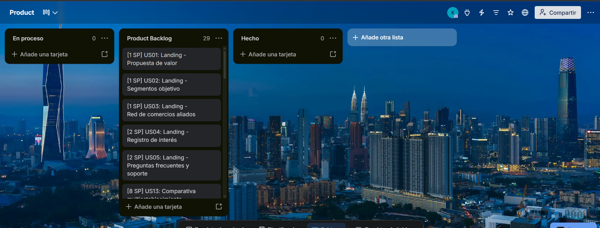
> *Figura 3.3: Captura del Product Backlog configurado, estimado y priorizado en la herramienta de gestión ágil.*

# Capítulo IV: Product Design

En esta sección, el equipo establece las bases para contar con un repositorio central y organizado de recursos visuales y estructurales de uso común. El objetivo principal es garantizar una presentación consistente, sólida y enfocada en todos los productos digitales de **PeruTech**, facilitando la colaboración entre diseñadores y desarrolladores mediante el uso estandarizado de activos, fuentes, estilos y criterios de arquitectura de la información.

## 4.1. Style Guidelines

Estas guías establecen la identidad visual base para todos los productos digitales del ecosistema **PeruTech**.

### 4.1.1. General Style Guidelines

#### **A. Branding & Tono de Comunicación**
* **Tono:** El lenguaje será **Entusiasta y Sereno**. Se busca que el usuario se sienta motivado por la innovación y el ahorro inteligente, pero con la tranquilidad de que la información presentada es confiable y veraz.
* **Lenguaje:** Se utilizará un estilo **Formal/Casual**, directo y fácil de entender tanto para familias como para jóvenes profesionales y comercios aliados.

#### **B. Paleta de Colores (Colors)**
Se ha seleccionado una paleta moderna, equilibrada y tecnológica que evoca confianza, claridad y dinamismo:

| Uso | Nombre del Color | Hexadecimal | Representación / Aplicación |
| :--- | :--- | :--- | :--- |
| **Primario** | Negro Azabache | `#000000` | Sólido y profesional. Utilizado en encabezados, botones principales y contraste de textos de alta jerarquía. |
| **Secundario** | Turquesa Tecnológico | `#00ACAC` | Frescura, agilidad e innovación. Destacado en llamados a la acción, estados activos y acentos de interfaz. |
| **Acento / Fondo Suave** | Gris Claro Nieve | `#DFDEDC` | Limpieza visual. Se utiliza para fondos de tarjetas, contenedores secundarios y fondos de sección. |
| **Neutro Medio** | Gris Medio | `#A6A7A2` | Elementos secundarios, bordes, estados desactivados y divisores. |
| **Texto / Contraste** | Antracita Oscuro | `#464545` | Utilizado en el cuerpo de texto principal para optimizar la legibilidad y reducir la fatiga visual. |

#### **C. Tipografía (Typography)**
* **Títulos y Encabezados:** *Montserrat* (Bold / Semi-Bold) - Proporciona un aspecto moderno, profesional y estructurado.
* **Cuerpo de Texto y UI:** *Roboto* (Regular / Medium) - Sigue los estándares de legibilidad para interfaces digitales móviles y web.

#### **D. Espaciado y Rejilla (Spacing & Grid)**
* Se aplicará un sistema de rejilla basado en **8dp (8pt grid)** para mantener consistencia en márgenes, *paddings* y alineación de componentes UI en todas las pantallas.

### 4.1.2. Web Style Guidelines

[Contenido]

## 4.2. Information Architecture

En esta sección se documentan las decisiones y criterios de organización de contenido en las **plataformas web** y en las **aplicaciones móviles** de **PeruTech**, optimizando los sistemas de **organización, etiquetado, búsqueda y navegación**.

### 4.2.1. Organization Systems

Se distingue entre la **organización visual** (layout y jerarquía en pantalla) y los **esquemas de categorización** (criterios lógicos de agrupación).

##### **Organización Visual**

| Tipo | Cuándo se usa en PeruTech | Ejemplos concretos |
| --- | --- | --- |
| **Jerárquica** | Cuando un bloque comunica importancia relativa priorizando información clave. | **Landing:** Hero con propuesta de valor → beneficios → prueba social → CTA. **Merchant Web:** Panel con KPIs principales arriba (Tráfico Mensual, Venta Perdida) y detalle operacional debajo. |
| **Secuencial (paso a paso)** | Flujos guiados que requieren un orden fijo de ejecución. | **Buyer:** Asistente "Configurar Canasta Básica / Lista → Ajustar Presupuesto → Generar Ruta Multiparada → Confirmar Punto Óptimo de Compra". **Post-compra:** "Confirmar Visita → Ver Ahorro Neto → Calificar Comercio / Reseña → Reportar Discrepancia de Precio". |
| **Matricial** | Contenidos multidimensionales que admiten múltiples filtros y comparaciones. | **Buyer:** Grilla de Artículos de Compra (*Categoría × Precio Unitario × Comercio Minorista*). **Merchant:** Tablero de inventario (*Artículo × Estado de stock × Vigencia de Oferta Relámpago*). |

##### **Esquemas de Categorización**

| Esquema | Cuándo se usa | Ejemplos en el producto |
| --- | --- | --- |
| **Alfabético** | Listados extensos de orden explícito. | Listados de Artículos de Compra en el catálogo Merchant y ordenación A–Z en búsquedas. |
| **Cronológico** | Información ordenada por temporalidad. | Historial de Rutas Multiparada finalizadas y registro histórico de actualización de precios u ofertas relámpago. |
| **Por Tema (Tópico)** | Categorización por dominios del supermercado o módulos de ayuda. | Navegación de productos por categoría de Despensa Familiar (Abarrotes, Limpieza, etc.) y secciones FAQ. |
| **Por Audiencia** | Separación según el rol del usuario. | Diferenciación clara entre flujos de **Buyer (Consumidor / Jefe de Hogar)** y **Merchant (Comerciante)**. |

##### **Resumen por Superficie**

| Superficie | Organización visual | Esquemas de categorización |
| --- | --- | --- |
| **Landing Web** | Jerárquica | Por tema y por audiencia (CTA Buyer vs. Merchant) |
| **App Buyer (Móvil)** | Secuencial en flujos clave; matricial en catálogo | Tópico (categorías de Despensa), cronológico (historial de rutas), alfabético |
| **Portal Merchant (Web/App)** | Jerárquica en paneles; matricial en tablas de datos | Alfabético, por estado de stock / oferta y cronológico (reportes) |

### 4.2.2. Labeling Systems

El sistema de etiquetado utiliza términos breves, claros y estrictamente unificados.

##### **Etiquetas Principales y Asociaciones**

| Etiqueta (UI) | Entidad / Asociación (Ubiquitous Language) | Regla de Brevedad y Claridad |
| --- | --- | --- |
| **Canasta Básica** | `Basic Basket` | Módulo de configuración de necesidades esenciales de abastecimiento. |
| **Lista Compartida** | `Shared Shopping List` | Registro estructurado y colaborativo del hogar. |
| **Presupuesto** | `Purchase Budget` | Techo financiero asignado para la jornada de compra. |
| **Ruta Multiparada** | `Multi-stop Route` | Itinerario optimizado que conecta el hogar con múltiples comercios. |
| **Punto Óptimo** | `Optimal Purchase Stop` | Establecimiento sugerido por mejor relación cercanía/precio/stock. |
| **Comercios** | `Retail Store` | Puntos de venta físicos (supermercados y mercados de abastos). |
| **Ahorro Neto** | `Net Savings` | Diferencia económica positiva considerando el sobrecosto de desplazamiento. |
| **Bien Sustituto** | `Substituted Good` | Sugerencia alternativa ante falta de stock o exceso de presupuesto. |
| **Discrepancia** | `Price Discrepancy` / `Error de precio` | Reporte colaborativo de diferencias entre góndola y caja. |
| **Confianza** | `TrustProfile` / Insignia de Confianza | Score y nivel de fiabilidad del comercio asignado por la comunidad. |
| **Catálogo / Ofertas** | Módulos de gestión Merchant | Administración de inventario inicial y Ofertas Relámpago. |
| **Reportes** | Tráfico Mensual y Venta Perdida | Métricas clave de rendimiento para el Comerciante. |

##### **Microcopy y Mensajes del Sistema**
* **Validaciones:** Frases directas y comprensibles (*"Ingresa un presupuesto mayor a S/ 0"*, *"Selecciona al menos un Punto Óptimo de Compra"*).
* **Estados de Carga:** Verbos indicativos directos (*"Calculando Ruta Multiparada optimizada..."*, *"Verificando Discrepancia de Precio..."*, *"Guardando cambios..."*).

### 4.2.3. SEO Tags and Meta Tags

##### **Sitio Web Estático — Landing Page**

| Meta / Etiqueta | Valor propuesto |
| --- | --- |
| **`<title>`** | `PeruTech \| Ahorra en tu Canasta Básica con Rutas Multiparada y Precios Reales` |
| **`<meta name="description">`** | `Planifica tu Lista Compartida, respeta tu Presupuesto de Compra y optimiza tus recorridos con Rutas Multiparadas. Compara precios reales con PeruTech.` |
| **`<meta name="keywords">`** | `PeruTech, canasta basica, presupuesto de compra, ruta multiparada, ahorro neto, punto optimo de compra, comercio minorista, dispersion de precios, Peru` |
| **`<meta name="author">`** | `PeruTech Team` |
| **Complementos** | Canonical `<link rel="canonical" href="https://www.perutech.pe/">`y Open Graph (`og:title`, `og:description`, `og:image`). |

##### **Aplicación Web — Portal Merchant (Inicio / Dashboard)**

| Meta / Etiqueta | Valor propuesto |
| --- | --- |
| **`<title>`** | `PeruTech Merchant \| Gestión de Catálogo, Ofertas y Reportes de Tráfico` |
| **`<meta name="description">`** | `Administra tu inventario, publica Ofertas Relámpago y consulta métricas de Venta Perdida en tiempo real para compradores de PeruTech.` |
| **`<meta name="keywords">`** | `PeruTech Merchant, comercio minorista, ofertas relampago, precio unitario, reporte de trafico, venta perdida, reputacion comercio` |
| **`<meta name="author">`** | `PeruTech Team` |

##### **ASO (App Store & Google Play)**

* **App Buyer — "PeruTech":**
  * **Título:** `PeruTech — Compras y Ahorro Neto`
  * **Subtítulo:** `Canasta básica, presupuesto y rutas`
  * **Keywords:** `compras, canasta basica, presupuesto, ruta multiparada, ahorro neto, supermercado, peru, gondola, perutech`
  * **Descripción corta:** `Gestiona tu Canasta Básica, respeta tu Presupuesto y recorre la mejor Ruta Multiparada. Compara precios reales y maximiza tu Ahorro Neto con PeruTech.`

* **App Merchant — "PeruTech Tiendas":**
  * **Título:** `PeruTech Tiendas`
  * **Subtítulo:** `Catálogo y ofertas en vivo`
  * **Keywords:** `retail, comercio minorista, catalogo, ofertas relampago, precio unitario, merchant, sede, perutech`
  * **Descripción corta:** `Gestiona tu inventario, publica Ofertas Relámpago y mantén tus precios actualizados para la comunidad de compradores de PeruTech.`

### 4.2.4. Searching Systems

El sistema de búsqueda permite una localización eficiente de bienes dentro de catálogos extensos y paneles de administración.

##### **Opciones y Alcance de Búsqueda**

| Contexto / App | Objeto de búsqueda | Tipo de Entrada | Alcance y Filtros |
| --- | --- | --- | --- |
| **Buyer — Catálogo** | Artículos de Compra por nombre, marca o presentación | Campo global + auto-sugerencias | Pestañas "En esta tienda" / "En todas". Filtros por Precio Unitario, Categoría de Despensa y Bienes Sustitutos. |
| **Buyer — Comercios** | Comercio Minorista por sede o mercado de abastos | Barra de búsqueda integrada en mapa/lista | Filtro por distancia, Insignia de Confianza y horario de atención. |
| **Buyer — Mi Lista** | Ítems agregados a la Lista Compartida | Filtro local en tiempo real | Filtrado rápido de texto por categoría de producto. |
| **Merchant — Backoffice** | Artículos, SKUs, Ofertas Relámpago activas | Tabla de datos con filtros combinados | Filtro por estado de stock, Discrepancia de Precio reportada y vigencia. |

##### **Comportamiento e Interfaz de Búsqueda**
* **Sugerencias Dinámicas:** Despliegue de resultados emergentes a partir de los 2 caracteres ingresados (`>= 2 chars`).
* **Visualización de Resultados:** Tarjetas con Precio Unitario destacado, indicación del Punto Óptimo de Compra y opción para añadir directamente a la Lista Compartida.

### 4.2.5. Navigation Systems

Estructura de desplazamiento y recorrido del usuario en las diferentes plataformas de **PeruTech**.

##### **Mapa de Navegación y Estructuras**

* **Landing Page (Web Estática):** Barra superior fija con desplazamientos suaves (*anchor links*) a `#producto`, `#como-funciona`, `#descargar` y `#contacto`.
* **App Buyer (Móvil):** Navegación primaria mediante **Tab Bar inferior** (*Inicio*, *Canasta / Lista*, *Ruta Multiparada*, *Perfil*). Flujos secundarios en *stack modal* (Sugerencia de Bien Sustituto, Reportar Discrepancia) y asistente para planificación del Presupuesto y Ruta Multiparada.
* **Portal Merchant (Web/App):** Menú lateral persistente (*Sidebar*) con acceso a *Panel de Métricas* (Tráfico y Venta Perdida), *Catálogo*, *Ofertas Relámpago*, *Reportes de Reputación* y *Configuración de Sede*.

| Superficie | Técnica de Navegación |
| --- | --- |
| **Landing Web** | Header fijo, scroll suave, CTAs de conversión repetidos tras bloques clave y footer legal. |
| **App Buyer** | Tabs inferiores persistentes, navegación por stack modal, asistente secuencial de Ruta Multiparada y *deep linking* desde notificaciones de ofertas relámpago. |
| **Merchant Web/App** | Sidebar persistente, indicador de sede activa en header, breadcrumbs navegables y tablas paginadas para catálogos extensos. |

## 4.3. Landing Page UI Design

### 4.3.1. Landing Page Wireframe

A continuación se presentan los wireframes de baja fidelidad representando la estructura y jerarquía visual.

### 4.3.2. Landing Page Mock-up

En esta sección se presenta el mockup de alta fidelidad con la identidad de la marca plasmada.

## 4.4. Web Applications UX/UI Design

### 4.4.1. Web Applications Wireframes

A continuación, se presentan las pantallas de wireframe de baja fidelidad de la aplicación **PeruTech**. El diseño contempla tanto la experiencia del usuario final (comprador) como el panel de gestión orientado a comercios afiliados.

#### 1. Pantalla de Inicio (Home)
Pantalla principal de la aplicación que integra el buscador global por productos o tiendas, accesos rápidos a la creación de listas, ofertas destacadas en la zona del usuario y el listado de tiendas cercanas con sus respectivas distancias.

---

#### 2. Vista de Lista Activa - Modo Normal
Permite visualizar la lista de compras actual con el control de presupuesto. Incluye sugerencias inteligentes de sustitutos más económicos para maximizar el ahorro y la opción de agregar o eliminar productos.

---

#### 3. Módulo de Comparativa de Precios
Cuadro comparativo interactivo que permite analizar el costo total de la lista activa en distintos supermercados según el radio de distancia seleccionado. Destaca la mejor opción económica y permite reportar inconsistencias en tiendas.

---

#### 4. Generador de Ruta de Compra Optimizada
Mapeo iterativo y sugerencia de itinerario para compras en múltiples establecimientos. Desglosa los tiempos de traslado, el ahorro estimado y el detalle de ítems a adquirir en cada parada.

---

#### 5. Panel de Analítica para Comercios
Dashboard principal orientado al comerciante o tienda aliada. Presenta métricas relevantes sobre impresiones en rutas, vistas de productos, consultas de ofertas y un gráfico de tendencias de tráfico mensual.

---

#### 6. Gestión de Catálogo de Precios (Comercios)
Interfaz de administración donde el comercio puede activar, desactivar y actualizar el listado de precios de sus productos e importar inventarios.

---

#### 7. Módulo de Ofertas y Promociones (Comercios)
Sección diseñada para que los establecimientos publiquen promociones temporales, establezcan precios de oferta con contador de vigencia y gestionen sus campañas activas.

---

#### 8. Perfil e Información de la Tienda
Pantalla que muestra la información institucional del establecimiento afiliado, incluyendo RUC, dirección fiscal, teléfono de contacto y la configuración de sus horarios de atención al público.

### 4.4.2. Web Applications Wireflow Diagrams

A continuación, se presentan los diagramas de Wireflow estructurados por segmento de usuario. Cada flujo define el objetivo de la interacción y la visualización del recorrido mediante su respectivo diagrama.

---

#### Segmento 1: Comprador

##### Diagrama 1: Búsqueda y Comparativa de Precios
* **Goal:** 1. Comparar precios de la canasta entre supermercados cercanos.
* **Descripción:** El usuario busca productos, revisa su lista de compras activa en Modo Normal para ajustar sugerencias de ahorro y accede al módulo comparativo para evaluar los costos totales por tienda.

---

##### Diagrama 2: Ejecución de Compra y Ruta Optimizada
* **Goal:** 2. Guiar el recorrido de compra físico y optimizar el itinerario.
* **Descripción:** El usuario selecciona una lista guardada, genera la ruta de compra optimizada entre tiendas e inicia el Modo Compra al llegar al establecimiento para marcar los productos en tiempo real.

---

#### Segmento 2: Comerciante

##### Diagrama 3: Gestión Comercial y Monitoreo
* **Goal:** 3. Analizar métricas de rendimiento y administrar el catálogo.
* **Descripción:** El comerciante ingresa a su panel principal para analizar impresiones y tendencias, navega al catálogo para actualizar inventario o precios y gestiona la información fiscal del local.

---

##### Diagrama 4: Publicación de Promociones Temporales
* **Goal:** 4. Crear y gestionar ofertas con tiempo limitado.
* **Descripción:** El comerciante selecciona productos desde su catálogo e ingresa al módulo de ofertas para configurar descuentos especiales y establecer la vigencia de la promoción.

### 4.4.3. Web Applications Mock-ups

A continuación, se presentan las pantallas que componen el prototipo de alta fidelidad de la aplicación **PeruTech**. El diseño contempla tanto la experiencia del usuario final (comprador) como el panel de gestión orientado a comercios afiliados.

#### 1. Pantalla de Inicio (Home)
Pantalla principal de la aplicación que integra el buscador global por productos o tiendas, accesos rápidos a la creación de listas, ofertas destacadas en la zona del usuario y el listado de tiendas cercanas con sus respectivas distancias.

---

#### 2. Vista de Lista Activa - Modo Normal
Permite visualizar la lista de compras actual con el control de presupuesto. Incluye sugerencias inteligentes de sustitutos más económicos para maximizar el ahorro y la opción de agregar o eliminar productos.

---

#### 3. Vista de Lista Activa - Modo Compra
Optimizada para usarse dentro del establecimiento físico, permitiendo al usuario marcar los productos mediante *checkboxes* a medida que los coloca en el carrito y calcular el subtotal en tiempo real.

---

#### 4. Gestión de Listas Guardadas
Sección destinada a la administración de plantillas personalizadas y listas reutilizables para compras recurrentes (p. ej., Desayuno Semanal o Limpieza del Hogar).

---

#### 5. Módulo de Comparativa de Precios
Cuadro comparativo interactivo que permite analizar el costo total de la lista activa en distintos supermercados según el radio de distancia seleccionado. Destaca la mejor opción económica y permite reportar inconsistencias en tiendas.

---

#### 6. Generador de Ruta de Compra Optimizada
Mapeo iterativo y sugerencia de itinerario para compras en múltiples establecimientos. Desglosa los tiempos de traslado, el ahorro estimado y el detalle de ítems a adquirir en cada parada.

---

#### 7. Panel de Analítica para Comercios
Dashboard principal orientado al comerciante o tienda aliada. Presenta métricas relevantes sobre impresiones en rutas, vistas de productos, consultas de ofertas y un gráfico de tendencias de tráfico mensual.

---

#### 8. Gestión de Catálogo de Precios (Comercios)
Interfaz de administración donde el comercio puede activar, desactivar y actualizar el listado de precios de sus productos e importar inventarios.

---

#### 9. Módulo de Ofertas y Promociones (Comercios)
Sección diseñada para que los establecimientos publiquen promociones temporales, establezcan precios de oferta con contador de vigencia y gestionen sus campañas activas.

---

#### 10. Perfil e Información de la Tienda
Pantalla que muestra la información institucional del establecimiento afiliado, incluyendo RUC, dirección fiscal, teléfono de contacto y la configuración de sus horarios de atención al público.

### 4.4.4. Web Applications User Flow Diagrams

A continuación, se presentan los diagramas de User Flow para la aplicación web y móvil basados en las pantallas de alta fidelidad.

---

#### Segmento 1: Comprador

##### Diagrama 1: Flujo de Búsqueda y Comparativa de Precios por Supermercado
* **Goal:** 1. Comparar precios de la canasta entre supermercados cercanos.
* **Descripción:** El usuario inicia en la pantalla de portada navegando por el buscador o categorías, gestiona su lista de compras activa en Modo Normal para evaluar sugerencias de ahorro y accede al cuadro comparativo para analizar los costos totales y productos disponibles por establecimiento.

---

##### Diagrama 2: Flujo de Ejecución de Compra y Ruta Optimizada
* **Goal:** 2. Guiar el recorrido de compra físico y optimizar el itinerario inter-tiendas.
* **Descripción:** El usuario selecciona una lista guardada o plantilla, activa el generador de rutas para visualizar el itinerario con paradas y tiempos de traslado, e inicia el Modo Compra en el establecimiento para marcar los ítems en su carrito en tiempo real.

---

#### Segmento 2: Comerciante

##### Diagrama 3: Flujo de Gestión Comercial y Monitoreo Analítico
* **Goal:** 3. Analizar métricas de rendimiento y administrar el catálogo del establecimiento.
* **Descripción:** El comerciante ingresa a su panel de analítica para evaluar tendencias e impresiones de su local, navega al catálogo para actualizar precios e inventarios y gestiona la información fiscal y los horarios de atención de la tienda.

---

##### Diagrama 4: Flujo de Publicación de Promociones Temporales
* **Goal:** 4. Crear y gestionar ofertas con tiempo de vigencia determinado.
* **Descripción:** El comerciante evalúa los productos desde su catálogo de precios e ingresa al módulo de ofertas para configurar promociones especiales, definir descuentos y establecer la vigencia temporal de la campaña.

## 4.5. Web Applications Prototyping

El vídeo de evidencia del prototipo plasma las interacciones que ejecutan los usuarios y las respuestas esperadas por el sistema.

[Prototipo evidencia](https://upcedupe-my.sharepoint.com/:v:/g/personal/u20241c101_upc_edu_pe/IQCEOW9isi3LT7sIUmtoPLwAAQMF1OJDthoTqwwWszE9QvQ?nav=eyJyZWZlcnJhbEluZm8iOnsicmVmZXJyYWxBcHAiOiJPbmVEcml2ZUZvckJ1c2luZXNzIiwicmVmZXJyYWxBcHBQbGF0Zm9ybSI6IldlYiIsInJlZmVycmFsTW9kZSI6InZpZXciLCJyZWZlcnJhbFZpZXciOiJNeUZpbGVzTGlua0NvcHkifX0&e=cP37RQ)

## 4.6. Domain-Driven Software Architecture

La arquitectura de PeruTech se diseña siguiendo principios de Domain-Driven Design (DDD), tomando como punto de partida los resultados obtenidos en el Big Picture Event Storming desarrollado durante la etapa de Requirements Elicitation & Analysis.

El análisis del dominio permitió identificar los principales procesos asociados a los dos segmentos objetivo de la solución: los compradores que buscan optimizar el costo y desplazamiento de sus compras, y los comerciantes minoristas que requieren administrar la información de sus establecimientos, precios, disponibilidad y promociones.

A partir del refinamiento de los eventos, comandos, reglas y conceptos identificados previamente, el dominio de PeruTech se organiza en Bounded Contexts con responsabilidades claramente delimitadas. Esta separación permite reducir el acoplamiento entre capacidades de negocio y facilita posteriormente la implementación modular del Frontend Web Application y de los RESTful Web Services.

Los Bounded Contexts identificados para PeruTech son:

| Bounded Context | Responsabilidad principal |
|---|---|
| Identity and Access | Gestionar autenticación, identidad, roles y autorización de compradores y comerciantes. |
| Shopping Planning | Gestionar listas de compra, cantidades, presupuesto y progreso de la jornada de compra. |
| Catalog and Pricing | Gestionar productos, precios, disponibilidad y comparación entre establecimientos. |
| Route Planning | Calcular y optimizar rutas de compra entre múltiples establecimientos considerando localización y desplazamiento. |
| Merchant Management | Gestionar afiliación de comercios, información del establecimiento, catálogo local, inventario y promociones. |
| Community Price Verification | Gestionar discrepancias, reportes y confirmaciones comunitarias sobre precios observados. |
| Analytics and Engagement | Consolidar métricas de interacción y rendimiento relevantes para los comerciantes y generar información de seguimiento. |

Estos contextos se comunican mediante contratos explícitos, evitando que un módulo modifique directamente las reglas internas de otro contexto.

### 4.6.1. Design-Level Event Storming

Para profundizar el modelo obtenido durante el Big Picture Event Storming se realizó un Design-Level Event Storming orientado a analizar con mayor detalle los principales flujos de negocio de PeruTech.

El proceso de refinamiento comenzó identificando las acciones realizadas por los actores Buyer y Merchant. Cada acción relevante fue representada mediante Commands y posteriormente relacionada con los Aggregates responsables de mantener las reglas y consistencia del dominio. A partir de estas acciones se identificaron los Domain Events producidos por el sistema, así como Policies que reaccionan ante dichos eventos, Queries requeridas para consultar el estado del dominio, sistemas externos y Hotspots que representan decisiones o reglas pendientes de precisar.

Para facilitar la lectura del modelo se utilizó la siguiente convención visual:

- **Actor:** amarillo.
- **Command:** azul.
- **Aggregate:** amarillo claro.
- **Domain Event:** naranja.
- **Policy:** violeta.
- **Query / Read Model:** verde.
- **External System:** rosa.
- **Hotspot:** rojo.

El resultado del proceso permitió organizar el dominio en siete Bounded Contexts: Identity and Access, Shopping Planning, Catalog and Pricing, Route Planning, Merchant Management, Community Price Verification y Analytics and Engagement.

### 4.6.2. Software Architecture Context Diagram

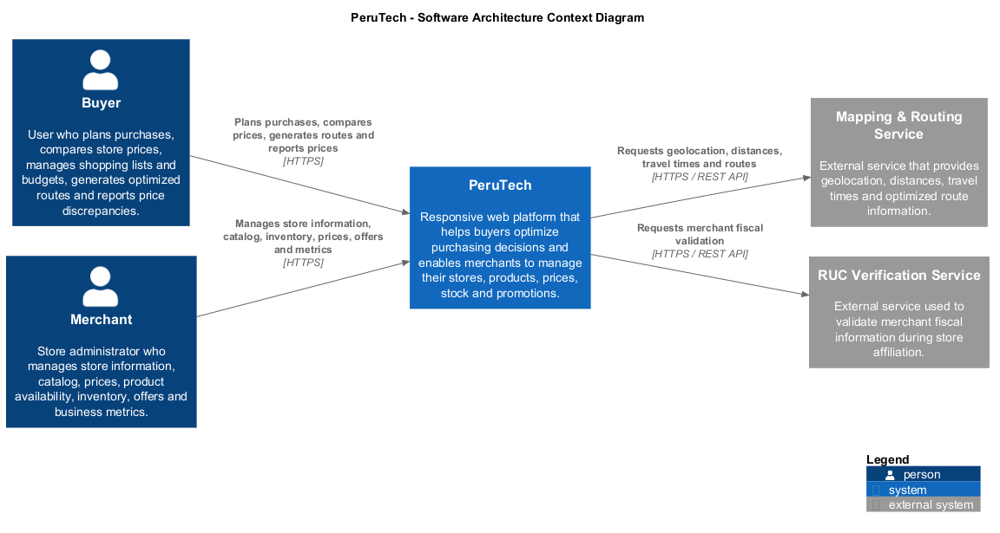

### 4.6.3. Software Architecture Container Diagrams

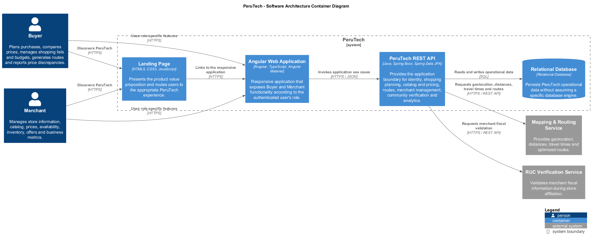

### 4.6.4. Software Architecture Components Diagrams

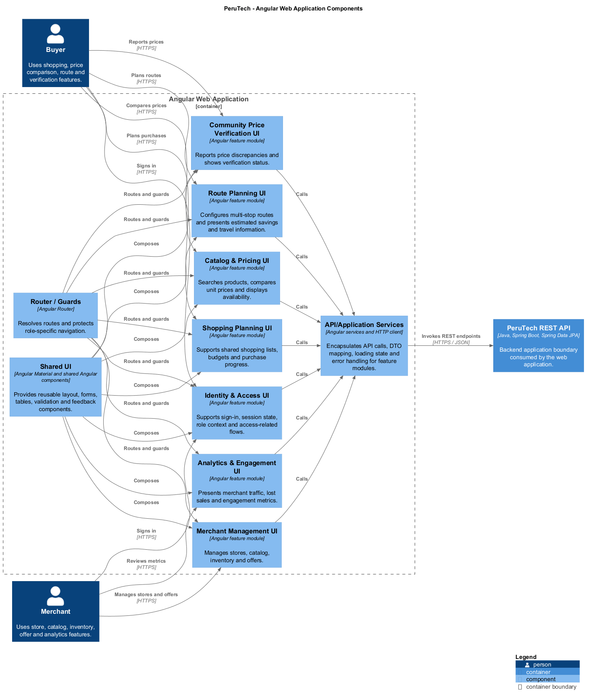

## 4.7. Software Object-Oriented Design

En esta sección se presenta el diseño orientado a objetos de PeruTech a partir de los Bounded Contexts identificados durante el proceso de Domain-Driven Design.

Con el objetivo de evitar un único modelo de clases excesivamente acoplado, el diseño se divide de acuerdo con los siete Bounded Contexts definidos previamente. Cada contexto mantiene sus propias entidades, servicios, interfaces, políticas, objetos de valor y enumeraciones, permitiendo representar de manera explícita sus responsabilidades y reglas de negocio.

Asimismo, cuando un contexto necesita información perteneciente a otro dominio, se utilizan referencias locales basadas en identificadores u objetos específicos del contexto, evitando compartir directamente las entidades internas de otros Bounded Contexts. Este criterio permite conservar límites claros entre los modelos y reducir dependencias innecesarias.

Los diagramas incluyen atributos y operaciones relevantes del dominio, utilizando visibilidad UML, relaciones nombradas y multiplicidades para representar las asociaciones entre los diferentes elementos.

### 4.7.1. Class Diagrams

Los Class Diagrams de PeruTech se organizan por Bounded Context con el propósito de representar de forma independiente las principales estructuras y comportamientos de cada parte del dominio.

#### Identity and Access

El Bounded Context **Identity and Access** concentra las responsabilidades relacionadas con autenticación, sesiones, roles y autorización.

La clase `User` representa la identidad principal del sistema y permite realizar operaciones como autenticarse, asignar roles, desactivar la cuenta y comprobar permisos. Las sesiones generadas se representan mediante `AuthSession`, mientras que `Role` y `Permission` modelan el esquema de autorización.

Las interfaces `IdentityRepository` y `AccessPolicy` abstraen respectivamente la persistencia de identidades y las reglas utilizadas para determinar si una operación está autorizada.

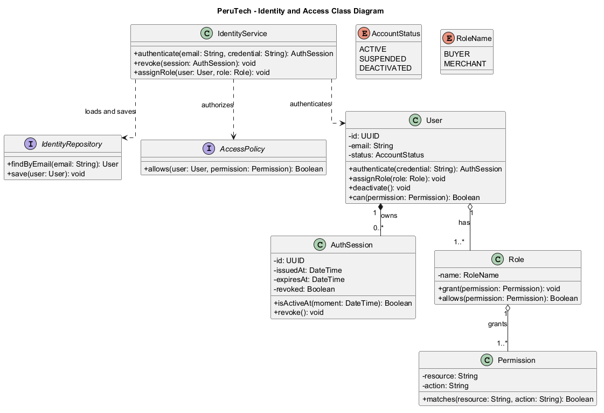

#### Shopping Planning

El Bounded Context **Shopping Planning** administra la planificación de compras del Buyer.

`ShoppingList` funciona como el elemento central del modelo y agrupa múltiples `ShoppingListItem`. Entre sus responsabilidades se encuentran agregar y eliminar ítems, marcar productos como comprados, calcular el costo estimado y completar una lista.

`PurchaseBudget` representa el presupuesto asociado a la planificación y encapsula operaciones como reservar o liberar importes y comprobar si un determinado gasto puede ser asumido. El objeto `Money` encapsula cantidades monetarias y sus operaciones.

`ProductRequirement` permite referenciar un producto requerido sin introducir directamente el modelo interno de Catalog and Pricing dentro de este Bounded Context.

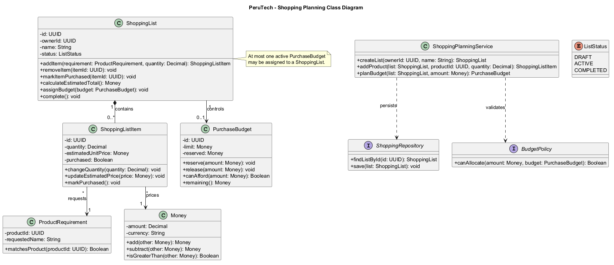

#### Catalog and Pricing

El Bounded Context **Catalog and Pricing** modela la consulta y comparación de productos, precios y disponibilidad entre establecimientos.

`Product` representa la información propia del catálogo, mientras que `StoreProduct` mantiene los datos asociados a un producto ofrecido por un establecimiento, tales como precio unitario, disponibilidad y fecha de actualización.

La clase `CatalogPricingService` proporciona operaciones de búsqueda, comparación de precios y selección de ofertas. Por otro lado, `PriceComparisonPolicy` encapsula la regla utilizada para determinar la alternativa más conveniente.

`RetailStoreRef` representa únicamente una referencia al establecimiento, preservando la separación respecto del modelo interno de Merchant Management.

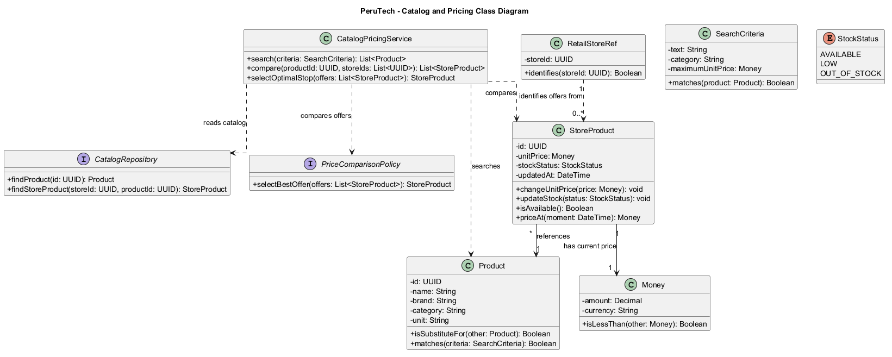

#### Route Planning

El Bounded Context **Route Planning** representa la generación y optimización de recorridos entre múltiples establecimientos.

El aggregate `MultiStopRoute` administra las diferentes paradas mediante objetos `RouteStop` y contiene las operaciones necesarias para agregar, eliminar y reordenar establecimientos, además de calcular el ahorro neto asociado a una ruta.

`RoutePlanningService` coordina la generación, recálculo y confirmación de rutas, mientras que `RoutingGateway` abstrae el acceso al servicio externo de mapas y ruteo.

Para mantener el aislamiento del contexto, conceptos pertenecientes a otros dominios se representan mediante elementos locales como `ShoppingPlanRef`, `ProductRequirement` y `StoreCandidate`.

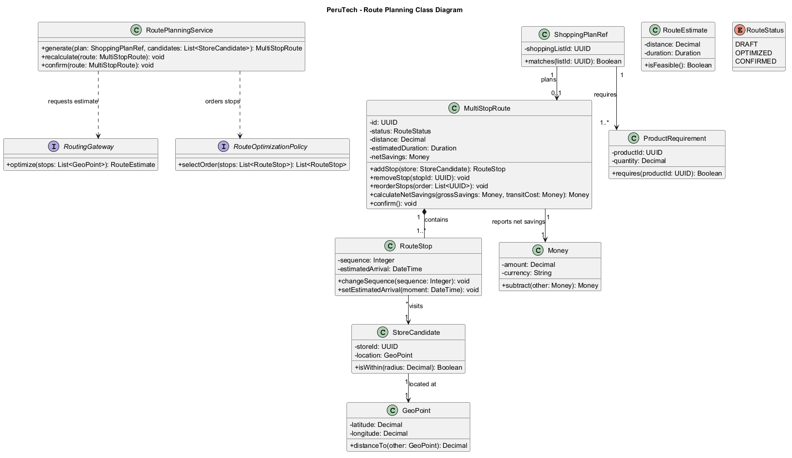

#### Merchant Management

El Bounded Context **Merchant Management** concentra las capacidades relacionadas con la afiliación y administración de establecimientos.

`MerchantProfile` representa el perfil comercial y mantiene su estado de verificación. Un Merchant puede administrar uno o varios objetos `RetailStore`, los cuales contienen los elementos de inventario y promociones correspondientes.

`InventoryItem` encapsula operaciones relacionadas con stock y precio, mientras que `Promotion` representa ofertas con un período de vigencia definido.

La interfaz `RucVerificationGateway` abstrae la comunicación con el servicio externo utilizado para validar la información fiscal del Merchant.

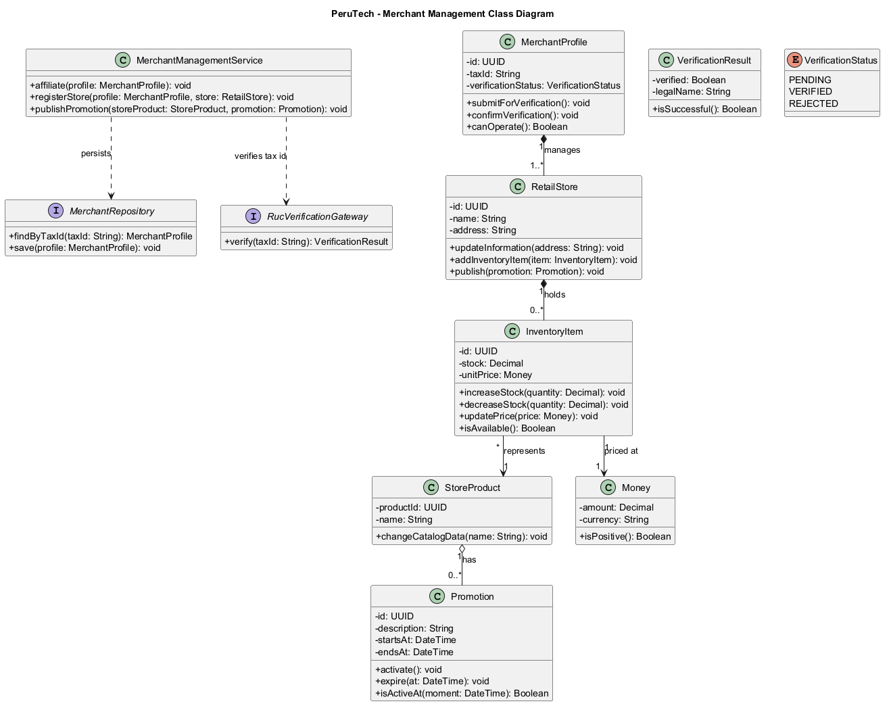

#### Community Price Verification

El Bounded Context **Community Price Verification** administra las observaciones y discrepancias de precios reportadas por los usuarios.

`PriceDiscrepancy` representa una diferencia detectada entre un precio esperado y uno observado y puede recibir múltiples `PriceObservation` y `VerificationConfirmation`.

La clase `TrustProfile` mantiene información local relacionada con la confiabilidad de las contribuciones realizadas por un usuario. Por otro lado, `VerificationPolicy` encapsula las reglas necesarias para aceptar, rechazar o solicitar revisión adicional de una discrepancia.

Los objetos `UserRef` y `StoreProductRef` actúan como referencias hacia información perteneciente a otros Bounded Contexts sin introducir sus modelos internos directamente.

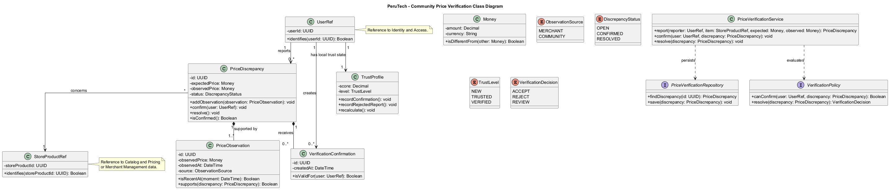

#### Analytics and Engagement

El Bounded Context **Analytics and Engagement** se encarga de registrar eventos relevantes y transformarlos en métricas útiles para los comerciantes.

`MetricEvent` representa interacciones como visitas a establecimientos, visualizaciones de productos, comparaciones de precios, ventas perdidas e interacciones con promociones.

`AnalyticsService` registra dichos eventos y genera posteriormente objetos `MerchantMetrics` y `MerchantReport`. La interfaz `MetricsCalculator` abstrae la lógica utilizada para calcular las métricas correspondientes a un período determinado.

De esta manera, el contexto mantiene separada la recopilación de eventos de la generación de información analítica destinada al Merchant.

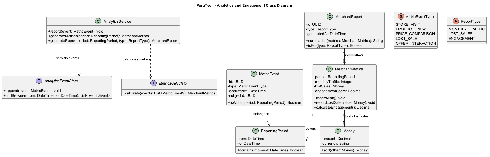

En conjunto, los Class Diagrams permiten representar la estructura interna de cada Bounded Context sin construir un único modelo global compartido. Esta separación mantiene alineado el diseño orientado a objetos con las fronteras establecidas mediante Domain-Driven Design y facilita que cada módulo evolucione manteniendo responsabilidades claramente delimitadas.

## 4.8. Database Design

El diseño de base de datos de PeruTech se organiza siguiendo los límites definidos previamente mediante Domain-Driven Design. En lugar de representar el almacenamiento únicamente como un modelo relacional global, se presentan vistas específicas para cada Bounded Context con el objetivo de evidenciar qué información pertenece a cada parte del dominio.

Cada diagrama identifica las entidades persistentes, sus atributos principales, claves primarias, claves foráneas, restricciones de unicidad y relaciones. Cuando un contexto necesita referenciar información perteneciente a otro Bounded Context, dicha dependencia se representa mediante identificadores marcados como referencias externas (`REF`), evitando asumir que la entidad referenciada pertenece al mismo modelo.

Adicionalmente, se incluye una vista general de la base de datos que permite observar la integración global de la información persistida por PeruTech.

### 4.8.1. Database Diagrams

Los Database Diagrams de PeruTech se presentan primero mediante una vista general y posteriormente mediante vistas específicas para cada Bounded Context.

#### Database Overview

El Database Overview muestra la estructura relacional completa propuesta para PeruTech y permite visualizar las principales relaciones entre usuarios, comerciantes, establecimientos, productos, planificación de compras, rutas, verificación comunitaria de precios y analítica.

La vista global también evidencia restricciones importantes del modelo, como la unicidad de correos y roles, la relación entre usuarios y perfiles de comerciantes, la unicidad de un producto por establecimiento dentro del catálogo, la secuencia única de paradas dentro de una ruta y la asociación de métricas y reportes con establecimientos.

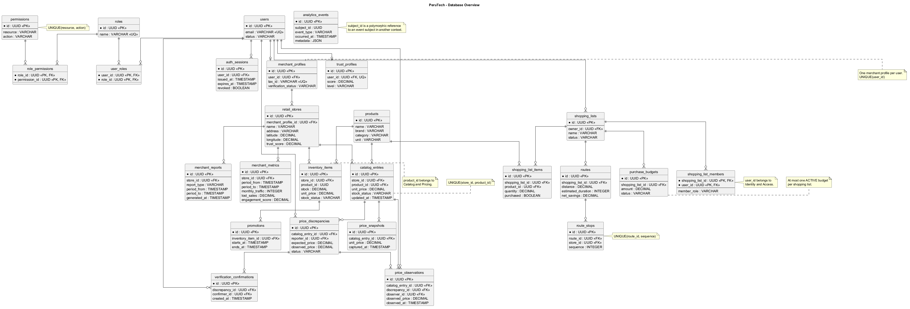

#### Identity and Access

El modelo de persistencia de **Identity and Access** administra la información necesaria para la identificación, autorización y manejo de sesiones.

La tabla `users` almacena las cuentas registradas, mientras que `roles` y `permissions` representan los mecanismos de autorización. Las tablas intermedias `user_roles` y `role_permissions` modelan las relaciones de muchos a muchos existentes entre usuarios, roles y permisos.

Finalmente, `auth_sessions` registra las sesiones asociadas a cada usuario, incluyendo su fecha de emisión, expiración y estado de revocación.

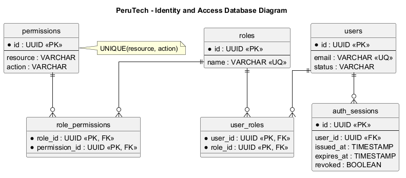

#### Shopping Planning

El Bounded Context **Shopping Planning** persiste la información relacionada con la planificación de compras.

`shopping_lists` representa las listas creadas por los usuarios, mientras que `shopping_list_items` almacena los productos requeridos, cantidades, precios estimados y estado de compra.

La tabla `shopping_list_members` permite relacionar otros usuarios con una lista determinada y `purchase_budgets` almacena los presupuestos asociados a cada planificación.

Los identificadores de usuario son referencias hacia Identity and Access y los identificadores de producto corresponden a información administrada por Catalog and Pricing.

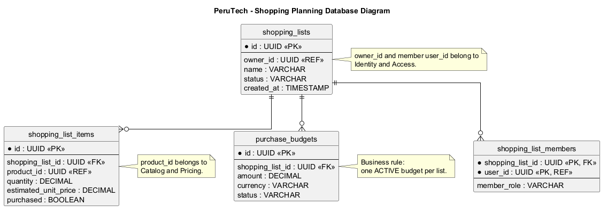

#### Catalog and Pricing

El modelo de **Catalog and Pricing** almacena los productos disponibles y la información necesaria para realizar comparaciones de precios.

La tabla `products` contiene la información base de cada producto. `catalog_entries` representa la oferta de un producto dentro de un establecimiento determinado e incluye su precio unitario, disponibilidad y fecha de actualización.

Adicionalmente, `price_snapshots` permite conservar registros históricos de precios asociados a una entrada del catálogo.

La combinación entre establecimiento y producto debe ser única dentro de `catalog_entries`. El identificador del establecimiento actúa como referencia hacia Merchant Management.

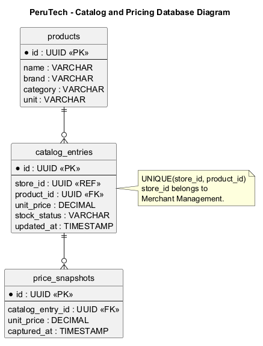

#### Route Planning

El Bounded Context **Route Planning** mantiene la información relacionada con las rutas calculadas para una planificación de compras.

La tabla `routes` almacena los datos principales del recorrido, tales como distancia, duración estimada, costo de desplazamiento, ahorro neto y estado.

Cada ruta se compone de múltiples `route_stops`, los cuales almacenan el establecimiento correspondiente, el orden dentro de la ruta y la hora estimada de llegada.

La combinación entre una ruta y su número de secuencia debe ser única. `shopping_list_id` referencia información proveniente de Shopping Planning y `store_id` corresponde a establecimientos administrados por Merchant Management.

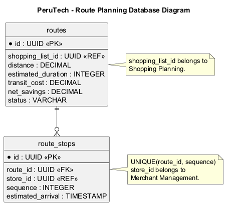

#### Merchant Management

El Bounded Context **Merchant Management** persiste la información necesaria para administrar comerciantes y establecimientos.

`merchant_profiles` representa el perfil comercial y su estado de verificación fiscal. Un perfil puede administrar múltiples registros `retail_stores`, los cuales almacenan datos del establecimiento y su ubicación.

`inventory_items` representa los productos gestionados dentro de cada establecimiento, incluyendo stock, precio y estado de disponibilidad.

Finalmente, `promotions` registra las promociones asociadas a elementos del inventario y mantiene sus períodos de vigencia.

El campo `product_id` de inventario funciona como una referencia hacia Catalog and Pricing.

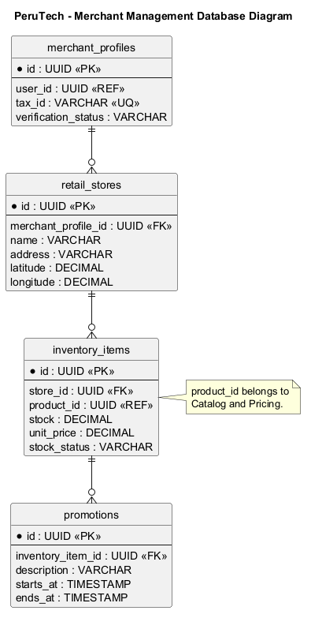

#### Community Price Verification

El modelo de persistencia de **Community Price Verification** permite almacenar reportes y evidencias relacionadas con discrepancias de precios.

`price_discrepancies` representa diferencias reportadas entre un precio esperado y uno observado. Cada discrepancia puede recibir múltiples registros `price_observations`, los cuales contienen el precio observado, fecha y origen de la observación.

Asimismo, `verification_confirmations` registra las confirmaciones realizadas por otros usuarios y `trust_profiles` mantiene información relacionada con el nivel de confianza de las contribuciones realizadas por cada usuario.

Las referencias hacia productos y usuarios pertenecen respectivamente a Catalog and Pricing e Identity and Access.

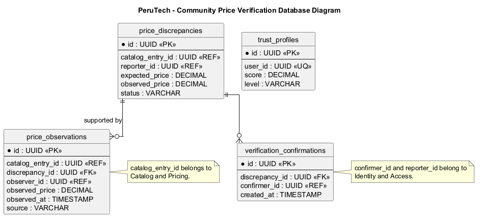

#### Analytics and Engagement

El Bounded Context **Analytics and Engagement** almacena eventos de interacción y los resultados analíticos generados a partir de ellos.

`analytics_events` registra eventos relevantes mediante un tipo, una fecha de ocurrencia, un sujeto asociado y metadatos adicionales.

A partir de estos eventos pueden generarse registros `merchant_metrics`, los cuales consolidan indicadores como tráfico mensual, ventas perdidas y engagement dentro de un período determinado.

La tabla `merchant_reports` representa los reportes generados para un establecimiento, incluyendo el tipo de reporte, período analizado y fecha de generación.

Los identificadores de establecimiento utilizados por métricas y reportes actúan como referencias hacia Merchant Management.

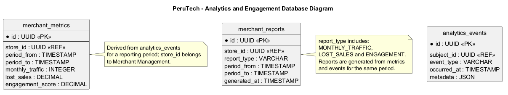

En conjunto, estos diagramas permiten mantener una visión global de la persistencia de PeruTech y, al mismo tiempo, conservar los límites definidos entre los Bounded Contexts. Las referencias externas entre contextos se representan mediante identificadores, mientras que las relaciones internas utilizan claves primarias, claves foráneas y restricciones propias de cada modelo.

---

# Capítulo V: Product Implementation, Validation & Deployment

## 5.1. Software Configuration Management

[Contenido]

### 5.1.1. Software Development Environment Configuration

[Contenido]

### 5.1.2. Source Code Management

[Contenido]

### 5.1.3. Source Code Style Guide & Conventions

[Contenido]

### 5.1.4. Software Deployment Configuration

[Contenido]

## 5.2. Landing Page, Services & Applications Implementation

[Contenido]

### 5.2.1. Sprint 1

[Contenido]

#### 5.2.1.1. Sprint Planning 1

[Contenido]

#### 5.2.1.2. Aspect Leaders and Collaborators

[Contenido]

#### 5.2.1.3. Sprint Backlog 1

[Contenido]

#### 5.2.1.4. Development Evidence for Sprint Review

[Contenido]

#### 5.2.1.5. Execution Evidence for Sprint Review

[Contenido]

#### 5.2.1.6. Services Documentation Evidence for Sprint Review

[Contenido]

#### 5.2.1.7. Software Deployment Evidence for Sprint Review

[Contenido]

#### 5.2.1.8. Team Collaboration Insights during Sprint

[Contenido]

### 5.2.2. Sprint 2

[Contenido]

#### 5.2.2.1. Sprint Planning 2

[Contenido]

#### 5.2.2.2. Aspect Leaders and Collaborators

[Contenido]

#### 5.2.2.3. Sprint Backlog 2

[Contenido]

#### 5.2.2.4. Development Evidence for Sprint Review

[Contenido]

#### 5.2.2.5. Execution Evidence for Sprint Review

[Contenido]

#### 5.2.2.6. Services Documentation Evidence for Sprint Review

[Contenido]

#### 5.2.2.7. Software Deployment Evidence for Sprint Review

[Contenido]

#### 5.2.2.8. Team Collaboration Insights during Sprint

[Contenido]

## 5.3. Validation Interviews

[Contenido]

### 5.3.1. Diseño de Entrevistas

[Contenido]

### 5.3.2. Registro de Entrevistas

[Contenido]

### 5.3.3. Evaluaciones según heurísticas

[Contenido]

## 5.4. Video About-the-Product

[Contenido]

---

# Conclusiones

[Contenido]

# Conclusiones y recomendaciones

[Contenido]

# Video About-the-Team

[Contenido]

# Bibliografía

[Contenido]

# Anexos

[Contenido]
