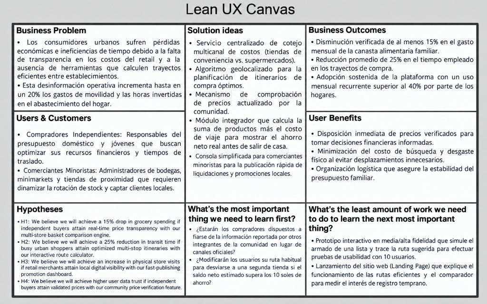
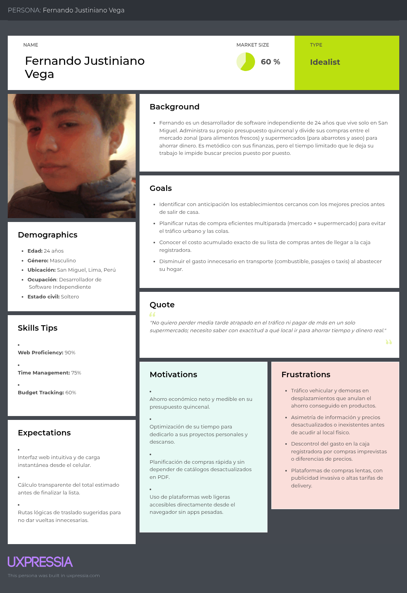
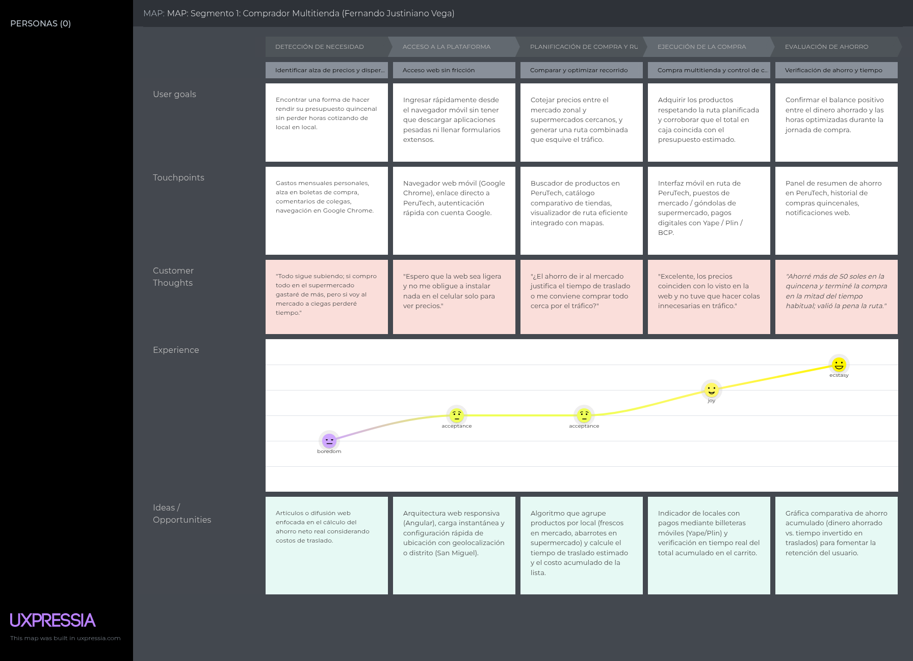
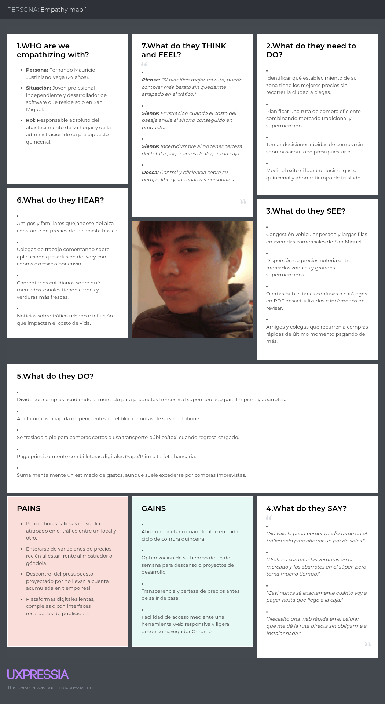

  

   

  <h3>Universidad Peruana de Ciencias Aplicadas</h3>
  
<strong>Carrera de Ingeniería de Software</strong>

Universidad Peruana de Ciencias Aplicadas

Carrera de Ingeniería de Software

### **1ASI0729**
### **Desarrollo de Aplicaciones Open Source**

NRC

**7750**

### **Informe del Trabajo Final**

Docente

**Bautista Ubillús, Efrain Ricardo**

Equipo

**PeruTech** 

Proyecto

**Preciazo** 

#### **Integrantes**

<table align="center" style="all: unset;">
<tr style="background: none !important; border: none !important;">
<td align="left" style="border: none !important; padding: 0 40px 0 0 !important; background: none !important;"><strong>Código</strong></td>
<td align="left" style="border: none !important; padding: 0 !important; background: none !important;"><strong>Apellidos y Nombres</strong></td>
</tr>
<tr style="background: none !important; border: none !important;">
<td align="left" style="border: none !important; padding: 0 40px 0 0 !important; background: none !important;">u20241c101</td>
<td align="left" style="border: none !important; padding: 0 !important; background: none !important;">Capillo Lema, Mía Valentina</td>
</tr>
<tr style="background: none !important; border: none !important;">
<td align="left" style="border: none !important; padding: 0 40px 0 0 !important; background: none !important;">U20221A525</td>
<td align="left" style="border: none !important; padding: 0 !important; background: none !important;">Pardo Chumpitazi, Kevin Patrick</td>
</tr>
<tr style="background: none !important; border: none !important;">
<td align="left" style="border: none !important; padding: 0 40px 0 0 !important; background: none !important;">[Código]</td>
<td align="left" style="border: none !important; padding: 0 !important; background: none !important;">[Apellidos y Nombres]</td>
</tr>
<tr style="background: none !important; border: none !important;">
<td align="left" style="border: none !important; padding: 0 40px 0 0 !important; background: none !important;">[Código]</td>
<td align="left" style="border: none !important; padding: 0 !important; background: none !important;">[Apellidos y Nombres]</td>
</tr>
<tr style="background: none !important; border: none !important;">
<td align="left" style="border: none !important; padding: 0 40px 0 0 !important; background: none !important;">[Código]</td>
<td align="left" style="border: none !important; padding: 0 !important; background: none !important;">[Apellidos y Nombres]</td>
</tr>
<tr style="background: none !important; border: none !important;">
<td align="left" style="border: none !important; padding: 0 40px 0 0 !important; background: none !important;">[Código]</td>
<td align="left" style="border: none !important; padding: 0 !important; background: none !important;">[Apellidos y Nombres]</td>
</tr>
</table>

 

**Período 202620**

**Septiembre 2026**

---

# Registro de Versiones del Informe

| Versión | Fecha | Autor | Descripción de modificación |
|--------|------|------|-----------------------------|
| 1.0 | 06/09/2026 | Capillo Lema, Mía Valentina   | Creación inicial del informe |
| | | | |

---

# Project Report Collaboration Insights

[Contenido correspondiente a Project Report Collaboration Insights]

---

# Contenido

## Tabla de Contenidos

- [Student Outcome](#student-outcome)

- [Capítulo I: Introducción](#capítulo-i-introducción)
  - [1.1. Startup Profile](#11-startup-profile)
    - [1.1.1. Descripción de la Startup](#111-descripción-de-la-startup)
    - [1.1.2. Perfiles de integrantes del equipo](#112-perfiles-de-integrantes-del-equipo)
  - [1.2. Solution Profile](#12-solution-profile)
    - [1.2.1. Antecedentes y problemática](#121-antecedentes-y-problemática)
    - [1.2.2. Lean UX Process](#122-lean-ux-process)
      - [1.2.2.1. Lean UX Problem Statements](#1221-lean-ux-problem-statements)
      - [1.2.2.2. Lean UX Assumptions](#1222-lean-ux-assumptions)
      - [1.2.2.3. Lean UX Hypothesis Statements](#1223-lean-ux-hypothesis-statements)
      - [1.2.2.4. Lean UX Canvas](#1224-lean-ux-canvas)
  - [1.3. Segmentos objetivo](#13-segmentos-objetivo)

- [Capítulo II: Requirements Elicitation & Analysis](#capítulo-ii-requirements-elicitation--analysis)
  - [2.1. Competidores](#21-competidores)
    - [2.1.1. Análisis competitivo](#211-análisis-competitivo)
    - [2.1.2. Estrategias y tácticas frente a competidores](#212-estrategias-y-tácticas-frente-a-competidores)
  - [2.2. Entrevistas](#22-entrevistas)
    - [2.2.1. Diseño de entrevistas](#221-diseño-de-entrevistas)
    - [2.2.2. Registro de entrevistas](#222-registro-de-entrevistas)
    - [2.2.3. Análisis de entrevistas](#223-análisis-de-entrevistas)
  - [2.3. Needfinding](#23-needfinding)
    - [2.3.1. User Personas](#231-user-personas)
    - [2.3.2. User Task Matrix](#232-user-task-matrix)
    - [2.3.3. User Journey Mapping](#233-user-journey-mapping)
    - [2.3.4. Empathy Mapping](#234-empathy-mapping)
  - [2.4. Big Picture Event Storming](#24-big-picture-event-storming)
  - [2.5. Ubiquitous Language](#25-ubiquitous-language)

- [Capítulo III: Requirements Specification](#capítulo-iii-requirements-specification)
  - [3.1. User Stories](#31-user-stories)
  - [3.2. Impact Mapping](#32-impact-mapping)
  - [3.3. Product Backlog](#33-product-backlog)

- [Capítulo IV: Product Design](#capítulo-iv-product-design)
  - [4.1. Style Guidelines](#41-style-guidelines)
    - [4.1.1. General Style Guidelines](#411-general-style-guidelines)
    - [4.1.2. Web Style Guidelines](#412-web-style-guidelines)
  - [4.2. Information Architecture](#42-information-architecture)
    - [4.2.1. Organization Systems](#421-organization-systems)
    - [4.2.2. Labeling Systems](#422-labeling-systems)
    - [4.2.3. SEO Tags and Meta Tags](#423-seo-tags-and-meta-tags)
    - [4.2.4. Searching Systems](#424-searching-systems)
    - [4.2.5. Navigation Systems](#425-navigation-systems)
  - [4.3. Landing Page UI Design](#43-landing-page-ui-design)
    - [4.3.1. Landing Page Wireframe](#431-landing-page-wireframe)
    - [4.3.2. Landing Page Mock-up](#432-landing-page-mock-up)
  - [4.4. Web Applications UX/UI Design](#44-web-applications-uxui-design)
    - [4.4.1. Web Applications Wireframes](#441-web-applications-wireframes)
    - [4.4.2. Web Applications Wireflow Diagrams](#442-web-applications-wireflow-diagrams)
    - [4.4.3. Web Applications Mock-ups](#443-web-applications-mock-ups)
    - [4.4.4. Web Applications User Flow Diagrams](#444-web-applications-user-flow-diagrams)
  - [4.5. Web Applications Prototyping](#45-web-applications-prototyping)
  - [4.6. Domain-Driven Software Architecture](#46-domain-driven-software-architecture)
    - [4.6.1. Design-Level Event Storming](#461-design-level-event-storming)
    - [4.6.2. Software Architecture Context Diagram](#462-software-architecture-context-diagram)
    - [4.6.3. Software Architecture Container Diagrams](#463-software-architecture-container-diagrams)
    - [4.6.4. Software Architecture Components Diagrams](#464-software-architecture-components-diagrams)
  - [4.7. Software Object-Oriented Design](#47-software-object-oriented-design)
    - [4.7.1. Class Diagrams](#471-class-diagrams)
  - [4.8. Database Design](#48-database-design)
    - [4.8.1. Database Diagrams](#481-database-diagrams)

- [Capítulo V: Product Implementation, Validation & Deployment](#capítulo-v-product-implementation-validation--deployment)
  - [5.1. Software Configuration Management](#51-software-configuration-management)
    - [5.1.1. Software Development Environment Configuration](#511-software-development-environment-configuration)
    - [5.1.2. Source Code Management](#512-source-code-management)
    - [5.1.3. Source Code Style Guide & Conventions](#513-source-code-style-guide--conventions)
    - [5.1.4. Software Deployment Configuration](#514-software-deployment-configuration)
  - [5.2. Landing Page, Services & Applications Implementation](#52-landing-page-services--applications-implementation)
    - [5.2.1. Sprint 1](#521-sprint-1)
      - [5.2.1.1. Sprint Planning 1](#5211-sprint-planning-1)
      - [5.2.1.2. Aspect Leaders and Collaborators](#5212-aspect-leaders-and-collaborators)
      - [5.2.1.3. Sprint Backlog 1](#5213-sprint-backlog-1)
      - [5.2.1.4. Development Evidence for Sprint Review](#5214-development-evidence-for-sprint-review)
      - [5.2.1.5. Execution Evidence for Sprint Review](#5215-execution-evidence-for-sprint-review)
      - [5.2.1.6. Services Documentation Evidence for Sprint Review](#5216-services-documentation-evidence-for-sprint-review)
      - [5.2.1.7. Software Deployment Evidence for Sprint Review](#5217-software-deployment-evidence-for-sprint-review)
      - [5.2.1.8. Team Collaboration Insights during Sprint](#5218-team-collaboration-insights-during-sprint)
    - [5.2.2. Sprint 2](#522-sprint-2)
      - [5.2.2.1. Sprint Planning 2](#5221-sprint-planning-2)
      - [5.2.2.2. Aspect Leaders and Collaborators](#5222-aspect-leaders-and-collaborators)
      - [5.2.2.3. Sprint Backlog 2](#5223-sprint-backlog-2)
      - [5.2.2.4. Development Evidence for Sprint Review](#5224-development-evidence-for-sprint-review)
      - [5.2.2.5. Execution Evidence for Sprint Review](#5225-execution-evidence-for-sprint-review)
      - [5.2.2.6. Services Documentation Evidence for Sprint Review](#5226-services-documentation-evidence-for-sprint-review)
      - [5.2.2.7. Software Deployment Evidence for Sprint Review](#5227-software-deployment-evidence-for-sprint-review)
      - [5.2.2.8. Team Collaboration Insights during Sprint](#5228-team-collaboration-insights-during-sprint)
  - [5.3. Validation Interviews](#53-validation-interviews)
    - [5.3.1. Diseño de Entrevistas](#531-diseño-de-entrevistas)
    - [5.3.2. Registro de Entrevistas](#532-registro-de-entrevistas)
    - [5.3.3. Evaluaciones según heurísticas](#533-evaluaciones-según-heurísticas)
  - [5.4. Video About-the-Product](#54-video-about-the-product)

- [Conclusiones](#conclusiones)
- [Conclusiones y recomendaciones](#conclusiones-y-recomendaciones)
- [Video About-the-Team](#video-about-the-team)
- [Bibliografía](#bibliografía)
- [Anexos](#anexos)

---

# Student Outcome

El curso contribuye al cumplimiento del Student Outcome ABET:

**ABET – EAC - Student Outcome 3**

**Criterio:**  

*Capacidad de comunicarse efectivamente con un rango de audiencias. En el siguiente cuadro se describe las acciones realizadas y enunciados de conclusiones por parte del grupo, que permiten sustentar el haber alcanzado el logro del ABET – EAC - Student Outcome 3.*

| Criterio específico | Acciones realizadas | Conclusiones |
|---------------------|---------------------|--------------|
| **Comunica oralmente con efectividad a diferentes rangos de audiencia.** | [Descripción de acciones realizadas]   **AV1**   [Evidencia] | [Conclusiones] |
| **Comunica por escrito con efectividad a diferentes rangos de audiencia.** | [Descripción de acciones realizadas]   **AV1**   [Evidencia] | [Conclusiones] |

---

# Capítulo I: Introducción

## 1.1. Startup Profile

### 1.1.1. Descripción de la Startup

PeruTech es una organización de innovación tecnológica integrada por estudiantes de la carrera de Ingeniería de Software de la Universidad Peruana de Ciencias Aplicadas (UPC). La iniciativa se enfoca en el diseño e implementación de soluciones digitales orientadas a mitigar fricciones urbanas cotidianas, principalmente aquellas vinculadas a la planificación financiera del hogar, la dispersión de precios minoristas y la optimización de traslados en la ciudad.

El proyecto central del equipo, denominado **Preciazo**, surge como una respuesta directa a las dificultades económicas que enfrentan las familias en Lima ante la variación continua de costos en la canasta básica. La plataforma otorga transparencia al mercado minorista al articular un motor comparativo de precios de bienes esenciales con la optimización algorítmica de rutas de desplazamiento. De esta forma, Preciazo asiste a los compradores independientes en la toma de decisiones de abastecimiento eficientes —maximizando su presupuesto y reduciendo tiempos de traslado—, mientras provee a los comercios minoristas un canal estructurado de visibilidad digital para posicionar sus catálogos.

*   **Misión:** Facilitar decisiones de abastecimiento eficientes mediante información verificable de precios, trazado inteligente de rutas comerciales y herramientas de presupuesto familiar, integrando en simultáneo a los comercios minoristas en un canal digital que potencie la exposición de sus ofertas locales.
*   **Visión:** Consolidar a Preciazo como la plataforma tecnológica referente a nivel nacional en la optimización de compras cotidianas y en la conexión digital directa y dinámica entre compradores independientes y comercios minoristas.

### 1.1.2. Perfiles de integrantes del equipo

  

**Capillo Lema, Mía Valentina**  
* **Código de estudiante:** U20241c101  
* **Carrera:** Ingeniería de Software  

Mi nombre es Mía Valentina. Poseo experiencia en en el lenguaje C++ y Python, lo que me permite contribuir en el desarrollo de soluciones eficientes. Además, tengo habilidades en la recopilación y análisis de información, lo cual es fundamental para identificar áreas de mejora y optimizar procesos. También tengo conocimientos sobre estructuras de datos, que me permiten organizar y gestionar información de manera efectiva. Mi enfoque se centra en generar soluciones innovadoras y prácticas que aporten valor a los proyectos en los que participo.

 

  

**Pardo Chumpitazi, Kevin Patrick**  
* **Código de estudiante:** U20221A525 
* **Carrera:** Ingeniería de Software  

Estudiante de pregrado de la carrera de Ingeniería de Software en la Universidad Peruana de Ciencias Aplicadas (UPC). Posee conocimientos en desarrollo de soluciones de software mediante lenguajes de programación como C#, Java, Python y TypeScript, así como en la estructuración de componentes web en Angular y servicios en Spring Boot. Cuenta con experiencia en administración de bases de datos relacionales, aplicación de flujos de trabajo colaborativos bajo GitFlow y Conventional Commits, y gestión ágil mediante tableros Kanban y marcos Scrum. En el equipo aporta liderazgo técnico en la configuración de entornos, estandarización de repositorios, control de versiones y trazabilidad en la arquitectura de software.

## 1.2. Solution Profile

### 1.2.1. Antecedentes y problemática

*   **Who? (¿Quién?):**
    *   *Compradores Independientes:* Estudiantes, jóvenes profesionales y responsables del abastecimiento en hogares de Lima Metropolitana que disponen de un presupuesto acotado y requieren optimizar sus tiempos de traslado.
    *   *Comerciantes Minoristas:* Propietarios, administradores y encargados de bodegas, minimarkets, tiendas de conveniencia y puestos de abasto que precisan dinamizar la rotación de su inventario, reducir la merma de productos y captar clientes presenciales en su entorno comercial local.
*   **What? (¿Qué?):** La asimetría en el acceso a la información de precios y la ineficiencia logística en la planificación de recorridos de aprovisionamiento minorista. Actualmente existe una marcada inconsistencia entre las tarifas publicadas en canales digitales y los costos en las estanterías de las tiendas físicas, sumado a la falta de herramientas centralizadas para contrastar el costo consolidado de una lista de compras multiestablecimiento. Esta desconexión ocasiona sobrecostos financieros en los hogares e incrementos innecesarios en gastos de transporte y tiempos de traslado.
*   **Where? (¿Dónde?):** El problema se focaliza en sectores y ejes urbanos de Lima Metropolitana con alta densidad y dispersión de establecimientos minoristas. La solución está dirigida a compradores independientes con conectividad móvil y a comerciantes minoristas interesados en maximizar su presencia georreferenciada en su zona de influencia.
*   **When? (¿Cuándo?):** Se presenta durante la planificación periódica del aprovisionamiento familiar (semanal o quincenal) y en compras imprevistas de reposición inmediata. La situación se vuelve crítica durante los fines de semana o jornadas de ofertas zonales, periodos en los cuales el stock y las tarifas varían de manera acelerada.
*   **Why? (¿Por qué?):** Principalmente debido a la fragmentación tecnológica del sector minorista y la rigidez de los sistemas de inventario tradicionales, los cuales impiden la difusión sincronizada de tarifas y promociones hacia el entorno cercano. En consecuencia, el comprador independiente incurre en traslados infructuosos hacia promociones desactualizadas, mientras que el comerciante minorista pierde ventas por no visibilizar oportunamente su catálogo.
*   **How? (¿Cómo?):** Actualmente, los compradores independientes recopilan información a través de canales dispares (redes sociales, catálogos físicos o consultas presenciales), evaluando de manera manual y aproximada si el diferencial de precio compensa el traslado. En simultáneo, los comerciantes minoristas dependen de medios convencionales de difusión (pizarras físicas, carteles o mensajería cerrada), lo que limita su capacidad para comunicar ofertas de forma inmediata a los compradores locales.
*   **How much? (¿Cuánto?):** Esta dificultad para optimizar el gasto se agrava ante la continua presión sobre los costos de la canasta alimentaria urbana. Por consiguiente, una porción significativa de las familias prioriza la localización de descuentos para equilibrar su presupuesto, mientras que desplazarse entre establecimientos dispersos sin planificación previa genera sobrecostos de hasta un 20% en transporte, impacto logístico que puede corregirse mediante algoritmos de trazado y optimización de rutas.

 

**Enunciado del problema:**  
Los compradores independientes de Lima Metropolitana afrontan barreras para identificar la alternativa de aprovisionamiento de menor costo consolidado, debido a la dispersión de información tarifaria y a la ausencia de herramientas integradas que consideren los tiempos y costos de desplazamiento entre establecimientos. Paralelamente, los comerciantes minoristas carecen de canales digitales centralizados para difundir su catálogo y promociones a compradores de proximidad, lo cual limita la visibilidad oportuna de sus ofertas.

**Objetivo general:**  
Diseñar, desarrollar y desplegar la plataforma web responsive **Preciazo**, permitiendo que los compradores independientes accedan instantáneamente desde el navegador de cualquier dispositivo móvil o de escritorio —sin requerir la descarga ni la instalación de un aplicativo móvil nativo— para consultar precios actualizados, consolidar presupuestos y trazar recorridos comerciales eficientes; proveyendo en simultáneo a los comerciantes minoristas una consola digital para registrar su oferta y dinamizar sus ventas locales.

**Restricciones de alcance:**  
* El acceso de los usuarios se realizará exclusivamente a través de navegadores web modernos mediante diseño responsive adaptativo, suprimiendo la necesidad de instalación en el almacenamiento del dispositivo.
* El alcance geográfico operativo se circunscribe a distritos comerciales de Lima Metropolitana.
* La exactitud de las listas de precios y la disponibilidad de productos se encuentra sujeta a la información suministrada por comerciantes inscritos y validaciones de la comunidad.
* La versión inicial del sistema no asegura la cobertura de la totalidad del universo comercial de la ciudad.
* La estructuración de rutas y la estimación de tiempos de viaje dependen de la disponibilidad operativa de servicios externos de geolocalización y mapas.
* La arquitectura se centra estrictamente en tecnologías web estandarizadas (HTML5, CSS3, TypeScript), descartando el empaquetado nativo durante esta fase de lanzamiento.

### 1.2.2. Lean UX Process

El proceso de Lean UX adoptado por PeruTech establece un marco de validación continua y temprana de valor para la plataforma **Preciazo**. Mediante la iteración constante de los ciclos de formulación de supuestos (*Think*), diseño de artefactos e interfaces (*Make*) y comprobación empírica con métricas objetivas (*Check*), el equipo orienta el esfuerzo de desarrollo hacia la construcción de un Producto Mínimo Viable (MVP). Este enfoque permite corroborar oportunamente los requerimientos críticos de los **compradores independientes** y los **comerciantes minoristas**, minimizando riesgos técnicos y garantizando soluciones eficientes ante las fricciones de costo y desplazamiento urbano.

#### 1.2.2.1. Lean UX Problem Statement

> **The current state of** retail shopping and local store management in Lima Metropolitan Area **has focused mainly on** individual supermarket discounts, traditional physical price browsing, and isolated delivery platforms that prioritize home delivery fees over local retail foot traffic and budget optimization.  
> **What existing products/services fail to address is** the lack of a unified, multi-establishment system that calculates the true consolidated cost of an in-person shopping trip—integrating real-time verified prices, multi-stop routing efficiency, and urban transit expenses—while providing proximity merchants with an accessible channel to publish promotions and liquidate slow-moving inventory.  
> **Our product/service will address this gap by** developing **Preciazo**, an instant-access responsive web platform that optimizes shopping lists against verified retail prices, transit costs, and user budget thresholds to generate dynamic multi-store routes, while equipping proximity retail managers with a centralized dashboard to broadcast local discounts and attract nearby store foot traffic.  
> **Our initial focus will be** budget-conscious independent buyers (university students and young adults living in Lima) and retail merchants (independent store managers and local market vendors).  
> **We’ll know we are successful when we see** independent buyers regularly generating and completing multi-store purchases using our optimized routes, and retail merchants actively publishing and updating weekly discount listings on the platform.

#### 1.2.2.2. Lean UX Assumptions

##### Business Assumptions
1. **Creemos que existe una demanda insatisfecha en el mercado** de compradores independientes que requieren una solución tecnológica que determine si el diferencial de ahorro de una oferta justifica el tiempo y costo de traslado urbano.
2. **Creemos que estas necesidades se satisfacen eficazmente mediante** la plataforma web responsive **Preciazo**, la cual calcula el costo consolidado de la canasta y optimiza itinerarios multiestablecimiento según el medio de locomoción del comprador independiente.
3. **Creemos que nuestros segmentos primarios son** los compradores independientes (estudiantes universitarios, jóvenes profesionales y jefes de hogar) y los comerciantes minoristas (administradores de bodegas, minimarkets y abastos locales) en zonas de alta densidad comercial de Lima Metropolitana.
4. **Creemos que la propuesta de valor diferenciada para el comprador independiente es** maximizar su presupuesto y optimizar tiempos de traslado; mientras que para el comerciante minorista es dinamizar la rotación de stock crítico y captar afluencia presencial en tienda física.
5. **Creemos que el modelo de monetización se sustentará en** planes de suscripción mensual/trimestral para comerciantes minoristas interesados en posicionamiento destacado en el catálogo local y en analítica predictiva de demanda barrial.
6. **Creemos que los principales competidores del servicio son** la cotización manual presencial, los catálogos estáticos de grandes cadenas y las aplicaciones de delivery que imponen sobrecostos tarifarios de envío.
7. **Creemos que la ventaja competitiva esencial de Preciazo reside en** consolidar el costo real total de abastecimiento (costo agregado de productos más costo de transporte georreferenciado) a través de una ruta optimizada entre múltiples comercios.
8. **Creemos que el riesgo operativo crítico es** la posible resistencia o demora inicial de los comerciantes minoristas en la actualización continua y oportuna de sus listas de precios.
9. **Creemos que mitigaremos dicho riesgo operativo** proveyendo un mecanismo colaborativo de verificación ciudadana de precios y demostrando a los comerciantes el incremento directo en el flujo de visitas y ventas locales.

##### Business Outcome Assumptions
1. **Creemos que lograremos una tasa de adopción activa donde** al menos el 65% de los compradores independientes registrados complete un recorrido de abastecimiento basado en las rutas sugeridas durante su primer mes de uso.
2. **Creemos que alcanzaremos una retención mensual (*churn rate* reducido) donde** más del 40% de los compradores independientes activos retorne a la plataforma web de forma recurrente semana a semana.
3. **Creemos que demostraremos la efectividad de la propuesta de valor cuando** el ahorro económico promedio comprobado por los compradores independientes sea de al menos un 15% sobre el valor convencional de su canasta básica.
4. **Creemos que validaremos la viabilidad de tracción comercial cuando** al menos el 60% de los comerciantes minoristas afiliados reporte un incremento verificable en la afluencia presencial a sus establecimientos derivado de sus publicaciones.

##### User Assumptions
1. **Creemos que los compradores independientes son** individuos de entre 18 y 50 años que gestionan presupuestos definidos, poseen smartphones con conectividad a internet y buscan optimizar sus trayectos cotidianos de aprovisionamiento.
2. **Creemos que los comerciantes minoristas son** propietarios o encargados de micro y pequeños negocios de abasto que buscan canales digitales accesibles y de bajo costo para dar salida oportuna a su inventario.
3. **Creemos que la solución encaja en el flujo de vida del comprador independiente** tanto en la fase previa de formulación del presupuesto en el hogar como en la fase operativa durante el recorrido entre comercios.
4. **Creemos que la solución encaja en la rutina operativa del comerciante minorista** durante las horas matutinas y jornadas de cierre de inventario para difundir promociones sobre productos de alta rotación o fecha de caducidad próxima.

##### User Outcome and Benefit Assumptions
1. **Creemos que los compradores independientes obtendrán como beneficio** visibilidad total y anticipada del costo exacto de su lista de abastecimiento antes de iniciar el trayecto físico.
2. **Creemos que los compradores independientes optimizarán su tiempo de desplazamiento urbano**, minimizando tiempos muertos y gastos innecesarios de movilidad entre tiendas zonales.
3. **Creemos que los comerciantes minoristas lograrán como resultado** acelerar la rotación de artículos de menor salida y reducir significativamente las pérdidas económicas por merma de bienes perecibles.
4. **Creemos que los comerciantes minoristas ampliarán su alcance de mercado local**, captando consumidores que habitualmente no frecuentaban su establecimiento.

##### Feature Assumptions
1. **Feature Assumption 1 (Comparador de Canasta Multi-establecimiento):** Creemos que proveer un módulo de armado de listas de compras con cotejo automático multi-establecimiento permitirá a los compradores independientes visualizar y elegir la combinación comercial más económica.
2. **Feature Assumption 2 (Optimizador de Rutas según Presupuesto Límite):** Creemos que implementar un motor de cálculo de rutas con restricciones presupuestarias y modos de transporte asegurará que los compradores completen sus adquisiciones sin exceder su límite de gasto.
3. **Feature Assumption 3 (Módulo de Verificación Colaborativa de Precios):** Creemos que habilitar un componente de validación ciudadana donde los compradores confirmen la exactitud de los precios en góndola garantizará la fiabilidad e integridad continua de los datos.
4. **Feature Assumption 4 (Consola de Gestión y Promociones para Comerciantes):** Creemos que desarrollar una consola simplificada para el registro rápido de catálogos y promociones georreferenciadas incrementará la afluencia de clientes de proximidad hacia los comercios minoristas.

#### 1.2.2.3. Lean UX Hypothesis Statements

*   **Hypothesis Statement 1 (basado en Feature Assumption 1: Comparador de Canasta Multi-establecimiento):**
    *   **We believe we will achieve** a 70% rate of active users completing at least one guided purchase in their first month and an overall platform user retention above 40%
    *   **If** independent buyers managing a tight budget
    *   **Attain** an accurate, pre-calculated total cost of their entire shopping list before leaving home
    *   **With** a comprehensive multi-store basket comparison engine (**Comparador de Canasta Multi-establecimiento**).

*   **Hypothesis Statement 2 (basado en Feature Assumption 2: Optimizador de Rutas según Presupuesto Límite):**
    *   **We believe we will achieve** an average reduction of 25% in the time users spend completing multi-store purchases
    *   **If** busy urban independent buyers looking to maximize both their time and money
    *   **Attain** optimized shopping itineraries that strictly respect their maximum budget and transportation choices
    *   **With** an interactive route calculator with budget caps (**Optimizador de Rutas según Presupuesto Límite**).

*   **Hypothesis Statement 3 (basado en Feature Assumption 3: Módulo de Verificación Colaborativa de Precios):**
    *   **We believe we will achieve** an 80% price verification accuracy rate between reported shelf prices and actual checkout counter costs
    *   **If** active members of the shopping community
    *   **Attain** high trust in platform data accuracy and recognition for contributing real-time updates
    *   **With** a crowd-sourced price reporting and verification system (**Módulo de Verificación Colaborativa de Precios**).

*   **Hypothesis Statement 4 (basado en Feature Assumption 4: Consola de Gestión y Promociones para Comerciantes):**
    *   **We believe we will achieve** a 20% drop in food waste/expiration and a 60% rate of partner stores reporting increased foot traffic
    *   **If** proximity retail merchants dealing with overstocked inventory
    *   **Attain** immediate local visibility for time-sensitive discounts to draw nearby shoppers into their physical stores
    *   **With** a fast-publishing promotion dashboard for store managers (**Consola de Gestión y Promociones para Comerciantes**).

#### 1.2.2.4. Lean UX Canvas

A continuación se presenta el Lean UX Canvas sintetizado, articulando el problema de negocio, los segmentos, los beneficios esperados, las hipótesis operativas y las tácticas de aprendizaje validado para la plataforma **Preciazo**:

  

 

## 1.3. Segmentos objetivo

### 1. Compradores Independientes
Este segmento comprende a estudiantes universitarios, jóvenes profesionales independientes y responsables del aprovisionamiento familiar que residen en áreas urbanas de Lima Metropolitana, concentrándose en los niveles socioeconómicos (NSE) B y C. Demográficamente, se sitúan en un rango etario de 18 a 50 años, disponen de conectividad constante mediante teléfonos inteligentes y presentan hábitos de consumo orientados a la optimización presupuestaria. 

A nivel estadístico, los estratos B y C destinan entre el 35% y el 45% de sus ingresos mensuales a la adquisición de alimentos y bienes de primera necesidad (INEI, 2026). Asimismo, el 41% de los consumidores peruanos ha adoptado conductas de compra omnicanal y multitienda para mitigar la inflación de la canasta básica, dividiendo sus transacciones en distintos puntos de venta para capturar ofertas (Kantar Worldpanel, 2025). Este grupo experimenta fricciones operativas causadas por la falta de transparencia en los precios físicos y la dispersión geográfica comercial, lo que incrementa hasta en un 20% sus gastos imprevistos de transporte urbano (Sabagh Nejad & Fazekas, 2022). Requieren una herramienta accesible desde el navegador móvil que les permita contrastar costos consolidados y trazar rutas eficientes sin incurrir en desplazamientos infructuosos.

### 2. Comerciantes Minoristas
Este segmento abarca a los propietarios, administradores y encargados de establecimientos comerciales de proximidad (bodegas estructuradas, minimarkets, discounters y puestos feriales) ubicados en zonas de alta densidad comercial en Lima Metropolitana. En términos de perfil operativo, gestionan inventarios de alta y mediana rotación, cuentan con equipos de cómputo básico o dispositivos móviles para la administración del local y dependen de una clientela concentrada en un radio de 500 metros a 1.5 kilómetros a la redonda.

En el Perú, el comercio minorista representa más del 12% del Producto Bruto Interno y agrupa a miles de unidades económicas donde la merma y el estancamiento de inventario perecible suponen pérdidas operativas directas de entre el 3% y el 7% de sus ingresos brutos (BCRP, 2025). Pese a la competencia del retail moderno, cerca del 70% de estos negocios carece de plataformas digitales integradas de bajo costo para publicitar liquidaciones puntuales a compradores locales (KPMG, 2025). En consecuencia, este segmento requiere una consola digital ágil y simplificada que les permita anunciar promociones georreferenciadas en tiempo real, impulsando el flujo peatonal presencial (*foot traffic*) y dinamizando la salida de stock antes de su vencimiento.

# Capítulo II: Requirements Elicitation & Analysis

## 2.1. Competidores

En el marco del desarrollo de la solución de software propuesta por PeruTech, resulta fundamental examinar de manera rigurosa el panorama competitivo en el que operará el sistema. El mercado digital orientado al consumo masivo, aprovisionamiento doméstico y comercio minorista en el país presenta diversas alternativas tecnológicas que resuelven de forma fragmentada las necesidades del consumidor final y de los comercios locales. El presente acápite tiene como propósito clasificar, analizar y contrastar las soluciones directas e indirectas existentes frente a nuestra propuesta de valor, identificando brechas operativas, limitaciones de modelo y oportunidades estratégicas que permitan posicionar a la plataforma como una alternativa técnica eficiente, transparente y orientada tanto al ahorro efectivo del presupuesto del comprador como a la visibilidad comercial justa de las tiendas y minimarkets afiliados.

### 2.1.1. Análisis competitivo

El ecosistema retail en el Perú ha experimentado un avance hacia la digitalización comercial; sin embargo, persiste una limitación estructural: la gran mayoría de plataformas operan como canales de venta diseñados para promover el consumo cautivo dentro de su propia tienda, en lugar de desempeñarse como herramientas orientadas al ahorro objetivo que asistan al consumidor en la toma de decisiones informadas para adquirir productos al menor costo real.

# Competitive Analysis Landscape - PeruTech

| **¿Por qué llevar a cabo este análisis?** | **Identificar las ventajas competitivas de PeruTech frente a soluciones de delivery, agregadores de catálogos y gestores de alacena, permitiendo posicionarnos como una plataforma web que integra optimización de presupuesto, comparativa de precios y trazado de rutas presenciales de compra en el mercado peruano.** |
| ----------------------------------------- | ------------------------------------------------------------------------------------------------------------------------------------------------------------------------------------------------------------------------------------------------------------------------------------- |

| Perfil | Atributo | PeruTech | Rappi / Fazil | Tiendeo / Ofertia | Out of Milk |
| :--- | :--- | :--- | :--- | :--- | :--- |
| **Perfil** | **Overview** | Plataforma web de planificación presupuestaria de compras, comparador de costos en góndola y optimización de rutas comerciales entre locales. | Ecosistema digital de comercio electrónico y logística de despachos inmediatos bajo demanda. | Plataforma agregadora de catálogos comerciales y encartes publicitarios en formato digital estático (PDF). | Herramienta móvil para confección de listas de compras y registro de existencias en el hogar. |
| | **Ventaja competitiva ¿Qué valor ofrece a los clientes?** | Algoritmo de optimización presupuestaria y cálculo anticipado del costo total de la canasta antes del pago en caja, junto con el trazado de rutas óptimas entre locales comerciales. Ofrece a los compradores ahorro monetario tangible sin cobros de intermediación, y a los comerciantes locales un canal directo de visibilidad para sus ofertas. | Infraestructura masiva de repartidores y entregas en lapsos reducidos. Ofrece comodidad inmediata al usuario al recibir los artículos en su domicilio sin desplazarse, priorizando el ahorro de tiempo a cambio de comisiones adicionales por servicio y envío. | Centralización de folletos y encartes promocionales de diversas cadenas minoristas en una sola interfaz. Ofrece visibilidad anticipada de promociones semanales, aunque sin herramientas de cálculo presupuestario dinámico ni asistencia durante la visita física. | Panel integrado para revisar stock de alacena y registrar faltantes mediante escaneo de código de barras, reduciendo la compra de artículos duplicados en alimentos básicos de uso regular. |
| **Perfil de Marketing** | **Mercado Objetivo** | Compradores independientes y consumidores urbanos que buscan optimizar su presupuesto; y comerciantes minoristas o administradores de tiendas locales interesados en visibilizar sus promociones en su zona de influencia. | Usuarios de niveles socioeconómicos A y B que priorizan la conveniencia y la inmediatez sobre el costo final de la canasta. | Personas habituadas a la consulta tradicional de folletos impresos y búsqueda anticipada de ofertas minoristas. | Consumidores que administran inventarios de cocina y priorizan el orden doméstico de insumos básicos. |
| | **Estrategias de marketing** | Posicionamiento orgánico web (SEO) centrado en ahorro inteligente, difusión comunitaria y programas de afiliación de bajo costo para comercios locales. | Captación agresiva sustentada en cupones promocionales, programas de suscripción mensual (Prime) y convenios corporativos de exclusividad. | Posicionamiento en motores de búsqueda para términos relacionados con ofertas comerciales y pauta publicitaria con marcas retail. | Posicionamiento orgánico en tiendas de aplicaciones móviles (ASO) y monetización por despliegue de anuncios display. |
| **Perfil de Producto** | **Productos & Servicios** | Plataforma Web responsiva con enfoque *mobile-first* desarrollada en Angular con servicios RESTful backend en Spring Boot, cálculo de canasta económica y panel de gestión de ofertas para comercios. | Aplicación de delivery con geolocalización en tiempo real, pasarela de pagos integrada y billetera digital. | Visor web y móvil de folletos interactivos geolocalizados sin motor transaccional de compras. | Herramienta móvil para edición de listas, gestión de existencias y escaneo de códigos de barra. |
| | **Precios & Costos** | Esquema Freemium (acceso gratuito para compradores con funciones esenciales de presupuesto y rutas; plan de afiliación mensual accesible en Soles para comerciantes que deseen destacar promociones). | Precios de góndola con margen incrementado, tarifa fija por despacho, tarifa de servicio (*service fee*) y costo de propinas. | Gratuito para el usuario final (modelo financiado directamente por la inversión publicitaria de las marcas retail). | Gratuito con inserción constante de anuncios visuales; pago único opcional para remover la publicidad. |
| | **Canales de distribución** | Plataforma Web accesible desde cualquier navegador moderno (escritorio y móviles), integrada con su Landing Page oficial. | Tiendas de distribución móvil (Google Play Store, App Store) y portal web de comercio electrónico. | Tiendas de distribución móvil y portal web informativo de catálogos. | Tiendas de distribución móvil (Google Play Store y App Store). |
| **SWOT** | PeruTech | Rappi / Fazil | Tiendeo / Ofertia | Out of Milk |
| **Fortalezas** | Algoritmo propio para proyección presupuestaria y optimización de rutas entre locales; arquitectura web escalable; total transparencia de precios presenciales; valor agregado tanto para compradores como para comercios afiliados. | Logística robusta y red masiva de repartidores consolidada; presupuesto elevado para marketing y fidelización de usuarios; convenios directos con cadenas de retail. | Extensa base de datos de catálogos comerciales a nivel nacional; interfaz intuitiva para lectura de volantes publicitarios; alto reconocimiento en búsqueda de ofertas. | Módulo dual de despensa y lista de compras integrado; escaneo funcional de código de barras; baja demanda de recursos en el dispositivo cliente. |
| **Debilidades** | Plataforma en fase inicial de penetración; volumen de datos inicial dependiente de la integración progresiva de establecimientos comerciales y adopción temprana de la comunidad. | Precios finales notablemente inflados frente a la compra directa en tienda; altas comisiones de servicio por pedido; dependencia de la disponibilidad de repartidores. | Contenido estático en imágenes o PDF que no permite búsquedas dinámicas de precios unitarios; nula asistencia en cálculo del gasto acumulado en tienda. | Interfaz gráfica desactualizada; ausencia de sincronización web colaborativa en tiempo real; saturación excesiva de publicidad en su versión gratuita. |
| **Oportunidades** | Sensibilidad al precio en compras presenciales ante variaciones de inflación; crecimiento de cadenas de descuento y necesidad de digitalización de bodegas de barrio. | Expansión hacia servicios financieros digitales (billeteras electrónicas) y programas corporativos de abastecimiento de oficinas. | Alianzas con pequeños comerciantes y bodegas de barrio para digitalizar sus promociones y volantes impresos. | Modernización visual del sistema orientada al consumo responsable y prevención del desperdicio de insumos perecibles. |
| **Amenazas** | Restricciones de acceso a datos públicos por parte de grandes cadenas de retail; incorporación de módulos de listas en plataformas bancarias o billeteras móviles. | Modificaciones en regulaciones laborales sobre repartidores que eleven los costos operativos; saturación y deserción de usuarios por cobros excesivos de servicio. | Desplazamiento por parte de usuarios jóvenes que demandan datos estructurados en tiempo real en lugar de lectura de folletos extensos. | Abandono de usuarios hacia aplicaciones genéricas de notas compartidas integradas en los sistemas operativos móviles. |

### 2.1.2. Estrategias y tácticas frente a competidores

A partir del diagnóstico FODA cruzado y el mapeo del entorno competitivo, se establecen las siguientes estrategias y tácticas preliminares para consolidar la propuesta de valor de PeruTech en el mercado:

* **Frente a Rappi / Fazil (Ecosistemas de Delivery On-Demand):**
  * **Estrategia (Aprovechamiento de debilidades y mitigación de amenazas):** Posicionar a PeruTech como la solución idónea frente a la sobretasa logística y comisiones excesivas, orientada al consumidor que prioriza el ahorro neto sobre la inmediatez delegada y al comerciante local que busca visibilidad sin pagar tarifas abusivas de intermediación.
  * **Tácticas:**
    * Implementar un comparador en tiempo real que contraste el costo del ticket presencial proyectado frente al costo promedio en aplicaciones de delivery, visibilizando el ahorro monetario directo.
    * Incorporar la funcionalidad de optimización de rutas geográficas entre establecimientos cercanos para que la compra física demande el menor tiempo y gasto de traslado posible.

* **Frente a Tiendeo / Ofertia (Agregadores de Catálogos Estáticos):**
  * **Estrategia (Explotación de limitaciones técnicas y oportunidades de mercado):** Reemplazar la consulta pasiva de folletos publicitarios estáticos mediante una arquitectura basada en datos estructurados y dinámicos, captando a usuarios que desestiman la navegación en catálogos no interactivos o en formato PDF.
  * **Tácticas:**
    * Desarrollar un motor de búsqueda indexada por categoría de producto y marca que desglose el precio unitario y permita la comparativa inmediata entre distintos establecimientos.
    * Integrar un módulo de presupuesto en vivo que consolide la suma automática de los ítems seleccionados antes de acudir al punto de venta.

* **Frente a Out of Milk (Gestores Móviles de Despensa y Listas):**
  * **Estrategia (Superación tecnológica y experiencia de usuario):** Diseñar una solución integral que conecte la gestión de listas de compra con la disponibilidad y precios reales de los locales en una plataforma moderna, eliminando la fricción de interfaces obsoletas saturadas de publicidad invasiva.
  * **Tácticas:**
    * Proporcionar una plataforma web responsiva con enfoque *mobile-first*, accesible de forma fluida desde cualquier navegador sin obligar a la instalación de aplicativos locales pesados.
    * Habilitar listas de compra dinámicas que sincronicen los productos seleccionados directamente con las ofertas vigentes publicadas por los comercios afiliados.

## 2.2. Entrevistas

Con el objetivo de validar las hipótesis iniciales del modelo de solución, comprender a profundidad los puntos de dolor y modelar con precisión los requerimientos funcionales del sistema, se desarrolló un proceso de investigación cualitativa sustentado en entrevistas en profundidad. Esta recolección de información se orientó de manera directa a representantes reales de los segmentos objetivo definidos para PeruTech: compradores individuales independientes (consumidores finales) y comerciantes minoristas o administradores de tiendas locales. A través de este acercamiento empírico, se exploraron tanto los hábitos de abastecimiento, métodos de ahorro y dificultades en recorridos presenciales por parte de los compradores, como los mecanismos de publicación de ofertas, gestión de precios y retos de visibilidad comercial que enfrentan los administradores de los establecimientos comerciales.

### 2.2.1. Diseño de entrevistas

El diseño del instrumento cualitativo se basa en el enfoque de Diseño Centrado en el Usuario (UCD) para recopilar evidencia empírica directa. Esta información sustenta la construcción rigurosa de los arquetipos (User Personas), mapas de empatía y recorridos de usuario (User Journey Maps).

El instrumento integra variables demográficas, competencias digitales y dinámicas operativas adaptadas a cada perfil objetivo. Para el segmento del consumidor final, las preguntas indagan en los hábitos de abastecimiento, sensibilidad al precio, planificación de rutas y control de gastos; mientras que, para el segmento del comerciante o administrador de tienda, el cuestionario se orienta a comprender los mecanismos de fijación de precios, la difusión de promociones y las barreras de visibilidad frente a las grandes cadenas minoristas. En ambos casos, las preguntas se estructuran en principales (orientadas a validar los problemas clave y la viabilidad de la solución) y complementarias (enfocadas en profundizar en fricciones operativas y hábitos cotidianos).

---

#### A. Preguntas de perfil demográfico y construcción de arquetipos (Comunes y de contexto)
*Objetivo: Obtener datos biográficos de base, entorno operativo, nivel de digitalización y hábitos tecnológicos de los entrevistados.*

1. **Datos Demográficos y Contexto:** ¿Cuál es su edad, ocupación/cargo actual, grado de instrucción y distrito donde reside o donde opera su establecimiento?
2. **Contexto Operativo y del Entorno:** 
   * *Para el consumidor:* ¿Con cuántas personas convive habitualmente y quién asume la responsabilidad de las compras del día a día?
   * *Para el comerciante:* ¿Cuál es el rubro o giro principal de su negocio (bodega, minimarket, puesto de abastos) y cuántos años lleva operando en la zona?
3. **Dispositivos y Competencias Digitales:** ¿Qué dispositivos tecnológicos (smartphone, tablet, laptop) utiliza a diario y con qué nivel de facilidad interactúa con nuevas aplicaciones web o herramientas digitales?
4. **Canales, Herramientas e Influencias:** ¿Qué aplicaciones o servicios digitales consulta con mayor frecuencia (billeteras digitales como Yape/Plin, redes sociales, banca móvil, plataformas web) para sus actividades cotidianas o laborales?

---

#### B. Segmento Objetivo 1: Compradores Multitienda y Optimizadores de Desplazamiento
*Perfil: Individuos que recorren diversos establecimientos buscando optimizar presupuesto frente a las distancias urbanas.*

* **Preguntas Principales:**
  1. ¿Sueles visitar varios establecimientos (mercados, supermercados, bodegas) en un mismo día para buscar mejores precios, o prefieres comprar todo en un solo lugar?
  2. Ante el constante aumento de precios, ¿cómo te enteras actualmente de qué locales de tu zona tienen los productos esenciales más baratos antes de salir de casa?
  3. ¿Cómo te trasladas habitualmente para hacer tus compras y cuánto influye el costo o tiempo de ese transporte en tu decisión de a dónde ir?
  4. ¿Qué es lo que más te frustra al momento de movilizarte para hacer tus compras en la ciudad (tráfico, gasto en pasajes/gasolina, tiempo perdido)?
  5. ¿Qué herramientas o métodos utilizas habitualmente para asegurarte de no excederte del presupuesto familiar que tienes disponible para el mes?
  6. Si existiera una plataforma que te compare los precios de locales cercanos y te diseñe la ruta de viaje más eficiente para ahorrar tiempo y dinero, ¿qué características harían que la uses en tu día a día?

* **Preguntas Complementarias:**
  1. ¿En qué momentos del día o días de la semana prefieres desplazarte para evitar la congestión en las tiendas o vías de transporte?
  2. Cuando encuentras una oferta atractiva en un establecimiento distante, ¿cómo evalúas si el ahorro compensa el gasto adicional de traslado?
  3. ¿Compartes información sobre precios u ofertas con amigos o familiares mediante canales digitales (como WhatsApp o grupos locales)?

---

#### C. Segmento Objetivo 2: Comerciantes Minoristas y Administradores de Tiendas Locales
*Perfil: Propietarios, administradores o encargados de bodegas, minimarkets y puestos de abasto responsables de la fijación de precios, control de existencias y comercialización de productos de consumo masivo.*

* **Preguntas Principales:**
  1. ¿Qué canales o métodos utiliza actualmente para comunicar sus precios, promociones del día y ofertas a los clientes de su zona (pizarras, carteles, redes sociales, catálogos físicos)?
  2. ¿Con qué frecuencia actualiza los precios de sus productos de mayor rotación (arroz, azúcar, lácteos, abarrotes) y qué criterios considera para realizar ajustes frente a la competencia de grandes cadenas o tiendas de conveniencia?
  3. ¿Cómo gestiona el control de su inventario diario y la identificación de artículos próximos a vencer o con bajo movimiento comercial?
  4. ¿Qué dificultades o limitaciones experimenta al intentar captar nuevos compradores presenciales que transitan por su zona de influencia?
  5. Si existiera una plataforma digital donde los vecinos pudieran comparar canastas y ver los precios de su local antes de salir de casa, ¿qué tan dispuesto estaría a registrar su negocio y publicar sus ofertas?
  6. ¿Qué herramientas o facilidades consideraría indispensables en un panel web para animarse a mantener actualizados sus precios y productos sin que le demande demasiado tiempo operativo?

* **Preguntas Complementarias:**
  1. ¿Cuáles son los principales motivos por los que un cliente habitual decide no concretar una compra en su establecimiento (falta de stock, diferencia de precio, métodos de pago)?
  2. ¿Qué opina sobre las comisiones y condiciones de las aplicaciones de delivery tradicionales (como Rappi o PedidosYa)? ¿Considera que benefician o perjudican el margen de ganancia de un comercio local?
  3. ¿Utiliza actualmente algún software de punto de venta (POS), hojas de cálculo en Excel o registros manuales (cuadernos) para administrar las ventas y el flujo de caja de su negocio?

### 2.2.2. Registro de entrevistas

A continuación, se presenta la bitácora de las entrevistas cualitativas realizadas a los representantes de los segmentos objetivo. Los datos recopilados documentan las características demográficas, hábitos tecnológicos, canales de interacción, dispositivos y factores psicográficos requeridos para la formulación formal de los arquetipos de usuario.

---

#### Segmento 1: Compradores Multitienda y Optimizadores de Desplazamiento

* **Entrevista 1:**
  * **Nombre y Apellidos:** Fernando Mauricio Justiniano Vega
  * **Edad:** 24 años
  * **Distrito de residencia:** San Miguel, Lima
  * **Ocupación:** Desarrollador de Software / Profesional Independiente
  * **Plataforma de video:** Microsoft Stream
  * **Enlace de Video:** [Ver Registro en Microsoft Stream](https://web.microsoftstream.com/)
  * **Marca de tiempo (Timing de inicio):** `[00:00]`
  * **Duración:** `[04:30 min]`
  * **Perfil técnico y entorno digital:**
    * *Dispositivos habituales:* Smartphone Android (gama media-alta) y Laptop personal.
    * *Navegador de preferencia:* Google Chrome.
    * *Canales digitales e influencias:* Billeteras digitales (Yape, Plin), aplicaciones bancarias (BCP), Google Maps y foros tecnológicos.
    * *Rasgos de personalidad:* Analítico, pragmático, enfocado en la eficiencia de tiempos y reservado en gastos innecesarios.
  * **Resumen descriptivo:** Fernando reside de manera independiente y realiza compras de aprovisionamiento de forma quincenal. Suele dividir sus compras entre el mercado zonal para alimentos frescos y un supermercado de cadena para abarrotes y artículos de aseo, con el fin de abaratar costos. Manifiesta alta frustración por el tráfico vehicular y los tiempos muertos de traslado entre locales, lo cual en ocasiones diluye el ahorro económico obtenido. No utiliza folletos físicos ni catálogos web tradicionales por considerarlos ineficientes; en su lugar, se traslada directamente asumiendo los precios del momento. Administra un presupuesto estimado mediante notas en su celular y pagos móviles, pero pierde la cuenta precisa de sus consumos al añadir artículos de último minuto. Señaló que utilizaría cotidianamente una solución web que compare precios de locales cercanos y trace la ruta más eficiente de traslado antes de salir de casa.

> *Figura 2.1: Registro audiovisual de la entrevista cualitativa a Fernando Justiniano Vega.*

- **Entrevista 2:**
  - **Nombre y Apellidos:** Laura Gamarra
  - **Edad:** 23 años
  - **Distrito de residencia:** Ate
  - **Ocupación:** Coordinadora General de una empresa familiar de transporte de carga a nivel nacional
  - **Grado de instrucción:** Estudiante universitaria de noveno ciclo de Negocios Internacionales
  - **Plataforma de video:** Microsoft Stream
  - **Enlace de Video:** [Ver entrevista](https://1drv.ms/v/c/33e54e659b0ea103/IQA5hhx1fJT0Q7aLNoTW3LBlAaVE9gRm6ooCZK9alOX3WCY?e=hjJT6B)
  - **Marca de tiempo (Timing de inicio):** `00:00`
  - **Duración:** `08:23 min`
  - **Perfil técnico y entorno digital:**
    - *Dispositivos habituales:* Smartphone y laptop.
    - *Canales digitales e influencias:* Instagram, TikTok, Yape, banca móvil, PedidosYa y aplicaciones de tiendas por departamento como Falabella y Ripley.
    - *Hábitos digitales relacionados con compras:* Consulta precios y disponibilidad de productos mediante Internet antes de desplazarse a los establecimientos.
    - *Rasgos inferidos a partir de la entrevista:* Planificada, sensible al precio y orientada a optimizar tanto el presupuesto como el costo de desplazamiento.

  - **Resumen descriptivo:** Laura, de 23 años, se encarga habitualmente de realizar las compras de su hogar. Antes de realizar una compra consulta precios en Internet y compara distintos establecimientos para identificar dónde puede adquirir los productos que necesita a menor costo. No suele visitar varios locales durante un mismo día; distribuye sus compras en diferentes días dependiendo de los precios y de la disponibilidad de los productos.
Además del precio directo de los productos, considera los beneficios asociados a sus tarjetas bancarias, tales como promociones y descuentos disponibles en determinados establecimientos o días de la semana. Para trasladarse habitualmente utiliza Uber, por lo que la distancia y el costo del transporte influyen de manera directa en su decisión de compra.
Uno de sus principales puntos de frustración es el tráfico y el costo de movilidad. Cuando no cuenta con promociones o descuentos en el servicio de transporte, puede incluso postergar una compra debido al aumento del costo total del desplazamiento.
Para controlar sus gastos establece un presupuesto aproximado de S/600 a S/700. Antes de comprar revisa qué productos necesita y consulta sus precios en la web. Cuando el monto total supera el presupuesto disponible, prioriza las compras urgentes y posterga otros productos para el siguiente mes.
Frente a una plataforma de comparación de precios y optimización de rutas, manifestó interés en identificar establecimientos cercanos que ofrezcan precios convenientes. También propuso considerar los descuentos y beneficios asociados a tarjetas bancarias y días específicos de promoción, permitiendo generar una planificación semanal de compras.
Laura prefiere realizar sus compras durante días laborables y aproximadamente entre las 11:00 a. m. y las 4:00 p. m., evitando los horarios de mayor congestión. Cuando encuentra una oferta en un establecimiento distante, evalúa el costo del transporte de ida y vuelta y considera qué otros productos podría adquirir en el mismo lugar para determinar si el desplazamiento realmente resulta conveniente. Asimismo, comparte regularmente información sobre precios y promociones con familiares.

> *Figura 2.2: Registro audiovisual de la entrevista cualitativa a Laura Gamarra, representante del Segmento 1.*

* **Entrevista 3:**
  * **Nombre y Apellidos:** `[Pendiente: Colocar Nombres y Apellidos del Entrevistado 3]`
  * **Edad:** `[Pendiente: Edad]`
  * **Distrito de residencia:** `[Pendiente: Distrito]`
  * **Ocupación:** `[Pendiente: Ocupación]`
  * **Plataforma de video:** Microsoft Stream
  * **Enlace de Video:** `[Pendiente: URL de Microsoft Stream]`
  * **Marca de tiempo (Timing de inicio):** `[00:00]`
  * **Duración:** `[hh:mm]`
  * **Perfil técnico y entorno digital:** `[Pendiente: Dispositivos, Navegador, Canales y Personalidad]`
  * **Resumen descriptivo:** `[Pendiente: Redactar resumen de respuestas del entrevistado 3]`

> *Figura 2.3: Registro audiovisual de la entrevista cualitativa 3.*

---

#### Segmento 2: Comerciantes Minoristas y Administradores de Tiendas Locales

* **Entrevista 4:**
  * **Nombre y Apellidos:** `[Pendiente: Colocar Nombres y Apellidos del Entrevistado 4]`
  * **Edad:** `[Pendiente: Edad]`
  * **Distrito de residencia:** `[Pendiente: Distrito]`
  * **Ocupación:** `[Pendiente: Ocupación]`
  * **Plataforma de video:** Microsoft Stream
  * **Enlace de Video:** `[Pendiente: URL de Microsoft Stream]`
  * **Marca de tiempo (Timing de inicio):** `[00:00]`
  * **Duración:** `[hh:mm]`
  * **Perfil técnico y entorno digital:** `[Pendiente: Dispositivos, Navegador, Canales y Personalidad]`
  * **Resumen descriptivo:** `[Pendiente: Redactar resumen de respuestas sobre presupuesto familiar y control de despensa]`

> *Figura 2.4: Registro audiovisual de la entrevista cualitativa 4.*

* **Entrevista 5:**
  * **Nombre y Apellidos:** `[Pendiente: Colocar Nombres y Apellidos del Entrevistado 5]`
  * **Edad:** `[Pendiente: Edad]`
  * **Distrito de residencia:** `[Pendiente: Distrito]`
  * **Ocupación:** `[Pendiente: Ocupación]`
  * **Plataforma de video:** Microsoft Stream
  * **Enlace de Video:** `[Pendiente: URL de Microsoft Stream]`
  * **Marca de tiempo (Timing de inicio):** `[00:00]`
  * **Duración:** `[hh:mm]`
  * **Perfil técnico y entorno digital:** `[Pendiente: Dispositivos, Navegador, Canales y Personalidad]`
  * **Resumen descriptivo:** `[Pendiente: Redactar resumen de respuestas del entrevistado 5]`

> *Figura 2.5: Registro audiovisual de la entrevista cualitativa 5.*

### 2.2.3. Análisis de entrevistas

A partir de la triangulación de la información cualitativa y la cuantificación de las respuestas de las entrevistas registradas, se sintetizan las variables objetivas y subjetivas más recurrentes por cada segmento objetivo, sirviendo de base estadística directa para la construcción de los arquetipos de usuario.

---

#### Segmento 1: Compradores Multitienda y Optimizadores de Desplazamiento
*(Análisis sustentado en la muestra de 3 entrevistados del Segmento 1)*

* **Variables Objetivas (Demográficas y Tecnológicas):**
  * **Comportamiento multitienda (100%):** El 100% (3 de 3) divide sus compras entre mercados zonales (alimentos frescos) y supermercados tradicionales (artículos de aseo o abarrotes empaquetados) con el fin deliberado de economizar.
  * **Desplazamiento urbano y fricción de transporte (100%):** El 100% combina traslados a pie con transporte público o taxi al retornar cargado, manifestando que el tráfico vehicular y los tiempos muertos restan el beneficio del ahorro económico.
  * **Dispositivos y herramientas digitales (100%):** La totalidad utiliza smartphones Android como dispositivo primario, recurriendo de forma continua a Google Chrome como navegador, Google Maps para movilidad y billeteras móviles (Yape/Plin) para transacciones rápidas.
  * **Gestión de listas no estructuradas (66.7%):** 2 de los 3 entrevistados anotan sus pendientes de forma desordenada en el bloc de notas del móvil, sin jerarquía por pasillo ni orden de prioridad.

* **Variables Subjetivas (Psicográficas, Hábitos y Frustraciones):**
  * **Frustración por información asimétrica de precios (100%):** La totalidad declara comprar "a ciegas" respecto a ofertas reales, rechazando los catálogos en PDF o folletos impresos por considerarlos obsoletos e ineficientes.
  * **Descontrol del gasto final en caja (66.7%):** 2 de cada 3 entrevistados afirman que los artículos de impulso o las variaciones imprevistas de precio provocan que el monto total en caja supere su estimación mental inicial.
  * **Receptividad a plataformas web ligeras (100%):** El 100% expresó plena disposición a utilizar una solución web responsiva orientada a la comparativa de precios y cálculo de rutas eficientes sin requerir descargas de aplicaciones nativas pesadas.

---

#### Segmento 2: Comerciantes Minoristas y Administradores de Tiendas Locales
*(Análisis sustentado en la muestra de 2 entrevistados del Segmento 2)*

* **Variables Objetivas (Demográficas y Tecnológicas):**
  * **Digitalización básica del punto de venta (100%):** El 100% (2 de 2) administra su negocio utilizando principalmente smartphones y herramientas cotidianas como WhatsApp Business y billeteras digitales (Yape/Plin), careciendo de sistemas de gestión empresarial (ERP) formales.
  * **Canales tradicionales de comunicación de precios (100%):** Ambos entrevistados comunican sus precios y ofertas mediante letreros en góndola o pizarras físicas en el frontis del local, lo que restringe su alcance únicamente al peatón que pasa frente a la tienda.
  * **Preferencia por soluciones web de baja complejidad (100%):** Manifiestan preferencia por plataformas web accesibles desde navegadores móviles o de escritorio que no requieran configuraciones técnicas avanzadas ni descargas complejas.

* **Variables Subjetivas (Psicográficas, Hábitos y Frustraciones):**
  * **Pérdida de competitividad frente a cadenas de descuento (100%):** El 100% reconoce sentir desventaja operativa y de visibilidad frente a la agresiva expansión de minimarkets y tiendas de conveniencia de grandes corporaciones en su misma zona.
  * **Rechazo a las comisiones de aplicativos de delivery (100%):** La totalidad descarta o califica de insostenibles las tarifas y comisiones de intermediación (entre 15% y 25%) que imponen las plataformas tradicionales de entrega a domicilio.
  * **Disposición a la digitalización comunitaria (100%):** Ambos mostraron una disposición favorable hacia un portal de afiliación que les permita visibilizar sus productos y promociones en los mapas de compras de los vecinos cercanos, siempre que el registro y la actualización de precios sean ágiles y sencillos.

## 2.3. Needfinding

A partir de la triangulación de la información cualitativa recolectada en las entrevistas, el análisis competitivo previo y las hipótesis formuladas en el Lean UX Canvas, se identifican las necesidades, frustraciones y motivaciones críticas de los segmentos objetivo de PeruTech. Los hallazgos confirman la problemática central: la pérdida de poder adquisitivo por asimetría de precios e ineficiencia logística en los desplazamientos del consumidor, sumada a la falta de canales accesibles y económicos de visibilidad digital para el comercio minorista local.

A continuación, se sintetizan las necesidades esenciales por segmento que fundamentan el modelado de los artefactos de diseño centrado en el usuario (User Personas, User Task Matrix, User Journey Maps, Empathy Mapping y As-Is Scenario Mapping):

* **Segmento 1: Compradores Multitienda y Optimizadores de Desplazamiento**
  * **Comparación multiestablecimiento ágil:** Necesidad de consultar precios actualizados entre mercados zonales, minimarkets y cadenas comerciales antes de salir de casa para evitar recorridos a ciegas.
  * **Optimización de trayectos y transporte:** Requerimiento de planificar rutas de compra eficientes que minimicen el tiempo en tráfico y el gasto en pasajes o combustible, asegurando que el costo logístico no anule el ahorro obtenido en góndola.
  * **Proyección de gasto previo:** Demanda de calcular el importe total estimado de la canasta antes de acudir a la tienda para no sobrepasar el presupuesto personal disponible.
  * **Plataforma web ligera:** Necesidad de acceder a la herramienta desde el navegador de su dispositivo móvil sin verse forzados a descargar aplicativos nativos de gran peso.

* **Segmento 2: Comerciantes Minoristas y Administradores de Tiendas Locales**
  * **Visibilidad digital hiperlocal:** Necesidad de exponer sus productos, promociones y ofertas destacadas a los consumidores que transitan o residen en su misma zona de influencia.
  * **Competitividad comercial sin intermediación abusiva:** Requerimiento de un canal de difusión accesible que no comprometa sus márgenes de ganancia con las altas comisiones de los servicios de delivery tradicionales.
  * **Gestión ágil y simplificada de ofertas:** Demanda de una interfaz web intuitiva que permita registrar el comercio y actualizar precios clave de manera rápida, sin requerir capacitaciones técnicas ni sistemas ERP complejos.
  * **Atracción de clientes al punto físico:** Necesidad de que su negocio aparezca geolocalizado en las rutas de compra recomendadas a los usuarios, incrementando la afluencia directa a su local.
  
### 2.3.1. User Personas

La elaboración de los arquetipos de usuario sintetiza los patrones empíricos recolectados durante las entrevistas cualitativas y el diagnóstico del ecosistema competitivo. Las fichas integran variables demográficas, competencias digitales, motivaciones y fricciones reales para guiar el diseño centrado en el usuario de PeruTech, asegurando que las decisiones arquitectónicas y funcionales respondan a necesidades operativas validadas.

---

#### User Persona 1: Fernando Justiniano Vega (Comprador Multitienda y Optimizador de Desplazamiento)

> *Figura 2.6: Ficha de User Persona correspondiente al Segmento 1, elaborada en UXPressia.*

---

#### User Persona 2: Manuel Quispe Torres (Comerciante Minorista y Administrador de Tienda Local)

> *Figura 2.7: Ficha de User Persona correspondiente al Segmento 2, elaborada en UXPressia.*

> *(Espacio reservado para la incorporación de la ficha gráfica del arquetipo del Segmento 2 a cargo del equipo).*

### 2.3.2. User Task Matrix

En esta sección se presenta la matriz de tareas de usuario (*User Task Matrix*), estructurada a partir de los dos segmentos objetivo del proyecto: el **Segmento 1**, representado por Fernando Justiniano Vega (Comprador Multitienda y Optimizador de Desplazamiento), y el **Segmento 2**, representado por Manuel Quispe Torres (Comerciante Minorista y Administrador de Tienda Local). 

Las actividades identificadas corresponden estrictamente a tareas del mundo real que cada actor ejecuta de manera habitual en su día a día —el consumidor para optimizar su abastecimiento y el comerciante para gestionar la venta y visibilidad de sus productos— independientemente del uso de una solución tecnológica o software específico.

| Tarea (Task) | Fernando Justiniano (Frecuencia) | Fernando Justiniano (Importancia) | Manuel Quispe (Frecuencia) | Manuel Quispe (Importancia) |
| :--- | :--- | :--- | :--- | :--- |
| **Monitorear precios de la competencia en la zona** | Quincenal | Alta | Semanal | Alta |
| **Publicar y actualizar precios u ofertas del día** | N/A | N/A | Diaria | Alta |
| **Comparar costos de productos entre establecimientos** | Quincenal | Alta | Semanal | Media |
| **Definir rutas físicas de desplazamiento entre locales** | Quincenal | Alta | Rara vez | Baja |
| **Controlar stock de góndola y productos por vencer** | Ocasional | Baja | Diaria | Alta |
| **Calcular presupuesto estimado antes de pagar / cobrar** | Quincenal | Alta | Diaria | Alta |
| **Comunicar promociones mediante carteles o pizarras** | N/A | N/A | Semanal | Media |
| **Buscar nuevos canales para atraer compradores del barrio** | N/A | N/A | Mensual | Alta |

---

#### Análisis comparativo de tareas

* **Tareas con mayor frecuencia e importancia:**  
  Para el comprador (Fernando), **comparar precios entre establecimientos** y **calcular el presupuesto estimado antes de acudir a caja** son actividades quincenales críticas para proteger su capacidad adquisitiva. Para el comerciante (Manuel), **publicar y actualizar precios u ofertas del día** junto con el **control de stock y vencimientos** constituyen tareas diarias indispensables para rotar su mercadería y mantenerse competitivo frente a las cadenas minoristas.

* **Principales coincidencias:**  
  Ambos actores monitorean constantemente las variaciones de precios en el mercado zonal: mientras el consumidor busca la tarifa más baja para no exceder su presupuesto, el comerciante revisa los costos del entorno para fijar precios competitivos sin liquidar su margen de utilidad.

* **Principales diferencias:**  
  * **Demanda vs. Oferta:** Fernando prioriza la **definición de rutas físicas de transporte** para optimizar tiempos de traslado y costos de movilidad urbana. Por su parte, Manuel concentra sus esfuerzos en **atraer clientes a su establecimiento físico** y **gestionar el abastecimiento comercial**, tareas operativas propias del funcionamiento de un punto de venta minorista.
  * **Ciclo operativo:** Fernando ejecuta sus actividades de abastecimiento personal en ciclos **quincenales**, mientras que el comerciante opera con una periodicidad **diaria** para ajustar pizarras de ofertas, reponer mercadería y cuadrar la caja del negocio.

### 2.3.3. User Journey Mapping

En esta sección se modelan los *User Journey Maps* en su versión actual (*As-Is*) para cada uno de los arquetipos de usuario. El propósito de este artefacto es ilustrar el viaje de extremo a extremo (*end-to-end journey*) que experimenta cada actor en su realidad cotidiana —el comprador al abastecerse y el comerciante al gestionar y comercializar sus productos—, identificando las etapas del proceso, puntos de contacto, pensamientos, niveles de satisfacción y las fricciones críticas que enfrentan en ausencia de la plataforma PeruTech.

---

#### User Journey Map 1: Fernando Justiniano Vega (Segmento 1 - Comprador Multitienda)

El recorrido documenta la experiencia de Fernando al realizar sus compras de abastecimiento quincenal. La travesía inicia con la identificación de faltantes y la fijación de un presupuesto mental, continúa con el traslado físico a ciegas hacia los comercios de su zona (enfrentando tráfico y dispersión de precios), prosigue con la búsqueda de productos y la incertidumbre en caja, y concluye con el balance final entre el tiempo invertido en el transporte y el ahorro monetario obtenido.

> *Figura 2.8: Diagrama de User Journey Map (As-Is) correspondiente al Segmento 1, elaborado en UXPressia.*

---

#### User Journey Map 2: Manuel Quispe Torres (Segmento 2 - Comerciante Minorista y Administrador de Tienda Local)

El recorrido documenta la jornada típica de Manuel en la administración de su negocio. La experiencia inicia con la recepción matutina de mercadería y el ajuste de precios del día; continúa con la colocación manual de ofertas en carteles o pizarras externas; prosigue con la baja afluencia de compradores presenciales que optan por cadenas de conveniencia cercanas o desconocen sus promociones; y concluye al final de la tarde con el cuadre de caja y la incertidumbre por el estancamiento de productos de rotación media en sus anaqueles.

> *Figura 2.9: Diagrama de User Journey Map (As-Is) correspondiente al Segmento 2, elaborado en UXPressia.*

> *(Espacio reservado para la incorporación del diagrama y la descripción detallada del recorrido del Segmento 2 a cargo del equipo una vez concluidas sus entrevistas).*

### 2.3.4. Empathy Mapping

En esta sección se sintetiza el proceso de empatización desarrollado para comprender a profundidad el entorno emocional, cognitivo y conductual de los arquetipos de usuario. La construcción de cada *Empathy Map* se estructuró situando a cada arquetipo en el centro del análisis para desglosar sus percepciones en torno a las dimensiones clave: qué piensa y siente, qué ve, qué oye, qué dice y hace, así como sus principales esfuerzos (*Pains*) y resultados esperados (*Gains*).

---

#### Empathy Map 1: Fernando Justiniano Vega (Segmento 1 - Comprador Multitienda)

El mapa de empatía de Fernando refleja la tensión constante entre la necesidad de ahorrar en la canasta básica y el desgaste generado por la ineficiencia del transporte urbano. Sus dolores se concentran en la asimetría de información de precios y las pérdidas de tiempo en el tráfico, mientras que sus ganancias se orientan al ahorro neto medible y al uso de una solución web ligera que agilice su toma de decisiones antes de salir de casa.

> *Figura 2.10: Mapa de empatía correspondiente al Segmento 1, elaborado en UXPressia.*

---

#### Empathy Map 2: Manuel Quispe Torres (Segmento 2 - Comerciante Minorista y Administrador de Tienda Local)

El mapa de empatía de Manuel documenta las presiones comerciales y operativas vinculadas a la gestión diaria de un comercio minorista. Refleja la preocupación constante por la pérdida de clientes frente al avance de tiendas de conveniencia y cadenas de descuento en su zona (*Pains*), el descontento hacia las altas comisiones de plataformas de delivery y la necesidad de un canal digital accesible que conecte sus ofertas y precios competitivos con los vecinos de su entorno para dinamizar sus ventas presenciales (*Gains*).

> *Figura 2.11: Mapa de empatía correspondiente al Segmento 2, elaborado en UXPressia.*

> *(Espacio reservado para la incorporación del diagrama gráfico y el análisis del mapa de empatía del Segmento 2 a cargo del equipo una vez concluidas sus entrevistas).*

## 2.4. Big Picture Event Storming

Para modelar la complejidad del dominio de negocio de PeruTech, el equipo llevó a cabo un taller colaborativo de *Big Picture Event Storming*. Esta metodología de exploración de alto nivel permitió alinear el entendimiento del problema entre el equipo técnico y el análisis de negocio, identificando los procesos clave, oportunidades y eventos significativos que rigen tanto el abastecimiento inteligente del consumidor como la visibilidad comercial de los establecimientos minoristas afiliados.

---

### 2.4.1. Fase 1: Generación Abierta de Eventos (Open Space)

En esta etapa inicial, los participantes realizaron una lluvia de ideas sin restricciones temporales ni de orden secuencial para registrar todos los eventos de dominio (*Domain Events*) posibles, redactados en tiempo pasado (post-it naranjas). Se levantaron eventos desde la detección de necesidad y registro del usuario hasta la optimización de rutas, control presupuestario, publicación de ofertas y validación de precios en los locales comerciales.

> *Figura 2.12: Fase Open Space del Big Picture Event Storming, registro inicial de eventos de dominio.*

---

### 2.4.2. Fase 2: Exploración y Línea de Tiempo (Explore)

Durante la fase de exploración, el equipo ordenó cronológicamente los eventos identificados de izquierda a derecha para estructurar la línea de tiempo del negocio. Asimismo, se identificaron puntos de fricción, cuellos de botella y dudas del dominio mediante marcas de riesgo o problemas (*Hotspots* / post-it rojos/rosados), tales como la dispersión de precios no verificados, el tráfico vehicular, el estancamiento de stock en locales y los desvíos presupuestarios imprevistos en caja.

> *Figura 2.13: Fase Explore del Big Picture Event Storming, ordenamiento cronológico y detección de puntos críticos.*

---

### 2.4.3. Fase 3: Consolidación y Definición de Triggers (Close Space)

En el cierre del espacio de exploración, se refinó la línea de tiempo eliminando redundancias y se incorporaron los comandos o acciones desencadenantes (*Commands* / post-it azules) ejecutados por los actores del sistema (el comprador independiente o el comerciante minorista), así como las políticas o reglas de negocio automáticas (*Policies* / post-it lilas) que reaccionan a determinados eventos, por ejemplo, alertas por superación de presupuesto, notificaciones de nuevas promociones zonales o recálculo de rutas por congestión.

> *Figura 2.14: Fase Close Space del Big Picture Event Storming, integración de comandos, actores y políticas de negocio.*

---

### 2.4.4. Fase 4: Modelo Final del Dominio (Final Landscape)

Como resultado consolidado del proceso, se estructuró el mapa integral del paisaje del negocio (*Business Landscape*). Este diagrama agrupa los eventos, comandos y políticas en torno a los flujos operativos fundamentales de PeruTech: gestión de perfiles e identidad (consumidores y comercios), catálogo y actualización de precios/ofertas, planificación de listas de compra, y optimización de rutas de traslado con control presupuestario previo a la compra física.

> *Figura 2.15: Modelo consolidado del Big Picture Event Storming de PeruTech.*

### 2.4.5. Ubiquitous Language

En esta sección se define el *Ubiquitous Language* (Lenguaje Ubicuo) para el dominio de PeruTech, siguiendo los principios de modelado estratégico de *Domain-Driven Design* (DDD) formulados por Eric Evans. Este glosario formal unifica el vocabulario compartido entre los desarrolladores, los expertos del dominio y los usuarios finales (consumidores y comerciantes), eliminando ambigüedades operativas. Se enfoca estrictamente en términos de la dinámica comercial minorista, abastecimiento presencial y movilidad urbana:

* **Affiliated Store (Tienda Afiliada):** Establecimiento comercial físico (bodega, minimarket o puesto de abastos) cuyos datos registrales han sido formalmente validados para exhibir su catálogo y ofertas en la plataforma.
* **Affiliation Request (Solicitud de Afiliación):** Trámite inicial mediante el cual un comerciante minorista registra los datos de su negocio y su identificación fiscal para integrarse a la red del sistema.
* **Basic Basket (Canasta Básica):** Conjunto estructurado de bienes y alimentos de primera necesidad requeridos para el consumo periódico de una persona o grupo familiar.
* **Crowdsourced Verification (Verificación Colaborativa):** Mecanismo mediante el cual la comunidad de compradores confirma, actualiza o reporta la vigencia de los precios y el stock físico observado en góndola.
* **Multi-stop Route (Ruta Multiparada):** Itinerario secuencial de desplazamiento físico que conecta el punto de origen del comprador con múltiples locales comerciales optimizados geográficamente.
* **Net Savings (Ahorro Neto):** Diferencia económica positiva resultante de deducir el gasto logístico de transporte (pasajes o combustible) del ahorro monetario bruto obtenido por la dispersión de precios en góndola.
* **Optimal Purchase Stop (Punto Óptimo de Compra):** Establecimiento comercial sugerido por el sistema al ofrecer el mejor balance entre proximidad geográfica, disponibilidad de artículos y menor precio de canasta.
* **Price Discrepancy (Discrepancia de Precio):** Desfase identificado entre el precio de venta publicado digitalmente o exhibido en anaquel y el importe real cobrado en la caja registradora.
* **Price Dispersion (Dispersión de Precios):** Variación del precio de venta de un mismo producto idéntico entre distintos establecimientos comerciales de una misma zona o distrito.
* **Product Catalog (Catálogo de Productos):** Conjunto indexado de artículos y bienes de consumo masivo clasificados por marca, categoría y presentación estándar.
* **Purchase Budget (Presupuesto de Compra):** Techo financiero monetario definido por el consumidor antes de salir a comprar para controlar su nivel de gasto.
* **Purchase Item (Artículo de Compra):** Bien individual definido por nombre, marca, formato y unidad de medida que integra la lista de compras del usuario.
* **Retail Store (Comercio Minorista):** Punto de venta físico dedicado a la comercialización directa de bienes de consumo al comprador presencial.
* **Shopping List (Lista de Compras):** Registro organizado de los artículos que el consumidor planifica adquirir durante su jornada de compra.
* **Store Administrator (Administrador de Tienda):** Propietario o encargado formal del establecimiento comercial responsable de la publicación de precios, control de promociones y gestión del perfil del local.
* **Store Offer (Oferta de Tienda):** Reducción temporal de precio o promoción especial publicada por un comercio afiliado para incentivar la afluencia de compradores locales.
* **Substituted Good (Bien Sustituto):** Producto de características o valor nutricional equivalente que el comprador selecciona como alternativa cuando el artículo preferente no tiene stock o excede su presupuesto.
* **SUNAT Verification (Validación SUNAT):** Verificación del estado del Registro Único de Contribuyentes (RUC) y la condición fiscal activa del comercio antes de habilitar su visibilidad pública.
* **Transit Overhead (Sobrecosto de Desplazamiento):** Demora temporal y gasto adicional de movilidad en los que incurre un comprador debido al tráfico urbano o a la lejanía entre tiendas.
* **Unit Price (Precio Unitario):** Costo por unidad estándar de medida (kilogramo, litro, paquete) que permite comparar con equidad el valor real de productos con diferentes tamaños de empaque.

# Capítulo III: Requirements Specification

## 3.1. User Stories

[Contenido]

## 3.2. Impact Mapping

[Contenido]

## 3.3. Product Backlog

[Contenido]

---

# Capítulo IV: Product Design

## 4.1. Style Guidelines

[Contenido]

### 4.1.1. General Style Guidelines

[Contenido]

### 4.1.2. Web Style Guidelines

[Contenido]

## 4.2. Information Architecture

[Contenido]

### 4.2.1. Organization Systems

[Contenido]

### 4.2.2. Labeling Systems

[Contenido]

### 4.2.3. SEO Tags and Meta Tags

[Contenido]

### 4.2.4. Searching Systems

[Contenido]

### 4.2.5. Navigation Systems

[Contenido]

## 4.3. Landing Page UI Design

[Contenido]

### 4.3.1. Landing Page Wireframe

[Contenido]

### 4.3.2. Landing Page Mock-up

[Contenido]

## 4.4. Web Applications UX/UI Design

[Contenido]

### 4.4.1. Web Applications Wireframes

[Contenido]

### 4.4.2. Web Applications Wireflow Diagrams

[Contenido]

### 4.4.3. Web Applications Mock-ups

[Contenido]

### 4.4.4. Web Applications User Flow Diagrams

[Contenido]

## 4.5. Web Applications Prototyping

[Contenido]

## 4.6. Domain-Driven Software Architecture

[Contenido]

### 4.6.1. Design-Level Event Storming

[Contenido]

### 4.6.2. Software Architecture Context Diagram

[Contenido]

### 4.6.3. Software Architecture Container Diagrams

[Contenido]

### 4.6.4. Software Architecture Components Diagrams

[Contenido]

## 4.7. Software Object-Oriented Design

[Contenido]

### 4.7.1. Class Diagrams

[Contenido]

## 4.8. Database Design

[Contenido]

### 4.8.1. Database Diagrams

[Contenido]

---

# Capítulo V: Product Implementation, Validation & Deployment

## 5.1. Software Configuration Management

[Contenido]

### 5.1.1. Software Development Environment Configuration

[Contenido]

### 5.1.2. Source Code Management

[Contenido]

### 5.1.3. Source Code Style Guide & Conventions

[Contenido]

### 5.1.4. Software Deployment Configuration

[Contenido]

## 5.2. Landing Page, Services & Applications Implementation

[Contenido]

### 5.2.1. Sprint 1

[Contenido]

#### 5.2.1.1. Sprint Planning 1

[Contenido]

#### 5.2.1.2. Aspect Leaders and Collaborators

[Contenido]

#### 5.2.1.3. Sprint Backlog 1

[Contenido]

#### 5.2.1.4. Development Evidence for Sprint Review

[Contenido]

#### 5.2.1.5. Execution Evidence for Sprint Review

[Contenido]

#### 5.2.1.6. Services Documentation Evidence for Sprint Review

[Contenido]

#### 5.2.1.7. Software Deployment Evidence for Sprint Review

[Contenido]

#### 5.2.1.8. Team Collaboration Insights during Sprint

[Contenido]

### 5.2.2. Sprint 2

[Contenido]

#### 5.2.2.1. Sprint Planning 2

[Contenido]

#### 5.2.2.2. Aspect Leaders and Collaborators

[Contenido]

#### 5.2.2.3. Sprint Backlog 2

[Contenido]

#### 5.2.2.4. Development Evidence for Sprint Review

[Contenido]

#### 5.2.2.5. Execution Evidence for Sprint Review

[Contenido]

#### 5.2.2.6. Services Documentation Evidence for Sprint Review

[Contenido]

#### 5.2.2.7. Software Deployment Evidence for Sprint Review

[Contenido]

#### 5.2.2.8. Team Collaboration Insights during Sprint

[Contenido]

## 5.3. Validation Interviews

[Contenido]

### 5.3.1. Diseño de Entrevistas

[Contenido]

### 5.3.2. Registro de Entrevistas

[Contenido]

### 5.3.3. Evaluaciones según heurísticas

[Contenido]

## 5.4. Video About-the-Product

[Contenido]

---

# Conclusiones

[Contenido]

# Conclusiones y recomendaciones

[Contenido]

# Video About-the-Team

[Contenido]

# Bibliografía

[Contenido]

# Anexos

[Contenido]
